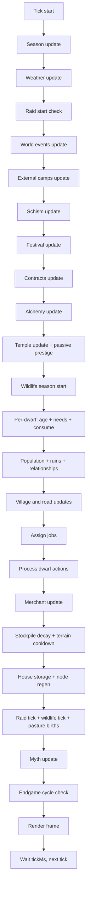

# NodeDwarves Technical Manual ⚙️

This is the technical and gameplay manual for NodeDwarves. `README.md` is a high-level
product overview; this document is the operational runbook for system behavior, execution
flow, and implementation references, with a deterministic-chaos engineering mindset.

## 0) Scope and navigation 🧭

- For running the simulation, controls, and export workflows, see "Operations and workflows".
- For system architecture and execution pipeline order, see "Mental model" and "Tick flow".
- For detailed system behavior (economy, structures, raids, ruins, myths), see "Simulation systems".
- For rendering internals and view-layer constraints, see "Rendering system".
- For policy inference and PPO training details, see "AI and training".
- For config control-plane reference, see "Configuration".
- For deep dives and checklists, see "Adding a new resource" and "Project layout cheatsheet".

## 1) Operations and workflows 🛠️

Use this as the runtime runbook for local dev loops and exports.

### Run the simulation ▶️

```bash
npm start
```

Runtime controls: `Space` pause/resume, `l` legend panel, `i` dwarf inspect panel,
`h` telemetry Data Center panel, `←`/`→` change telemetry pages (or browse inspect entries when inspect is open),
`↑`/`↓` switch between surface and unlocked underrealm depths,
`m` export all currently unlocked layers (PNG + SVG), `Shift+M` export all
unlocked layers with structures/roads.

### Run training 🏋️

```bash
npm run ai:train
```

Pass extra trainer flags safely through any profile command (for example):

```bash
npm run ai:train:fast -- --fresh
```

Force a manual worker count for all phases:

```bash
npm run ai:train:full -- --workers 6
```

Disable profile-aware worker scaling (keep one flat worker count in all phases):

```bash
npm run ai:train:full -- --workers-flat
```

### Run trained policy 🧠

```bash
npm run ai:play
```

See "AI and training" below for preset details and evaluation notes.

### Export a map PNG + SVG 🗺️

During gameplay, press `m` to export all currently unlocked layers (surface +
underrealm depths) for the current season styling. Press `Shift+M` to include
built structures and roads (dwarves are excluded). While export is running, the
save panel shows an in-progress summary with layers and output formats.

```bash
npm run map:export -- --width=120 --height=40 --season=spring
```

All seasons with the same seed:

```bash
npm run map:export:seasons -- --width=120 --height=40 --seed=12345
```

Notes:

- Renders the terrain map only (no telemetry overlay or active entities; includes static structures like mines/ruins and, when present in snapshot, temple footprint stages; frame follows `display.frame.enabled`).
- Outputs to `maps/png` and `maps/svg` by default.
- Uses a fixed terrain palette defined in `scripts/export_map.js` so terminal
  colors remain unchanged.
- If `display.frame.enabled` is true, the export includes the frame; `--width`
  and `--height` still refer to the inner map size (output grows by 2).
- Default export background/foreground are `#24273a` / `#cad3f5` (override with
  `--background`/`--foreground`).
- `--scale` affects PNG output only; SVG is vector.
- Stores metadata in a PNG `tEXt` chunk named `NodeDwarves` with JSON containing
  seed, season info, terrain counts, hashes, and a SHA-256 signature. The SVG
  embeds the same JSON in a `<metadata>` block.
- Uses Puppeteer (headless Chromium) for PNG rendering and SVG font metrics
  (Chromium is downloaded on install unless configured) and picks mid-season
  ticks to avoid transition palettes.
- `--seasonProgress` lets you pick a progress value in `0..1`.
- `--season=all` or `--allSeasons` exports all seasons with the same seed.
- `--count` exports multiple images; with `--seed` it increments from that
  base, otherwise seeds are random.
- When `--name` is used with `--count`, a numeric suffix is appended.
- `--includeStructures` keeps all structures and roads from a snapshot.
- `--state` provides the JSON snapshot file (used by `Shift+M`).
- `--layers` selects exported planes (`surface,d1,d2`, `unlocked`, or `all`).
- `--underrealmUnlockedDepth` forces unlocked depth for CLI exports.
- `--underrealmMaxDepth` clamps max underrealm depth considered by `--layers`.

### Run deterministic headless benchmark 📈

Use this to tune defaults on long runs without terminal rendering.

```bash
node scripts/headless_benchmark.js --ticks 8000 --seeds 101,202,303,404
```

Variant A/B comparison in one run:

```bash
node scripts/headless_benchmark.js --ticks 8000 --variant baseline --set path=value --variant candidate
```

Gate candidate variants against baseline (exit code `1` on failures):

```bash
node scripts/headless_benchmark.js --ticks 8000 --variant baseline --variant candidate --gate
```

Write machine reports for CI/artifacts:

```bash
node scripts/headless_benchmark.js --ticks 8000 --variant baseline --variant candidate --gate --report-json debug/balance_report.json --report-md debug/balance_report.md
```

Preset gate profiles via npm scripts:

```bash
npm run balance:gate:strict
npm run balance:gate:standard
npm run balance:gate:relaxed
```

Inject candidate overrides into the active preset:

```bash
npm run balance:gate:standard -- --set jobs.gatherTriggerRatio.food=1.1 --set jobs.gatherTriggerRatio.water=1.1
```

How it works (under the hood):

- Runs each variant on the same deterministic seed set and tick horizon.
- Treats the first variant as `baseline` and compares every following variant against it.
- Produces:
  - per-variant per-seed end-state rows,
  - per-variant averages,
  - summary deltas vs baseline,
  - seed-by-seed deltas,
  - a compact comparison score (`higher is better`),
  - optional gate verdicts (`PASS/FAIL`) when `--gate` is enabled.
- Exits with code `1` if any gate check fails (useful for CI).

Preset utility in practice:

- `strict`: pre-merge hard guardrail; blocks risky economy drawdowns and hidden instability.
- `standard`: day-to-day tuning default; catches meaningful regressions without over-blocking.
- `relaxed`: exploratory balancing and ideation; allows wider variance while still surfacing metrics.

Preset thresholds:

| Preset     | minScore | maxPopDrop | maxMoraleDrop | maxHungerRise | maxThirstRise | maxResourceDrop |
| ---------- | -------: | ---------: | ------------: | ------------: | ------------: | --------------: |
| `strict`   |      `0` |     `0.03` |        `0.01` |        `0.05` |        `0.05` |          `0.08` |
| `standard` |     `-2` |     `0.08` |        `0.03` |        `0.08` |        `0.10` |          `0.12` |
| `relaxed`  |     `-4` |     `0.12` |        `0.05` |        `0.12` |        `0.18` |          `0.20` |

Important variant-routing rule:

- In preset scripts, `baseline` is fixed as the first variant and `candidate` as the second.
- Extra `--set ...` flags passed with `npm run ... -- ...` are applied to `candidate`.
- Avoid adding extra `--variant` flags on top of presets unless you explicitly want a different comparison structure.

Practical playbook:

1. Start with `standard` for fast feedback while tuning one or two knobs.
2. If `standard` passes and change is significant, re-run with `strict`.
3. If `strict` fails, inspect seed deltas in the generated report to identify unstable seeds/resources.
4. Use `relaxed` only while exploring broad design space, then return to `standard`/`strict`.

Concrete examples:

- Small economy tweak (local smoke):

```bash
npm run balance:gate:standard -- --ticks 2000 --seeds 101,202 --set jobs.gatherTriggerRatio.food=1.1
```

- Candidate with two changes + artifact reports for review:

```bash
npm run balance:gate:standard -- --set jobs.gatherTriggerRatio.food=1.1 --set jobs.gatherTriggerRatio.water=1.1 --report-json debug/my_candidate.json --report-md debug/my_candidate.md
```

- CI hard gate (fail pipeline on regressions):

```bash
npm run balance:gate:strict
```

Report outputs:

- Presets write reports in `debug/` by default (`balance_strict.*`, `balance_standard.*`, `balance_relaxed.*`).
- You can override paths via `--report-json` / `--report-md`.

Cached baseline workflow (faster iteration):

```bash
npm run bench:baseline
npm run bench:candidate -- --set path=value
npm run bench:diff
```

- `bench:baseline` writes `regression/baselines/headless_benchmark_baseline.json|.md`.
- `bench:candidate` writes `debug/headless_benchmark_candidate.json|.md`.
- `bench:diff` compares the two saved reports (no baseline rerun) and writes `debug/headless_benchmark_diff.json|.md`.
- `bench:underrealm:hot` writes `debug/underrealm_stress_hot.json|.md` using fixed hot seeds (`303,404 @ 12000`).
- `bench:underrealm:full` writes `debug/underrealm_stress_full.json|.md` using fixed full set (`101,202,303,404 @ 8000`).
- Underrealm stress scripts use symmetric scenario overrides on both variants (`schism=false`, `festivals=true`, doctrine path disabled) and pin legacy underrealm guard/cooldown knobs only on `baseline` so `candidate` reflects active tuned defaults.
- `bench:run`, `bench:baseline`, and `bench:candidate` stream benchmark progress lines by default (`[progress] variant=... seed=... tick=...`).
- You can pass horizon/seeds/resources overrides to baseline/candidate scripts:
  - `npm run bench:baseline -- --ticks 20000 --seeds 101,202 --variant baseline`
  - `npm run bench:candidate -- --ticks 20000 --seeds 101,202 --set underrealm.combat.dwarf_champion.requires_party_presence=false`

General benchmark notes:

- Uses `createInitialState` + repeated `stepState` with deterministic seeded randomness per run.
- Default output includes `population`, `morale`, `beerBoost`, needs averages, and selected stockpile resources.
- Adds a comparative score (baseline vs candidate), per-seed deltas, and optional gate checks.
- Use `--resources` and `--output json` for machine-readable stdout, or `--report-json` / `--report-md` for saved artifacts.
- Underrealm long-run review checklist (baseline vs candidate):
  - `underFail` delta should stay at or below project target for the scenario.
  - `underReadiness` delta should not collapse beyond project target for the scenario.
  - `resource_avg_rel` should remain within the accepted downside envelope.

## 2) Mental model (big picture) 🧠

NodeDwarves is a fully autonomous colony simulation that runs in the terminal.
Think of it as a configurable state machine with an ASCII renderer on top. Each tick:

1. The **state** is updated (season, weather, raids, population, jobs, movement, etc.).
2. The **renderer** turns state into ASCII + optional colors.
3. The loop repeats at a configurable tick rate.

Everything important is **config-driven** via `config.json`.

Key concepts:

- **State-first**: the simulation has one authoritative JS world state updated each tick.
- **Config-first**: tunables live in `config.json` (training overrides act as a controlled overlay).
- **Shortage-driven economy**: stockpile ratios behave like a feedback controller for priorities and builds.
- **Soft modifiers**: seasons, weather, clans, ruins, myths, and schism stack as multiplicative layers.
- **Deterministic core**: randomness is localized (weather, raids, ruins, external camps) to keep runs comparable for training.

## 3) Tick flow (diagram + order) ⏱️

The tick order in code lives in `src/simulation/index.js` and is the execution contract.

**Tick order (short list)**

1. Update **season** (`season.js`).
2. Update **weather** (`weather.js`).
3. Check raid start conditions (`raids.js`).
4. Update world events (`world_events.js`).
5. Update external camps (`external_camps.js`).
6. Update schism arc (`schism.js`).
7. Update festivals (`festivals.js`).
8. Update contracts (`contracts.js`).
9. Update alchemy rites and backlash (`alchemy.js`).
10. Update temple site/effects/prestige tick (`temple.js`).
11. Update wildlife season spawns (`wildlife.js`).
12. For each dwarf:

- Age + life stage updates (`population.js`).
- Needs decay (season/weather/myth/alchemy/world-event/festival/schism/temple modifiers).
- Consume resources from stockpile when thresholds hit.

13. Handle deaths, roles, ruins, housing, relationships, reproduction (`population.js`, `roles.js`, `ruins.js`).
14. Village and road updates (`villages.js`, `roads.js`).
15. Assign jobs (`jobs.js`).
16. Move and perform actions (`dwarf_actions.js`).
17. Merchant update (`merchant.js`).
18. Stockpile decay + terrain cooldown tick (`resources.js`, `terrain.js`).
19. House storage + node regen (`resources.js`).
20. Raid tick + wildlife tick + pasture births (`raids.js`, `wildlife.js`).
21. Myth update (`myths.js`).
22. Endgame cycle check (`endgame.js`).

**Tick flow diagram**



Notes:

- The **render** step happens outside the simulation in `app.js` after `stepState(...)`.
- AI actions are sampled in `app.js` every `ai.stepTicks` and passed into the simulation for
  job priorities and festival intent.
- Endgame resets replace the state in place; active myths are cleared, traditions persist.
- When adding new systems, place them intentionally in this order and define which modifiers they must respect.

## 4) Entry points and runtime 🖥️

- `app.js`
  - Main CLI orchestrator and simulation control loop.
  - Loads `config.json`, builds the terminal runtime, creates initial state, and starts the tick loop.
  - Optionally loads an AI policy when `--ai <path>` or env `AI_POLICY` is provided.
  - Tick pacing uses `display.tickMs`; hard stop uses `simulation.maxTicks`.
  - AI action cadence uses `ai.stepTicks` to throttle policy calls.
  - Terminal resize behavior is configured under `display.resize.*`: default profile keeps resize handling enabled but does not reflow world geometry (`reflow_world=false`) to avoid live road/village/temple resets.
  - Space toggles pause/resume during the live simulation.
  - Press `i` to open/close the dwarf inspect panel (works during pause or live); use `←`/`→` to browse spawn order.
  - Press `h` to open/close the telemetry Data Center panel (`Dashboard`, `Overview + Deep`, `Economy`).
  - While telemetry is open, use `←`/`→` to switch pages.
  - Press `↑` / `↓` to switch map view between surface and unlocked underrealm depths.
  - Press `l` to toggle the legend overlay panel (works during pause or live).
  - Press `m` to export all currently unlocked layers (PNG + SVG) using current season styling.
- `src/config.js`
  - Zero-magic JSON loader for configuration.
- `src/runtime.js`
  - Computes grid/frame layout and overlay bounds, and handles terminal resize.
  - Auto-size caps (`display.maxWidth`, `display.maxHeight`) accept `<= 0` as uncapped (follow terminal dimensions).
  - Resolves optional in-map inset carving (`display.mapInset.*`) and exports effective playable area (`runtime.playableArea`) for scaling-sensitive systems.
- `src/terminal.js`
  - Low-level terminal I/O helpers (clear screen, move cursor, hide/show cursor).
  - Handles screen clearing and cursor control during live rendering.

## 5) State creation and world generation 🌍

### Core state builder 🧱

  - `src/state/index.js`
  - `createInitialState(config, runtime)` builds the authoritative world state:
    - `dwarves`, `nodes`, `structures`, `merchant`, `worldEvents`, `externalCamps`, `weather`, `raid`, `tools`, etc.
    - `temple` and `prestige` meta-state for Temple of Ancestors progression.
    - `underrealm` depth metadata (active depth, unlocked depths, full-size layer terrains), plus deep economy/faction runtime.
    - `stockpile` initialized from `config.resources.stockpile`.
    - Initial stockpiles (and optional node counts) can scale with map size via `resources.mapScale`
      using effective playable map area as a baseline (grid area minus carved inset when enabled).
    - Counters and stats used by AI, raids, ruins, myths, alchemy, and endgame cycles.
    - Decision observability snapshots: `lastGovernorSignals`, `lastPriorities`, `lastDecisionTrace` (used by telemetry explainability rows).
  - `fitStateToGrid(...)` repositions entities after resize and keeps everything in-bounds (used when `display.resize.reflow_world=true`).

### Terrain generation 🗺️

- `src/state/terrain.js`
  - Generates terrain using noise and rules.
  - Valley-only terrain generator (see `config.display.terrain.valley.*`).
  - Produces:
    - `types` grid (terrain types)
    - `walkable` map
    - `spawnable` map
  - Valley mode can sprinkle extra ponds (`display.terrain.valley.ponds`) that count as lake water for humidity and gathering.
  - Domain warp, water-distance jitter, and the biome noise mask can break up geometric patterns (`display.terrain.valley.domain_warp`, `display.terrain.valley.water_distance_*`, `display.terrain.valley.biome_noise`).
  - The biome noise mask is a low-frequency field that biases height thresholds, water-distance, and biome noise thresholds so forests/food/pasture do not follow perfectly smooth contours; tune `display.terrain.valley.biome_noise.*`.
  - Macro climate zones add broad wet/dry and rough/soft regions so thresholds vary per area instead of globally (`display.terrain.valley.macro_zones.*`).
  - A curved world spine can raise a long relief band for more iconic mountain/hill silhouettes (`display.terrain.valley.world_spine.*`).
  - Water coverage can be capped with a global budget so rivers stay readable and optional lakes/ponds do not dominate (`display.terrain.valley.water_budget.*`).
  - Forest/food/pasture borders can be lightly eroded/expanded with noise to avoid clean geometric edges (`display.terrain.valley.biome_edge_jitter.*`).
  - Optional `display.terrain.valley.fantasyPreset` applies curated terrain art-direction presets; `natural_epic` is balanced/organic, while `heroic_contrast` pushes stronger landmark silhouettes.
  - Landmark guides can shape a stronger fantasy composition: `landmarks.river_spine` nudges river tracing along an organic corridor, while `landmarks.ridge_mask` lifts and reinforces a mountainous band.
  - `display.terrain.valley.landmark_first` can shift terrain generation to a landmark-led composition pass so rivers/ridges define macro relief before local noise.
  - Default `landmark_first` and `landmark_suitability` values are intentionally moderate to keep maps evocative without destabilizing biome balance.
  - Forest/food/pasture suitability can also consume those landmark masks through `landmark_suitability`, so biome placement follows story landmarks instead of only local noise.
  - `display.terrain.valley.forest.natural_spread` adds a low-frequency inland mask so forests can form organic groves away from water instead of hugging only river/lake corridors.
  - Forest edges near lakes can be softened with distance jitter and shoreline edge noise via `display.terrain.valley.forest`.
  - Valley ponds/fallback lakes can use jagged edges or edge stretch via the `edge_*` lake/pond settings.
  - Pasture patches can be generated via `display.terrain.valley.pasture` and get their own symbol/color.
  - Minimum terrain tile counts (food/pasture/mountain/stone) can be enforced with `display.terrain.minimumTiles`.
  - Ruins placement can reserve spawn terrain via `structures.ruins.minSpawnTiles`.
  - Terrain affects movement, spawn rules, and (optionally) resource gathering.
  - Terrain resources can be harvested directly when `resources.useTerrainTiles` is enabled.
  - Terrain walkability and movement delays are controlled by `display.terrain.walkable.*` and `display.terrain.movementDelay.*`.
  - When `display.mapInset.reserveSimulationSpace=true`, inset cells are forced non-walkable/non-spawnable and are excluded from build/path placement.
  - Underrealm layers use a dedicated cave generator in `src/state/index.js`: deterministic wall fill + smoothing, chamber carving, tunnel linking graph (MST + loop links), and disconnected-cave pruning.
  - The generator carves tunnels as cave tiles (no dedicated corridor tile output) and injects wall pillars inside broad caverns to reduce oversized open rooms and keep topology legible.
  - Underrealm feature tiles (`chasm`, `crystal`, `magma`, `shrine`) are depth-scaled via `underrealm.terrain.*`; magma/shrine can be gated to deep layers only (`magma_min_depth`, `shrine_min_depth`) before walkable/spawnable conversion.
  - Underrealm generation is biome-free and season-free by design: no surface biome masks or seasonal terrain palettes are applied.
  - Underrealm layers preserve runtime economy snapshots across terrain resync (`layer.economy`, `underrealm.deepFaction`) so resize does not wipe deep progression.

## 6) Simulation systems (what lives in `src/simulation/`) ⚙️

These modules are the simulation hot path. Keep logic explicit and complexity predictable.

### Population and life cycle 👥

- `population.js`
  - Ages and life stages from `population.aging` (adult age, fertile range, old age start, max age).
  - Needs decay per tick from `needs.decayPerTick`, scaled by season/weather/housing/myths.
  - Consumption uses `consumption.*` thresholds/relief values for food, water, beer, plus beer reserve logic.
  - Current beer-morale defaults are slightly persistence-biased for endgame support (`beerMoraleGain=0.095`, `beerMoraleDecayPerTick=0.0032`, `beerMoraleMax=0.30`).
  - Derived mood metrics (morale/stress/fatigue) come from average needs and beer morale boost.
  - Deaths: starvation threshold/ticks and old-age chance from `population.death` and `population.aging`.
  - Housing assignment, couple co-housing, and winter penalties are driven by `population.housing.*`.
  - Relationships/bonding use `population.relationships.*`, with morale and housing multipliers,
    plus optional same-clan bond gain bonuses.
  - Reproduction uses `population.reproduction.*` (base chance, soft cap, gestation, cooldown, stockpile gates, birth cost).

### Clan culture 🛡️

- `clans.js` is the canonical clan utility layer (ids, labels, weighted picks, effects, and share helpers).
  - `clans.enabled=false` hard-disables clan assignment and clan effects.
  - `clans.list` defines valid ids; `clans.labels` only affects display.
  - Spawn distribution is weighted by `clans.distribution.<id>`; if weights are invalid/empty, fallback is uniform.
- Newborn inheritance is deterministic-by-rule, stochastic-by-branch (`population.js`):
  - `clans.inheritance.mode=parent` (default): if both parents have clans, child inherits one parent clan (50/50 when mixed).
  - `clans.inheritance.mode=random`: newborn ignores parents and rolls distribution again.
  - Missing parent clan data falls back to weighted random pick.
- Effects are local to dwarves but consumed by multiple global systems:
  - `jobs.js`: build speed adjustments (`build_ticks_bonus`) before job execution.
  - `dwarf_actions.js`: gather/mine/sawmill output/tick penalties and mine rare-drop chance bonus.
  - `dwarf_actions.js`: build completion can apply extra stone/iron costs (`build_cost_penalty`) if stockpile can pay.
  - `index.js`: storm/cold need-decay mitigation (`storm_cold_need_decay_bonus`) during harsh weather.
  - `raids.js`: adult-population clan share contributes to defense and watchtower kill cap.
  - `ruins.js`: expedition party clan share contributes to hazard reduction and combat power.
- Aggregation model is explicit:
  - Raid modifiers are weighted by adult clan share (`getClanShare`).
  - Ruins modifiers are weighted by expedition party share (`getClanShareByIds`).
  - This keeps effects continuous and avoids hard binary breakpoints.
- Social synergy note:
  - Relationship bonding can receive same-clan bonus via `population.relationships.sameClanBondGainBonus` (config-driven, outside `clans.effects`).
- Visibility and AI:
  - Telemetry exposes fixed operational sections (World, Underrealm, Population, Pressure, Lore, Structures, Diplomacy, Stockpile, Operations) instead of a dedicated clans block.
  - AI observation includes `clanShare_<id>` features, so policy training can adapt to composition changes.

### Jobs and economy 📦

- `jobs.js` is a staged scheduler with strict early exits (first failing gate stops that branch, not the whole tick).
- Worker pool creation:
  - Eligible workers are idle adults, not on expedition, and not assigned to active Underrealm duty.
  - Brewmasters are handled first (unless brewery is paused by food emergency).
  - Current brewery defaults are tuned for long-run mid/late game support: up to 4 breweries,
    4 workers each, `outputPerTick.beer=1.3`, and a softer food pause gate (`pauseWhenFoodRatioBelow=0.35`).
- High-level assignment pipeline (in order):
  1. Brewmaster staffing/build.
  2. Manager-managed builds (well/field/watchtower) when manager mode is active.
  3. Forced extra mine queue (if configured and eligible).
  4. General build/upgrade queue (housing, workshops, mines, armory, alchemy lab, etc.).
  5. Continuous structure work slots (mine, sawmill).
  6. Tool upgrade and structure upgrade jobs.
  7. Armory production jobs (expedition kits + tiered weapon/armor stock).
  8. Shortage-driven gather/craft/hunt jobs.
- Queue guardrails are explicit and independent:
  - `jobs.buildQueue.maxConcurrent/maxPerTick` for build+upgrade.
  - `jobs.mineQueue.maxConcurrent/maxPerTick` for extra mine expansion.
  - Reserved build positions/structure ids prevent duplicate build/upgrade targeting in the same tick.
- Emergency behavior:
  - Role emergency mode suppresses non-critical build/craft branches.
  - Mines/sawmills/armory/brewery can pause on emergency depending on per-structure flags.
- Shortage scoring model:
  - Target source: `resources.targets` (+ `targetsPerCapita` scaling).
  - Trigger threshold: `effectiveTarget = target * jobs.gatherTriggerRatio`.
  - Missing amount drives base urgency; final priority is `score = shortageRatio * weight`.
  - Weight source: AI jobs-governor weights from `action.jobs.weights` (fallback legacy `action.weights`, then defaults), with optional dynamic low-stock boosts (`ai.priorityBoosts`).
- Shortage execution model:
  - If resource has active nodes/terrain source -> gather job.
  - If resource is `food` and hunting is enabled/eligible -> hunt job can replace gather.
  - If no direct source and recipe exists -> craft job at available workshop capacity.
- Role-aware assignment:
  - Ordering prefers gatherers first for shortage flow; builders/managers are consumed by earlier branches.
  - `takeIdleDwarf` enforces role preference but gracefully degrades to any idle worker.
- Building governor ranking (M4):
  - General build queue now supports ranked class selection from `action.building.{housingWeight,economyWeight,defenseWeight,specialWeight}`.
  - Class ranking is advisory only: every selected candidate still goes through the same legality/cost/cap/min-ratio guards in `structures.js`.
  - Defaults from `ai.governors.building.defaultWeights` keep legacy ordering stable when no building action is provided.
  - `action.building.mineBias` only reorders economy-class candidates (mine earlier/later) within `ai.governors.building.mineBiasMax`.
  - `action.building.upgradeBias` only reorders housing candidates (upgrade-first vs build-first) within `ai.governors.building.upgradeBiasMax`.
- Crafting and kit production:
  - Inputs are reserved at job creation time (not at completion), reducing race conditions.
  - Workshop capacity is tracked from active craft jobs to avoid overbooking.
  - Armory output now supports:
    - legacy expedition kit recipe (`kitMax`, `kitTicks`, `kitCost`)
    - equipment recipe catalog (`structures.armory.equipment.recipes.*`) with:
      - deterministic recipe priority (`craft_order`)
      - armory-level gate (`min_level`)
      - mineral gate against current level allow-list (`levels.<level>.allowed_minerals`)
      - stock cap enforcement (`max_stock`) against current + queued output.
- Integration with other systems:
  - Build costs and ratio guardrails are structure-config-driven (`structures.js` helpers).
  - Gather work/yield also inherits season/weather/myth/morale multipliers via `resources.js`.
  - Job priorities from AI directly steer runtime economy through `action.jobs.weights` (legacy `action.weights` still accepted).

### Dwarf actions ⛏️

- `dwarf_actions.js`
  - Executes a dwarf's job: move, gather, build, upgrade, craft.
  - Gather jobs pull from nodes or terrain tiles; terrain tiles get cooldowns after use.
  - Hunt jobs resolve against wildlife herds with configurable death/penalty risk and food yield.
  - Build/upgrade jobs create or level structures and can spawn well/field nodes.
  - Mine/sawmill/brewery jobs output per tick while staffed; brewery consumes food per tick.
  - Craft/armory jobs apply outputs on completion (after paying inputs).
  - Idle behavior returns home or wanders around the anchor.
  - Panic logic during raids (run to home or flee).
  - Job movement path keys are target-based (not per-job id) to increase path-field cache reuse at large populations.

### Movement and pathing 🧭

- `movement.js`
  - Grid-based movement with cooldowns.
  - Pathing mode from `population.pathing.mode`: `detour` or `field`.
  - Detour mode uses stall detection (`stallThreshold`), detour ticks, and local BFS (`bfsRadius`).
  - Field mode builds distance fields (`field.radius`) cached for `field.ttlTicks`.
  - Path-field pruning runs once per tick and enforces a bounded cache size to avoid late-game cache bloat.
  - Field step costs weight terrain delay and crowding (`field.terrainWeight`, `field.crowdWeight`),
    plus inertia and stay penalty.
  - Field pathing can optionally bias medium/long trips toward road overlays via
    `population.pathing.field.roadAffinity.*`.
  - Road affinity supports `pragmatic` and `scenic` profiles for lighter vs stronger corridor-following.
  - Road-distance maps for affinity are cached by road overlay version and rebuilt only when roads actually change.
  - Terrain movement delays come from `display.terrain.movementDelay.<type>`.

### Resources and stockpile 📊

- `resources.js`
  - Stockpile target calculation (with per-capita options).
  - Stockpile ratios drive shortages, guardrails, and AI signals.
  - Node regeneration uses `resources.nodeRegen.*` scaled by season/weather/myths.
  - Field irrigation scales with water stockpile (`structures.field.irrigationMin/MaxMultiplier`).
  - Terrain gathering uses `resources.useTerrainTiles` and `resources.terrainAllowed`.
  - Terrain cooldowns are controlled by `resources.terrainCooldownTicks` and can be bypassed
    by `resources.terrainCooldownCriticalRatio` during shortages.
  - Pasture stock regrows on a global birth interval via `pasture.birth.*`.
  - House storage buffers use `structures.house.storage.*` (capacity per level, transfer, decay).
  - Stockpile decay per tick uses `resources.decayPerTick`.
  - Output multipliers stack from tools, mithril forge, beer morale, contract boons, ruins bonuses, and alchemy rites/backlash.

### Structures and building 🏗️

- `structures.js`
  - Structure creation, build jobs, upgrade jobs, placement rules.
  - Build costs/ticks live in `structures.<type>.buildCost/buildTicks` (plus upgrade variants).
  - Houses have levels with per-level capacity and optional storage buffers.
  - Wells/fields spawn resource nodes and respect max counts and spacing rules.
  - Industrial buildings can use `structures.<type>.placement.mode = poisson` with `placement.district.*` and `placement.roadAffinity.*` for sampled peripheral placement that also follows organic sectors and road frontage.
  - `placement.nearbySearchRadius` can be lowered for more micro-variation or raised for smoother, cleaner district outlines.
  - Watchtowers provide raid defense and per-tick attacks.
  - Alchemy labs unlock high-risk global rite formulas fueled by rare minerals.
  - Mines/sawmills/breweries scale output by level with exponential upgrade costs.
  - Mine placement respects `buildMinRadius`/`buildOuterBuffer` unless `structures.mine.ignorePeripheralRadius` is enabled.
  - Extra mine builds can be prioritized via `structures.mine.preferExtraAlways`.
  - Guardrails are **ratio-based** (important for stability).

### Villages 🏘️

- `villages.js`
  - Tracks village centers and founding triggers.
  - New villages are founded at population thresholds.
  - New centers must be far enough from existing villages and near required resources.
  - Stockpile remains shared; village centers influence well/field/house placement.

### Roads 🛣️

- `roads.js` runs as a planner + builder pipeline, not an instant path painter.
- Runtime state (`state.roads`) tracks:
  - built tile map (`types`), pending queue (`queue`, `queueIndex`, `planned`)
  - per-link progress (`links`, `tileLinks`, `pending`, `completed`)
  - failure/retry bookkeeping (`failedLinks`, `retryLinks`)
  - primary mine lock (`primaryMineLinkKey`) and build cadence (`nextBuildTick`)
- Planning order is intentionally staged for stable growth:
  1. Plan the primary mine link from V1 to nearest mine.
  2. Until that link is completed (or failed), village inter-links are blocked.
  3. After primary completion, plan `V1 <-> V2`.
  4. If V3 exists, plan `V3 -> nearest(V1,V2)`.
  5. Additional mines link to nearest village center.
- Link construction is incremental:
  - Each successful path is converted into queued tiles with per-tile link ownership.
  - `buildNextRoadTile` consumes one tile at cadence `roads.buildEveryTicks`.
  - Tile build requires both stockpile ratio gate (`roads.buildMinResources`) and tile material cost (`roads.cost.<tileType>`).
  - If tile cost is temporarily unaffordable, tile is requeued instead of abandoning the whole link.
- Pathfinding strategy is multi-pass and deterministic-by-seed:
  - Preferred mode: weighted A\* with terrain penalties and style noise (`roads.pathStyle.enabled=true`).
  - Fallback mode: strict BFS if style pathing is disabled.
  - Search passes:
    - primary: hard avoid + soft-avoid treated as blocked
    - fallback: hard avoid only, soft-avoid becomes weighted penalty
    - relaxed: same two modes with smaller parallel-avoid radius when enabled
- Shape controls (`roads.pathStyle.*`):
  - `profile`: `pragmatic` vs `scenic` default bundles.
  - `turnPenalty`, `straightStepThreshold/straightStepPenalty` tune corridor curvature.
  - `noiseScale/noiseWeight` add deterministic low-frequency route variance.
  - `terrainPenalty` adds per-terrain weighted costs.
  - `softAvoidPenalty` discourages but does not hard-block fallback terrains.
- Long-link waypoint system:
  - For long Manhattan distances, candidates are generated near a perpendicular offset corridor.
  - Candidate path must satisfy detour bounds (`maxDetourRatio`, `maxDirectRatio`) and segment minima.
  - Final pick is based on path score and optional curvature/deviation gains (`minTurnGain`, `minLineDeviationGain`, `turnReward`).
- Topology hygiene rules:
  - Anchor snapping (`anchorRadius`) reuses nearby road endpoints near villages/mines.
  - Parallel suppression (`parallelAvoidRadius`) blocks path tiles near existing roads except near start/goal buffers.
  - Optional relax-on-fail (`parallelRelaxOnFail`, `parallelRelaxRadius`) avoids deadlocks in dense maps.
- Terrain and crossings:
  - `avoidTerrain` is always blocked.
  - `softAvoidTerrain` is blocked in primary pass, penalized in fallback.
  - River/water crossings resolve into `bridge`/`ford` by link kind and `roads.crossings.*`.
  - `waterTerrain` forces bridge tile typing when fallback passes through water-like tiles.
- Failure handling:
  - Failed links are marked in `failedLinks` and optionally re-armed via `retryFailedEveryTicks`.
  - Completion pushes an event (`Road completed: ...`) and unlocks dependent planning branches.
- Gameplay note:
  - Roads are currently overlay/visual infrastructure only; movement speed/path costs for dwarves do not yet consume road state directly.

### Roles 👤

- `roles.js`
  - Assigns adult dwarves into roles based on `population.roles.*`.
  - Role switching uses `population.roles.switchCooldownTicks`.
  - Emergency gathering triggers when `population.roles.emergencyMinRatio` is breached for
    `population.roles.emergencyResources`.
  - Special handling for brewmaster counts via `structures.brewery.brewmaster*`.

### Seasons and weather 🌦️

- `season.js` is deterministic and tick-index driven:
  - Season is computed from `state.tick`, `seasons.durationTicks`, and `seasons.order`.
  - No hidden timers: `season.globalIndex`, `season.tickInSeason`, and `season.duration` are recomputed each tick.
  - Modifier access is explicit via `getSeasonModifier(state, key, fallback)`.
- Season modifiers are multiplicative inputs for multiple systems:
  - need decay, gather ticks/yield, craft ticks, node/field regen, reproduction factors.
  - The active season payload is copied into `state.season.modifiers` for cheap lookup.
- `weather.js` is a state machine with weighted resampling:
  - If `ticksRemaining > 0`, weather just counts down.
  - When timer hits 0, next weather type is sampled from `weather.states.*.weight` plus optional `weather.seasonBias.<season>`.
  - Duration is sampled from per-state `durationTicks` or global fallback.
  - Every transition emits an event (`Weather: <Type>`).
- Weather multipliers are split by granularity:
  - scalar modifiers via `getWeatherModifier(..., key, fallback)`.
  - per-need map via `needDecayByNeed` for asymmetric stress (e.g. thirst vs hunger).
- `festivals.js` is season-coupled and AI-intent driven, with schism-council fallback:
  - Trigger source is `action.festivalIntent` normalized against AI weight range.
  - During schism ritual windows, council fallback intent can start festivals even with low/no AI intent (if legitimacy/pressure gates allow).
  - Activation requires all gates: season allowed, window open, cooldown seasons passed, stockpile ratio guardrails (including water-first safety floors), full cost affordability, optional raid lock.
  - Costs are paid up-front once at start (`festivals.costs`) and can be doctrine-scaled by schism.
  - Active festivals apply temporary `effects.*` multipliers until `durationTicks` expires (also doctrine-scaled by schism).
  - Start/end events are pushed for telemetry observability.
- Festival eligibility is exposed to AI:
  - observation contains `festivalActive`, `festivalTimeLeft`, `festivalEligible`, `festivalCostRatio`.
  - This allows policy to time activation near seasonal windows instead of random triggering.
- Stacking order in the simulation loop:
  - season and weather update first, schism update runs before festival evaluation.
  - final need decay multiplier stacks season _ weather _ housing _ endgame difficulty _ clan _ myths _ alchemy _ world-events _ festival _ temple _ schism.

### Schism arc 🔥

- `schism.js` models a run-scale social arc driven by pressure and legitimacy:
  - `pressure`: rises with shortages/raids/failures, drops with temple stability and festival relief.
  - `legitimacy`: rises from successful governance/events/festivals, drops from deaths and failed diplomacy.
- Phase model:
  - `concord -> murmurs -> fracture -> reckoning` based on pressure thresholds (`schism.phase_thresholds.*`).
  - Each phase applies explicit multiplicative runtime modifiers via `schism.modifiers.phase.<phase>.*`.
- Doctrine model:
  - Runtime doctrine (`austerity` or `revelry`) can shift at guarded intervals (`schism.doctrine.*`).
  - Hysteresis thresholds (`*_enter_*` / `*_exit_*`) reduce doctrine ping-pong by requiring stronger recovery before leaving austerity.
  - Doctrine affects economy via `schism.modifiers.doctrine.*`, and scales festival costs/effects (`schism.festival.*`).
- Ritual windows:
  - Open on configured seasons/ticks (`schism.ritual_windows.*`).
  - Expose a council-driven fallback festival trigger when legitimacy/pressure gates pass.
  - During a valid trigger, one branching ritual can be selected from `schism.rituals.definitions`:
    - weighted by doctrine + context (`pressure`, legitimacy, shortages, active raids),
    - protected by anti-repeat logic (`schism.rituals.repeat_protection.*`) so recent rituals are de-prioritized or hard-cooled down,
    - paid with extra upfront ritual costs,
    - applied as timed global modifiers (`effects.*`) plus festival-only multipliers (`festival_effects.*`),
    - with immediate pressure/legitimacy narrative deltas (`deltas.*`).
- Climax lifecycle:
  - High pressure + low legitimacy can trigger a timed crisis (`schism.climax.*`).
  - On resolution, pressure/legitimacy are shifted and explicit narrative events are emitted.
- Integration points:
  - Tick order: runs before festivals in `simulation/index.js`.
  - Needs pipeline consumes schism `needDecay` modifier.
  - Resource systems consume schism `gatherTicks`, `gatherYield`, `nodeRegen/fieldRegen`, and `outputBonus`.
  - Underrealm bridge consumes schism modifiers for deep exploration pace, deep raid pressure/losses, delver morale shaping, and ruins readiness scoring.
  - Temple progression can use legitimacy fallback path when artifact gate is not met (`schism.temple.*`).

### World events 🎭

- `world_events.js` is a single-active-event state machine for short global arcs.
- Spawn model:
  - one active event at a time (`worldEvents.maxConcurrent` currently treated as 1 by runtime design).
  - spawn cadence uses `worldEvents.spawnRangeTicks` with `minTick`, global cooldown, and per-type cooldown.
  - event type is chosen by weighted config (`traveling_bards`, `rival_caravans`, `limited_opportunities`).
- Traveling bards:
  - ratio/population guardrails plus upfront costs.
  - temporary global multipliers via `effects.*` (for example `needDecay`, `gatherYield`).
- Rival caravans:
  - temporary trade/reward pressure window.
  - optional instant contest consumes resources when guardrails pass.
  - `action.trade.contestIntent` can prevent contest spending unless it exceeds `ai.governors.trade.contestIntentThreshold`.
  - applies either `effectsWin.*` or `effectsLose.*` for event duration.
- Time-limited opportunities:
  - spawns an offer (`request` + `reward`) with strict expiry.
  - `action.trade.opportunityIntent` can delay completion even when stockpile is sufficient.
  - near expiry, completion is forced by `ai.governors.trade.opportunityForceCompleteTicks` to avoid accidental timeout from low intent.
  - while active, request resources can receive target boosts (`targetBoosts`) to steer shortages/jobs.
  - on expiry, optional stockpile penalty is applied (`failureLossRatio` over configured resources).
- Integration points:
  - need decay pipeline consumes `world_events` multipliers in `simulation/index.js`.
  - gather ticks/yield and stockpile target steering consume `world_events` multipliers/boosts in `resources.js`.
  - merchant trade sizing consumes `merchantTradeRate`; contract rewards consume `contractReward` (both stack multiplicatively with external-camp economy modifiers when camps are active).
  - Telemetry shows active world event status (label, timer, and offer summary when relevant).
- Observability:
  - event stream logs start/end and opportunity completion/expiry outcomes.
  - `state.worldEvents.stats` tracks global and per-type spawn/completion/failure/expiry counts.

### Myths (global modifiers) 🗿

- `myths.js` manages a full lifecycle state: `active`, `history`, `traditions`, `counters`, and per-myth cooldown bookkeeping.
- Update sequence per tick:
  1. Expire active myths whose `endsTick` passed.
  2. Convert eligible expired myths into traditions (if enabled/capped).
  3. Evaluate trigger definitions.
  4. Activate newly triggered myths if slot/cooldown constraints pass.
- Trigger families currently supported:
  - `resource_crisis`: low stockpile ratio sustained by ticks and/or repeated season-window hits.
  - `raid_deaths`: per-raid deaths and rolling recent-raid death windows.
  - `ruins_success`: success streak tracking plus optional artifact-immediate trigger.
  - `drought_or_water_crisis`: drought-season hits and/or prolonged low-water ratio.
- Activation guardrails:
  - `myths.maxActive` limits concurrent active myths.
  - `myths.minGapTicks` enforces per-myth retrigger cooldown via `lastTriggerTicks`.
  - Already-active myths never reactivate until expired.
- Effects model:
  - Active myth multipliers come from `definitions.<id>.effects`.
  - Tradition multipliers come from `definitions.<id>.traditionEffects`.
  - `getMythMultiplier` multiplies active and tradition contributions together with caller fallback.
- Expiry and tradition behavior:
  - Myth duration is `durationTicks` (0 means no auto-expiry timer).
  - On expiry, history entry gets `endedTick`; tradition may be added/refreshed.
  - Traditions are capped by `myths.maxTraditions`; oldest is evicted when full.
- Endgame interaction:
  - Active myths and trigger counters are reset on cycle reset.
  - Traditions and bounded history are carried across cycles (`carryMythsAcrossCycle`).
- Observability:
  - Events: `Myth awakened`, `Myth faded`, `Tradition formed`.
  - Telemetry renders active myths + traditions and an aggregate bonuses line.
  - AI observation includes myth flags and severity metrics, so policy can react to long-tail global states.

### Alchemy lab and pacts ⚗️

- `alchemy.js`
  - Uses a single-slot deterministic state machine: only one rite can be active at a time, then optional backlash, then cooldown (`active -> backlash? -> cooldown -> ready`).
  - Tick order matters: alchemy updates before per-dwarf need decay and before ruins/raid resolution in the same tick, so modifiers apply immediately once a rite starts.
  - Formula selection is deterministic: formulas are sorted by `priority` (desc) then formula id (asc), and the first eligible formula is activated.
  - Eligibility gates are strict and all must pass:
    - required structures (`requiredStructures`, default fallback requires `alchemy_lab`)
    - minimum population (`minPopulation`)
    - optional unresolved-artifact gate (`requiresUnfoundArtifacts`)
    - raid lock (`blockDuringRaid`, default-on unless explicitly `false`)
    - input stockpile availability (`inputs`)
    - stockpile ratio guardrails (`minStockpileRatios.<resource>`)
  - Rite inputs are consumed up-front when activation happens (`inputs` are paid once at start, not per tick).
  - Active modifiers are global and stack multiplicatively with other systems (season/weather/myths/contracts/etc.) through `effects.*`, plus an additive production term via `outputBonus`.
  - Effect keys currently wired:
    - `needDecay` -> per-dwarf need decay
    - `mineRareChance` -> rare mine drop probability
    - `mineOutput`, `gatherTicks`, `buildTicks` -> mine yield, gather cadence, build cadence
    - `ruinsHazard`, `ruinsArtifactChance` -> expedition failure/artifact roll odds
    - `raidDeathRate`, `raidResourceLoss` -> raid casualties and stockpile loot loss
    - `underrealmRaidStrength`, `underrealmRaidLoss`, `underrealmRareDrop` -> deep raid pressure and deep rare extraction
    - `outputBonus` -> additive contribution to production multiplier (`1 + totalBonus`, clamped)
  - Backlash trigger logic is intentionally delayed: ruins failures are counted during the active window, but backlash is evaluated only when the rite expires (`failuresSinceStart >= failureThreshold`).
  - Backlash phase can do two things:
    - immediate stockpile burn (`resourceLossRatio` over `lossResources`)
    - temporary negative/positive global modifiers (`backlash.effects.*`, `backlash.outputBonus`)
  - Cooldown starts only after the active rite ends, and it ticks down only when no active rite/backlash is running.
  - History/stats are persisted in `state.alchemy`:
    - `stats.activations`, `stats.stableCompletions`, `stats.backlashes`
    - bounded history via `alchemy.historyLimit` (0 = unlimited)
  - Telemetry status (`src/telemetry/telemetry.js`) exposes runtime intent clearly:
    - `Alchemy: <label> <ticksLeft>t F<failures>/<threshold>` while active
    - `Alchemy: <backlashLabel> <ticksLeft>t` during backlash
    - `Alchemy: cooldown <ticksLeft>t` during cooldown
  - Endgame reset behavior: alchemy state is recreated on cycle reset (no pact/backlash carry-over between cycles).
  - Build-path note: `structures.js` auto-queues an `alchemy_lab` build only after its own structure and stockpile guardrails are met (`structures.alchemy_lab.requiresStructures`, `buildMinResources`, `buildCost`).
  - Current default epic formula: **Stone Abyss Pact** (`alchemy.formulas.stone_abyss_pact`):
    - active window `220` ticks, cooldown `260` ticks
    - requires `alchemy_lab + mithril_forge + armory + ruins`, `minPopulation=42`, and at least one unfound artifact
    - consumes `mithril 8`, `adamantio 4`, `mana_crystal 4`, `embersteel 2`, `ironshade 2`, `beer 120`
    - active upside: `outputBonus +0.20`, `mineRareChance x1.70`, `ruinsArtifactChance x1.35`
    - active risk: `ruinsHazard x1.18`, `needDecay x1.06`, `raidDeathRate x1.08`, `raidResourceLoss x1.12`
    - backlash trigger: `2` ruins failures during active phase
    - backlash penalty: `280` ticks, immediate `22%` loss on configured resources, `outputBonus -0.35`, harsher needs/raids/ruins, and reduced rare mining (`mineRareChance x0.75`)
  - Underrealm-focused formulas:
    - **Basalt Ward Draught** (`alchemy.formulas.basalt_ward_draught`): lowers deep raid strength/loss and boosts deep rare extraction.
    - **Emberforge Elixir** (`alchemy.formulas.emberforge_elixir`): speeds gather/build pipelines and increases mine output.
    - **Aegis of Khazad** (`alchemy.formulas.aegis_of_khazad`): premium late-epoch rite consuming deep reagents (`void_shard`, `ember_resin`) for strong deep-defense and rare-drop pressure.

### Raids 🐺

- `raids.js` has two phases: `updateRaidStart` (season-edge trigger) and `updateRaidTick` (active raid loop + resolution).
- Start trigger is intentionally narrow:
  - raids only roll on `season.tickInSeason === 1` for allowed `raids.seasonNames`.
  - requires `minTick`, `minPopulation`, and `minSeasonsBetween` since previous raid.
  - final chance is lerped from `raids.chance.min/max` by difficulty.
- Difficulty source:
  - base from `ai.difficulty` (`0..1`), multiplied by `state.endgameDifficulty`, then clamped.
  - This keeps raid pressure scaling with long-cycle progression.
- Active raid state tracks:
  - timer (`ticksRemaining`, `duration`), seasonal metadata, and visual beast positions.
  - beasts move each tick and can be thinned by watchtower attacks.
- Watchtower mitigation (`applyWatchtowerAttacks`):
  - each tower searches nearest beast in range.
  - per-tower hit rolls use `watchtower.raid.hitChance`.
  - max kills per tick is capped and can be increased by clan bonus.
- Raid resolution at timer end:
  - unsheltered dwarves are computed via exact house-position shelter check.
  - deaths are sampled from exposed dwarves only.
  - resource losses are applied by weighted stockpile loss map.
- Casualty/loss formulas are multiplicative stacks:
  - death rate uses difficulty, defense, myths, alchemy, and contract war reduction.
  - loot loss uses difficulty, defense, myths, and alchemy.
  - defense combines adult ratio, tower defense, and clan defense share.
- Stats and events:
  - cumulative: raid count, deaths, and loot totals.
  - per-last-raid: `lastRaidDeaths`, `lastRaidTick`.
  - events include raid start and a compact outcome summary (`slain`, `loot ...`).
- Integration points:
  - myths/alchemy/contract buffs all hook raid formulas through explicit multipliers/reductions.
  - housing quality indirectly drives raid survivability by reducing exposed population.

### Underrealm operations 🕳️

- Runtime placement and activation:
  - `updateUnderrealm(state, config)` is called every simulation tick from `simulation/index.js`, after role assignment and before ruins/housing/job scheduling.
  - If `underrealm.enabled=false` (or underrealm state is missing), all `underrealmDuty` flags are cleared and no deep logic runs.
  - Underrealm gameplay state is active regardless of current map view depth (`activeDepth` is a view selector, not a simulation gate).
- First-depth discovery gate (`underrealm.discovery.*`):
  - Depth `1` is no longer required to be unlocked at start; default run begins with `start_unlocked_depth=0`.
  - Discovery timer starts only after colony population reaches a deterministic threshold (`population_min_for_timer..population_max_for_timer`).
  - Once the threshold is reached, a deterministic delay (`min_tick..max_tick`, seeded) starts and unlocks depth `1` when it expires.
  - Once discovered, event stream announces the gate and a dedicated surface gate tile is rendered using `underrealm.discovery.symbol` / `underrealm.discovery.color_key`.
  - Discovery state (`populationThreshold`, `timerStartedTick`, `targetTick`, `found`, `foundTick`, `surfaceGate`) is persisted across runtime resync/resize.
- Crew assignment model (`miner` / `hauler` / `guard`):
  - Crew assignment is discovery-gated: no delver assignment occurs before depth `1` is discovered.
  - Candidate pool = adults only, not on expedition, sorted by spawn order for stable assignment.
  - Two hard guardrails control extraction pressure:
    - `surface_reserve_ratio`: minimum adult share reserved for surface economy.
    - `max_underrealm_ratio`: maximum adult share allowed for deep duty.
  - Assignable delvers are distributed across unlocked depths using weighted depth ramp (`depth_weight_growth`), biasing deeper layers.
  - Per-depth role counts are derived from `underrealm.crew.roles.*` (normalized as weights, then split to counts).
  - Assigned delvers get `dwarf.underrealmDuty={ active, depth, role }`, are removed from surface jobs immediately, and are excluded from:
    - surface job scheduler (`jobs.js`)
    - surface role planners (`roles.js`)
    - ruins expedition idle pools (`ruins.js`)
    - surface action loop (`dwarf_actions.js`)
- Deep economy loop (`underrealm.economy.*`):
  - Each unlocked depth owns an economy snapshot (`layer.economy`) with node pools, gathered totals, rare-drop totals, and exploration progress.
  - Node pools are deterministic at generation time:
    - seeded from depth terrain seed
    - resource templates from `underrealm.economy.nodes.<resource>`
    - candidates sampled from non-blocked cave cells (excluding `wall/chasm/magma`)
  - Extraction cadence is `tick_interval`:
    - work units = `miners + floor(haulers * gather_efficiency_per_hauler)`
    - active deep raid on that depth applies extraction penalty (`~40%` reduction via work-unit scaling)
    - per-work-unit yield uses node yield range with depth output multiplier (`depth_output_bonus`)
  - Rare drops are independent rolls over `underrealm.economy.rare_drops.*`:
    - chance scales with depth layer multiplier and guard bonus (`rare_drop_guard_bonus`)
    - chance is further affected by alchemy key `underrealmRareDrop`
    - rewards are written directly to stockpile and tracked in deep economy stats
  - Node regeneration runs on `node_regen_interval` by restoring a fraction of capacity (`node_regen_ratio`).
- Shrine command systems (`underrealm.shrines.*`):
  - Runtime state is persisted in `underrealm.shrines`:
    - `wardChargesByDepth`, `oathByDepth`, and cumulative shrine stats.
  - Ward charges (`underrealm.shrines.ward.*`):
    - generated on `charge_interval` only when a depth has both delvers and shrine tiles.
    - generation scales with shrine count and guard count, then consumes `resource_cost_per_charge`.
    - charges are capped by `max_charges_per_depth`.
    - when a deep raid starts, charges are auto-spent (`consume_on_raid_start`, capped by `consume_max_per_raid`) to reduce:
      - raid strength (`strength_reduction_per_charge`)
      - raid stockpile theft (`loss_reduction_per_charge`)
  - Delver oath cycle (`underrealm.shrines.oath.*`):
    - every `tick_interval`, eligible depths can run a shrine oath ritual.
    - eligibility requires minimum crew and shrine presence (`min_crew`, `min_shrines_per_depth`).
    - if ritual costs are available, oath becomes active for `duration_ticks`.
    - if costs are missing, unrest penalty applies for `failure_penalty_ticks`.
    - active oath effects:
      - exploration boost (`exploration_multiplier`)
      - per-tick delver morale gain + stress reduction (`morale_tick_bonus`, `stress_tick_reduction`)
    - unrest effects:
      - exploration penalty (`failure_exploration_multiplier`)
      - per-tick morale drain (`failure_morale_tick_penalty`)
  - Shrine prospection (`underrealm.shrines.prospection.*`):
    - enables terrain-linked rare extraction tied to crew activity.
    - `rift_drop` rolls from Abyssal Rift presence; default reagent: `void_shard`.
    - `magma_drop` rolls from Emberflow presence; default reagent: `ember_resin`.
    - chance scales with miner/guard intensity (`miner_bonus_per_unit`, `guard_bonus_per_unit`) and alchemy `underrealmRareDrop`.
    - prospection rewards are added to stockpile and tracked in shrine stats.
- Unlocking deeper planes (exploration + Deep Lift project):
  - Every unlocked depth accumulates survey progress from assigned miners/guards:
    - miners contribute `exploration_progress_per_miner`
    - guards contribute `exploration_progress_per_guard`
    - gain is reduced by depth difficulty multiplier
    - the current frontier depth can receive an additional command multiplier from an active Dwarf Champion (`frontier_exploration_bonus_*`, stacked by champion survivals and capped).
  - Survey alone does not unlock the next depth anymore; it marks the frontier as eligible.
  - Frontier unlock now requires a `Deep Lift` build project (`underrealm.progression.*`) with explicit gates:
    - minimum survey ratio (`required_survey_ratio`)
    - minimum frontier miners (`min_frontier_miners`)
    - optional no-active-raid gate (`require_no_active_raid`)
    - stockpile construction cost (`stockpile_cost_base` + per-depth scaling)
    - mined-in-frontier requirement (`mined_cost_base` + per-depth scaling, validated against `layer.economy.totalGathered`)
    - build duration (`build_ticks_base` + per-depth scaling)
  - When all gates pass:
    - stockpile cost is consumed once
    - Deep Lift enters active build state (`underrealm.lift`) and advances only while miner/raid gates stay valid.
    - active lift build speed can be accelerated by Dwarf Champion command (`lift_build_speed_bonus_*`, stacked by champion survivals and capped); progress uses fractional carry (`progressRemainder`) so non-integer speedups remain deterministic.
    - on completion, next depth unlocks and layer economy is initialized
  - Unlock threshold formula:
    - `unlock_threshold_base + unlock_threshold_per_depth * (depth-1)`
  - Depth quick reference (default config values):
    - Scope:
      - `max_depth=10`, `difficulty_per_depth=0.08`, `rare_drop_per_depth=0.10`, `depth_output_bonus=0.08`.
      - D2+ unlocks require `required_survey_ratio=100%`, `min_frontier_miners=2`, and no active frontier raid (`require_no_active_raid=true`).
      - `Deep Lift` costs are from `base + per_depth * (depth-1)` on the frontier depth.

  | Depth | Unlock requirement                                                                                                                                     | Bonuses (default)                                                                                                                 | Maluses / risk (default)                                                                         | Distinct elements (default)                                             |
  | ----- | ------------------------------------------------------------------------------------------------------------------------------------------------------ | --------------------------------------------------------------------------------------------------------------------------------- | ------------------------------------------------------------------------------------------------ | ----------------------------------------------------------------------- |
  | D1    | Secret gate discovered on surface (`discovery` gate after population threshold + delay).                                                               | `diff x1.00`, `rare x1.00`, gather output `x1.00`.                                                                                | Chasm ratio `2.0%`; hostile base term per check `~1.1% * crewFactor` (checked every `16` ticks). | Core caves, crystal fields (`1.5%`), no magma, no shrines.              |
  | D2    | From D1 frontier: survey target `95`; Deep Lift build `220` ticks; stockpile cost `stone 44, iron 16`; mined-in-depth requirement `stone 70, iron 26`. | `diff x1.08`, `rare x1.10`, gather output `x1.08`; new depth nodes include `mana_crystal`; rare tables start with `mana_crystal`. | Chasm ratio `3.0%`; hostile base term `~2.2% * crewFactor`.                                      | More crystal (`2.3%`) and first ancestor shrines for ward/oath loops.   |
  | D3    | From D2 frontier: survey target `160`; Deep Lift build `360` ticks; stockpile cost `stone 74, iron 30`; mined requirement `stone 114, iron 48`.        | `diff x1.16`, `rare x1.20`, gather output `x1.16`; `mithril` rare drops can roll from here.                                       | Chasm ratio `4.0%`; hostile base term `~3.3% * crewFactor`.                                      | First magma pockets and `ember_resin` prospection potential.            |
  | D4    | From D3 frontier: survey target `225`; Deep Lift build `500` ticks; stockpile cost `stone 104, iron 44`; mined requirement `stone 158, iron 70`.       | `diff x1.24`, `rare x1.30`, gather output `x1.24`; `mithril` nodes become available.                                              | Chasm ratio `5.0%`; magma ratio `2.0%` (non-walkable); hostile base term `~4.4% * crewFactor`.   | Denser shrine network and stronger ward charge throughput.              |
  | D5    | From D4 frontier: survey target `290`; Deep Lift build `640` ticks; stockpile cost `stone 134, iron 58`; mined requirement `stone 202, iron 92`.       | `diff x1.32`, `rare x1.40`, gather output `x1.32`; `adamantio` rare drops unlock.                                                 | Chasm ratio `6.0%`; magma ratio `2.5%`; hostile base term `~5.5% * crewFactor`.                  | High-pressure transition depth before late-tier mineral strata.         |
  | D6    | From D5 frontier: survey target `355`; Deep Lift build `780` ticks; stockpile cost `stone 164, iron 72`; mined requirement `stone 246, iron 114`.      | `diff x1.40`, `rare x1.50`, gather output `x1.40`; `adamantio` nodes unlock.                                                      | Chasm ratio `7.0%`; magma ratio `3.0%`; hostile base term `~6.6% * crewFactor`.                  | Deep-haul phase starts: heavier logistics, less forgiving raids.        |
  | D7    | From D6 frontier: survey target `420`; Deep Lift build `920` ticks; stockpile cost `stone 194, iron 86`; mined requirement `stone 290, iron 136`.      | `diff x1.48`, `rare x1.60`, gather output `x1.48`; `embersteel` nodes and rare drops unlock.                                      | Chasm ratio `8.0%`; magma ratio `3.5%`; hostile base term `~7.7% * crewFactor`.                  | Ember-biome pressure rises and shrine prospection value spikes.         |
  | D8    | From D7 frontier: survey target `485`; Deep Lift build `1060` ticks; stockpile cost `stone 224, iron 100`; mined requirement `stone 334, iron 158`.    | `diff x1.56`, `rare x1.70`, gather output `x1.56`; `ironshade` nodes and rare drops unlock.                                       | Chasm ratio `9.0%`; magma ratio `4.0%`; hostile base term `~8.8% * crewFactor`.                  | Full rare palette online; raids become a major economic threat.         |
  | D9    | From D8 frontier: survey target `550`; Deep Lift build `1200` ticks; stockpile cost `stone 254, iron 114`; mined requirement `stone 378, iron 180`.    | `diff x1.64`, `rare x1.80`, gather output `x1.64`; late-depth efficiency favors specialized crews.                                | Chasm ratio `10.0%`; magma ratio `4.5%`; hostile base term `~9.9% * crewFactor`.                 | Ultra-deep hazard density with very expensive recovery loops.           |
  | D10   | From D9 frontier: survey target `615`; Deep Lift build `1340` ticks; stockpile cost `stone 284, iron 128`; mined requirement `stone 422, iron 202`.    | `diff x1.72`, `rare x1.90`, gather output `x1.72`; maximum rare scaling and final deep economy ceiling.                           | Chasm ratio `11.0%`; magma ratio `5.0%`; hostile base term `~11.0% * crewFactor`.                | Apex underrealm pressure where guard/ward discipline becomes mandatory. |
  - Notes on table values:
    - `crewFactor` in hostile spawn = `(1 + assignedDelvers/24)` and is multiplied after the listed base term.
    - Hostile spawn chance is clamped to `0.95`.
    - Shrine count and feature ratios are generation targets; final topology can vary by deterministic terrain seed.

- Underrealm V2 combat framework (M1+M4):
  - Config includes `underrealm.combat.*` (readiness gates/weights, encounter pacing, per-floor champion/readiness templates, and per-depth overrides).
  - Runtime initializes `underrealm.combat.floorsByDepth` and mirrors each floor snapshot on `underrealm.layers[].combat` for deterministic depth-local state access.
  - Floor progression states are explicit per depth: `locked | accessible | contested | cleared`.
  - Deep Lift completion on a champion-required frontier marks that floor `contested`; further depth unlocks are blocked until champion victory.
  - Champion encounters are resolved deterministically with aggregated rounds (`underrealm.combat.encounter.*`), deterministic cooldowns, and explicit outcome accounting (`victory|retreat|defeat`).
  - Champion victory marks the floor `cleared` and unlocks next depth; defeat/retreat keeps floor `contested` and applies retry cooldown.
- Underrealm V2 armory production scaffolding (M2):
  - Armory progression now supports 10 upgrade levels (`structures.armory.levelMax=10`) and is included in structure-upgrade scheduling.
  - Armory can craft tiered weapons/armor (`weapon_tier_1..10`, `armor_tier_1..10`) in addition to expedition kits.
  - Recipe gating uses both armory level (`min_level`) and per-level mineral allow-lists (`allowed_minerals`), with deterministic stock-cap scheduling (`max_stock`).
- Underrealm V2 readiness dispatch policy (M3):
  - Ruins expedition dispatch evaluates readiness on depth `max(roomIndex + 1, currentFrontierDepth)` (clamped by `underrealm.maxDepth`).
  - When the current frontier floor is `contested`, champion cooldown gating and champion combat target the contested frontier depth first (instead of following room depth growth).
  - Readiness score uses weighted offense/defense/support components plus optional Dwarf Champion command bonus:
    - offense from average best-available weapon tier for party slots,
    - defense from average best-available armor tier for party slots,
    - support from expedition-kit coverage plus current armory level,
    - `dwarfChampionReadinessBonus = min(cap, base + per_survival * survivals)` from `underrealm.combat.dwarf_champion.readiness_score_bonus_*` when an active champion exists.
  - Dispatch is blocked when:
    - armory level is below floor `min_armory_level`, or
    - score is below floor `min_score` and `underrealm.combat.readiness.hard_min_gate=true`.
  - Dispatch is also blocked by deep warning hard guard when all are true:
    - gate is in warning zone (`score < recommended_score`),
    - `underrealm.combat.readiness.warning_zone_hard_guard.enabled=true`,
    - mapped depth >= `warning_zone_hard_guard.min_depth`,
    - `score < recommended_score * min_recommended_score_ratio`.
  - Warning zone dispatch (`score < recommended_score`) remains allowed, but applies explicit risk via `warning_zone_risk_multiplier`.
  - Runtime emits gate snapshots to telemetry (`state.ruins.readinessGate`) and increments:
    - `underrealm.combat.stats.blockedDispatches` for any blocked transition,
    - `underrealm.combat.stats.hardGuardBlocks` (+ per-depth map) for deep warning hard-guard transitions.
  - If a frontier champion is on retry cooldown, dispatch is blocked with reason `champion_cooldown`.
- Underrealm V2 telemetry/render integration (M5):
  - Underrealm telemetry now keeps a stable 9-row summary focused on combat progression:
    - `Depth progression: ...`
    - `Champion gate: ...`
    - `Readiness gate: ...`
    - compact pressure line (`Underrealm pressure: ward/oath/threats`).
  - Champion/readiness/progression lines are intentionally compact to stay within narrow telemetry columns.
  - When ruins readiness snapshot is unavailable, a frontier-floor fallback readiness line is shown instead of `-`.
  - Map inset Ops Snapshot adds a concise deep-combat token line (`P:* C:* R:*`) for at-a-glance progression/champion/readiness context.
- Underrealm V2 AI/training/regression integration (M6):
  - AI observation exports normalized Underrealm combat/progression signals for PPO (`depth/champion/readiness/pressure` bundle).
  - Trainer summary line now includes `under=...` diagnostics, so randomized regression can ingest `under_*` rollout metrics.
  - `scripts/regression.js` randomized suite reports now include `under_*` rows when summary diagnostics are available.
  - `scripts/headless_benchmark.js` now includes compact Underrealm KPIs (`underDepth`, `underChamp`, `underFail`, `underBlocked`, `underContested`, `underReady`) in summaries, comparisons, and seed deltas.
- Underrealm M8 safe Dwarf Champion integration:
  - Adds one optional runtime slot (`underrealm.combat.dwarf_champion`) for a unique active hero.
  - Promotion is deterministic and has two entry paths:
    - battle path: repeated survival in resolved champion encounters (`min_survivals` threshold),
    - vacancy auto-promotion path: when slot is empty and `auto_promotion` gates pass (`enabled`, `min_unlocked_depth`, `min_survivals`).
  - M8 now has two impact channels:
    - tactical channel for champion encounters: bounded additive attack/defense party multipliers (`attack_bonus_ratio`, `defense_bonus_ratio`),
    - strategic command channel (active champion required): readiness score bonus, champion retry-cooldown reduction, champion HP suppression at encounter start, party-only deterministic duel-round extension, frontier exploration acceleration, and Deep Lift build-speed acceleration.
  - Strategic command stacking rule (used by all `*_base/*_per_survival/*_cap` triplets): `value = min(cap, base + per_survival * survivals)`.
  - Current default profile: `min_survivals=1`, `attack_bonus_ratio=0.18`, `defense_bonus_ratio=0.16`, `requires_party_presence=false`, `auto_promotion.enabled=true`, `auto_promotion.min_unlocked_depth=1`, `auto_promotion.min_survivals=0`, `readiness_score_bonus_base=4`, `retry_cooldown_reduction_base=0.25`, `champion_hp_reduction_base=0.12`, `champion_round_bonus_base=1`, `frontier_exploration_bonus_base=1`, `lift_build_speed_bonus_base=1`.
  - `requires_party_presence` only gates tactical combat bonuses; strategic command bonuses still apply as long as the active champion is alive.
  - When party presence is enabled (`requires_party_presence=true`), active Dwarf Champion is pinned out of Underrealm duty assignment to keep party-bound tactical bonuses practical.
  - If active champion dies, slot is cleared and can be reassigned by later survivor promotion or by vacancy auto-promotion when enabled.
- Hostile deep faction pressure (`underrealm.hostiles.*`):
  - Raid checks run per unlocked depth on `check_interval` ticks.
  - Spawn prerequisites:
    - no active raid on that depth
    - no cooldown on that depth
    - assigned delvers on that depth >= `min_crew_for_spawn`
  - Spawn chance scales with:
    - base + per-depth chance
    - layer difficulty multiplier
    - local assigned delver count
  - Active raids apply two pressure channels:
    - casualties among assigned delvers (mitigated by guards)
    - weighted stockpile theft on `stockpile_loss_tick_interval`
  - Raid pressure multipliers stack from:
    - alchemy `underrealmRaidStrength` (raid strength scalar)
    - alchemy `underrealmRaidLoss` (stockpile theft scalar)
    - shrine ward charge mitigation consumed at raid start
  - Guard mitigation reduces both casualty and theft intensity (`guard_mitigation_per_guard`, clamped).
  - Raid identities are weighted factions (`hostiles.factions.*`) for event flavor and telemetry.
  - On raid end:
    - depth cooldown starts (`cooldown_ticks`)
    - resolution stats/events are updated (`raidsStarted`, `raidsResolved`, deep losses, deaths)
  - Rendering hook:
    - underrealm depth view overlays active delvers and hostile markers only on walkable deep tiles.
    - underrealm markers keep per-actor persistent positions and move with local tile-to-tile steps (no full-map teleport jitter).
    - underrealm depth view also renders vertical lift markers (`up`, `down`, `locked`, `active build`) so progression between layers is visible at a glance.
    - hostile glyph defaults to `☠` via `symbols.underrealm_hostile` (CP437-friendly).
- Colony-wide impact and balancing consequences:
  - Surface throughput drops when more adults are committed below ground (real workforce subtraction, not virtual modifiers).
  - Deep extraction adds strategic minerals to the shared stockpile and can offset late-game shortages if crew is protected.
  - Higher depth increases potential returns and hostile pressure simultaneously (risk/reward ramp by design).
  - Deep-raid deaths are tracked separately in `deathsByCause.deepRaid` for diagnostics/regression profiling.
- Population soft-cap coupling:
  - Reproduction crowding uses a dynamic soft-cap:
    - `base reproduction.softCap`
    - `+ unlock_population_bonus_per_depth * unlockedDepths`
    - `+ population_bonus_per_assigned * assignedDelvers`
  - This allows stable long runs with dedicated delver crews without collapsing surface labor entirely.
- Telemetry and control observability:
  - Telemetry exposes:
    - realm/depth status (`Surface` vs `Underrealm Dn`)
    - hidden gate status (population gate / search countdown / discovered)
    - depth progression status (`gate locked`, `lift`, `survey`, `locked by champion`, `max unlocked`)
    - frontier champion gate state (`off|unavailable|bypassed|contested|cleared` + compact encounter stats/cooldown)
    - readiness gate state (`ready|warning|blocked`, including `champion_cooldown`)
    - layer dimensions and difficulty/rare multipliers
    - depth stock ratio and frontier survey progress
    - delver doctrine ratios (`Delver oath M/H/G`)
    - assigned delvers vs surface adults
    - compact underrealm pressure line (ward charges + oath state + active threat count)
  - Input controls:
    - `↑` / `↓` changes active viewed depth (`0 = surface`, `1..maxUnlockedDepth = underrealm planes`)
  - Event stream logs key milestones: depth unlocks, rare finds, raid starts, casualties, raid resolution summaries.
  - Underrealm map readability:
    - delvers use dedicated map color `underrealm_delver` (fallback `dwarf`).
    - deep hostiles use `underrealm_hostile` (fallback `beast`).
    - lift markers use `underrealm_lift_up|down|active|locked` color keys.

### Endgame cycles 🔁

- `endgame.js` handles cycle resets as a controlled state replacement, not an incremental cleanup.
- Trigger contract:
  - all configured ruin artifacts must be found.
  - once complete, `endgameArtifactsTick` is latched.
  - reset fires when `tick - endgameArtifactsTick >= minTicksAfterArtifacts` (or immediately if 0).
  - default pacing is intentionally long (`minTicksAfterArtifacts=1800`) to keep late underrealm loops relevant before cycle reset.
- Reset execution (`runEndgameReset`):
  - builds a fresh state via `createInitialState`.
  - optionally overrides starting dwarf count with `endgame.resetPopulation`.
  - optionally randomizes terrain seed when transition config requests it.
  - swaps old state in-place with new state object.
- Persisted vs reset data:
  - persisted: `cycleStats.count`, `cycleStats.lastTicks`, myth traditions/history carry-over.
  - reset: terrain, nodes, structures, stockpile, jobs, raid/weather/alchemy/festival runtime state.
  - `endgameArtifactsTick` is cleared after reset.
- Difficulty scaling:
  - per-cycle multiplier from `endgame.difficulty.perCycle`, capped by `maxMultiplier`.
  - cached to `state.endgameDifficulty` each tick and consumed by raid/needs pressure.
- Safety behavior:
  - if artifact condition becomes false before threshold is reached, completion tick is cleared (no stale trigger).
  - reset path is deterministic given config + selected seed policy.
- Transition/UI note:
  - fade/story presentation is configured under `endgame.transition.*` in runtime/render flow.
  - simulation reset logic itself remains isolated in `endgame.js`.

### Temple of Ancestors and prestige 🏛️

- `temple.js`
  - Owns the **Dwarf Temple of Ancestors** lifecycle: site selection, staged construction, passive prestige, and live bonuses.
- Site selection:
  - Deterministic scoring over terrain topology/biomes (`preferTerrain`, highland density, water distance, village distance, center bias).
  - Rejects invalid footprints (terrain forbidden, occupied by structures/nodes, out of map bounds).
  - Can reserve the full final footprint (`reserveMaxFootprint`) so later stages are not blocked by new buildings.
- Construction model:
  - Each stage is config-driven (`structures.temple_of_ancestors.stages[]`) with `radius`, `buildTicks`, `buildCost`, `effects`, and prestige rewards.
  - Jobs are normal build jobs (`structureType=temple_of_ancestors`) so they respect the existing build queue and builder flow.
  - Temple doctrine-path lock (`structures.temple_of_ancestors.doctrine_path.*`):
    - path is locked once per run when the first temple stage job is queued (`austerity`, `revelry`, or `follow_schism` policy),
    - path scales stage build cost/time and stage prestige,
    - path also scales temple output/need-decay/raid-defense effects for all completed stages.
  - Guardrails before scheduling: `buildMinPopulation`, `buildMinCycles`, `buildMinIdleAdults`,
    stockpile ratio gates (`buildMinResources`), plus artifact/legitimacy dual gate:
    - artifact gate: `minArtifactCompletionRatio`
    - fallback legitimacy path: `schism.temple.legitimacy_path_enabled` + `schism.temple.min_legitimacy_by_stage[]`
- Runtime effects:
  - Need decay reduction stacks multiplicatively in the main needs pipeline.
  - Output bonus applies to gather yield and crafted/structure outputs (filtered by `outputApplyTo` when configured).
  - Raid defense bonus is added to the final defense stack in `raids.js`.
- Prestige system:
  - Stage completion and passive per-tick gain contribute to `state.prestige.total`.
  - Rank is derived from `prestige.tiers`.
  - Endgame reset carries prestige forward and can add `prestige.cycleResetBonus`.
  - Temple stage progress itself resets per cycle; prestige does not.

### Ruins and expeditions 🗝️

- `ruins.js`
  - Drives the ruins expedition loop (rooms, hazards, guardians, rewards).
  - Manages expedition cooldowns, casualties, and artifact bonuses.
- Armory kits are crafted in the `armory` structure and consumed per expedition.
- Armory also maintains a separate deep-equipment stockpile (`weapon_tier_1..10`, `armor_tier_1..10`) used by Underrealm V2 progression systems.
- Armory structures initialize and preserve `level` metadata, and that level now participates in expedition readiness gating.
- Mithril is only used for late-game expedition reinforcement.
- Preconditions (all must be satisfied before an expedition can start):
  - `ruins.enabled` is true and a `ruins` structure exists on the map.
  - `ruins.expedition.requiresArmory` requires at least one `armory`.
  - At least 1 kit in stockpile (`ruins.expedition.kitResource`).
  - `ruins.expedition.minPopulation` and `ruins.expedition.minIdleAdults` are met.
  - All `ruins.expedition.minStockpileRatio.<resource>` thresholds are met.
  - Room cost (`ruins.rooms[].cost`) is available.
  - Underrealm readiness gate for mapped floor depth (`max(roomIndex + 1, currentFrontierDepth)`) passes:
    - armory level >= floor `min_armory_level`,
    - readiness score >= floor `min_score` (when hard gate enabled), where score includes weighted offense/defense/support plus optional Dwarf Champion readiness command bonus.
    - deep warning hard guard can also block (`warning_deep_guard`) when mapped depth is high and score is below configured warning-zone ratio threshold.
    - if the contested frontier champion is on retry cooldown, dispatch is blocked with `champion_cooldown`.
- Party size:
  - Desired size is `ruins.rooms[].partySize`, clamped to `ruins.expedition.partySizeMin/Max`.
  - If idle adults are fewer than `partySizeMin`, no expedition starts.
- Timing:
  - Each room has `ruins.rooms[].expeditionTicks`.
  - Success applies `ruins.expedition.cooldownTicks`; failure applies `ruins.expedition.failureCooldownTicks`.
  - Failure cooldown can escalate per depth when recent failures accumulate:
    - windowed by `ruins.expedition.failureStreakCooldown.windowTicks`,
    - scaled by `perFailureMultiplier` with `maxMultiplier` cap,
    - active from `minDepth` and optionally reset on same-depth success (`resetOnSuccess`).
  - After all rooms are cleared, expeditions repeat the final room to finish artifact collections.
  - Repeatable expeditions can run concurrently (up to `ruins.expedition.maxConcurrentAfterClear`) and
    are limited by idle adults and resource costs rather than cooldowns.
  - Expeditions stop automatically once all artifacts in `ruins.artifacts.pool` are found.
- Guardians and combat:
  - Guardian spawns with `ruins.rooms[].guardianChance`.
  - Combat power is `partySize * (1 + kitPowerBonus + mithrilPowerBonus + combatBonus)`.
  - For warning-zone dispatches, guardian power is multiplied by `underrealm.combat.readiness.warning_zone_risk_multiplier`.
  - Guardian is defeated if combat power >= effective guardian power; otherwise expedition fails.
  - `kitPowerBonus` comes from `ruins.expedition.kitPowerBonus`.
  - `mithrilPowerBonus` applies only if reinforcement is used (see below).
  - `combatBonus` comes from artifacts/set/combos (`ruins.setBonuses` and `ruins.comboBonuses`).
- Champion encounters (Underrealm V2):
  - Triggered when champion target depth is `contested`, champion is required, and champion is not cleared.
  - Champion target depth prioritizes the current contested frontier floor; if no contested frontier gate exists, mapping falls back to the expedition/readiness depth.
  - Resolution is deterministic aggregated rounds using readiness components + expedition bonuses vs champion stats.
  - When M8 is enabled and a valid Dwarf Champion is active, party attack/defense gain bounded additive multipliers before round resolution.
  - Active champion command can also reduce champion HP at encounter start through `underrealm.combat.dwarf_champion.champion_hp_reduction_*` strategic knobs.
  - Active champion command can also add deterministic party-only extra duel rounds through `underrealm.combat.dwarf_champion.champion_round_bonus_*` strategic knobs.
  - Champion encounter survivors increment per-dwarf champion-survival counters; promotion can occur when no active Dwarf Champion exists.
  - When slot is vacant and `underrealm.combat.dwarf_champion.auto_promotion.enabled=true`, runtime lifecycle can appoint a champion deterministically from adult candidates after `min_unlocked_depth` gate is satisfied.
  - Outcomes:
    - `victory`: floor becomes `cleared`, champion clear flag is set, and next depth unlocks.
    - `retreat|defeat`: floor remains `contested`, retry cooldown is applied (optionally reduced by Dwarf Champion command ratio), and expedition fails.
  - Retreat casualty hints are capped below total-party wipe (`max losses = partySize - 1`) so resolved retreats can preserve at least one survivor.
  - Champion retry cooldown is read by dispatch gate and surfaced in telemetry (`Readiness gate: ... BLOCKED champion cd ...`); command-driven reductions are tagged in events as `champion command`.
- Hazards:
  - Base failure chance per room is `ruins.rooms[].hazardChance`.
  - Hazard chance is reduced by `hazardReduction` bonuses (from artifacts/combos).
  - For warning-zone dispatches, final hazard chance is multiplied by `underrealm.combat.readiness.warning_zone_risk_multiplier` (clamped to `0..1`).
- Long-run counters (deep readiness/cooldown diagnostics):
  - `underrealm.combat.stats.warningDispatches` (+ `warningDispatchesByDepth`) counts warning-zone starts.
  - `underrealm.combat.stats.hardGuardBlocks` (+ `hardGuardBlocksByDepth`) counts deep warning hard-guard blocks.
  - `underrealm.combat.stats.cooldownEscalations` (+ `cooldownEscalationsByDepth`) counts per-depth failure cooldown escalation triggers.
- Mithril reinforcement:
  - Enabled by `ruins.mithrilReinforcement.enabled`.
  - Only available from room index `ruins.mithrilReinforcement.minRoom` (1-based).
  - Consumes `ruins.mithrilReinforcement.cost` and adds `ruins.mithrilReinforcement.powerBonus`.
- Artifacts and drop rates (on successful expedition only):
  - Number of rolls: `ruins.rooms[].artifactRolls`.
  - Per roll chance: `artifactChance + guardianBonus + artifactChanceBonus`.
    - `artifactChance` is `ruins.rooms[].artifactChance`.
    - `guardianBonus` is `ruins.guardians.artifactBonus` (only if a guardian was defeated).
    - `artifactChanceBonus` comes from set/combo bonuses.
  - Each successful roll selects a not-yet-found artifact from `ruins.artifacts.pool` by weight.
  - Found artifacts update set counts (`ruins.artifacts.sets`) and activate bonuses (`ruins.setBonuses`, `ruins.comboBonuses`).
- Failure and casualties:
  - On failure, casualties are randomly selected from the expedition party.
  - Base loss range is `ruins.expedition.failureLossMin/Max`.
  - For warning-zone dispatches, sampled base losses are scaled by the warning risk multiplier before reductions.
  - Champion failures can inject deterministic loss hints (retreat/defeat severity), then normal casualty-reduction bonuses still apply.
  - Retreat loss hints are bounded to keep at least one survivor when the expedition still has living members at outcome resolution.
  - Losses are reduced by `casualtyReduction` bonuses (from artifacts/combos).

### Merchant 🧳

- `merchant.js` is a four-phase state machine with explicit state persistence:
  - `idle -> entering -> trading -> exiting -> idle`.
  - Spawn timing is pre-scheduled (`nextSpawnTick`) using `merchant.spawnRangeTicks`.
- Spawn/route behavior:
  - Merchant spawns from a random edge side and receives an independent exit side.
  - Stop target prefers a tile adjacent to random house, then falls back to village build spot.
  - Entry/exit movement reuses standard movement helpers (walkable constraints still apply).
- Trading behavior:
  - Trading lasts until `stayTicks` or `tradesRemaining` reaches zero.
  - Each tick in trading phase attempts at most one trade opportunity.
  - Trade search is shortage-aware:
    - pick most under-target resource as `receiveResource`.
    - pick most over-reserve resource (excluding `neverGive`) as `giveResource`.
- Trade sizing:
  - Uses target ratios from `resources.targets`/`targetsPerCapita`.
  - `reserveRatio` blocks giving away resources that are not safely above target.
  - `action.trade.reserveRatioBias` can shift reserve behavior within `ai.governors.trade.reserveRatioMin/Max` and `reserveRatioBiasMax`.
  - `tradeRate` (default or per-resource) determines give/receive amounts.
  - Legacy `tradeRate.give/receive` configs are still accepted and mapped to `give/receive` ratio.
  - Minimum transfer quantity is clamped to at least 1 on both sides.
- Accounting and observability:
  - Visit-level trade log tracks pair counts (`A->B xN`) and is summarized on departure.
  - Global stats track total ticks, trade count, cumulative `given`, cumulative `received`.
  - Events announce arrival/departure and short trade summary.
- Design intent:
  - Merchant acts as a soft rebalancer for overstock/shortage cycles without bypassing target logic.
  - `neverGive` protects strategic resources from accidental depletion.

### Contracts 📜

- `contracts.js` runs a timed single-active-contract loop with faction reputation and temporary boons.
- Lifecycle:
  - if active contract exists: check instant fulfillment first, then expiry fail check.
  - if none active and spawn timer elapsed: roll/create next offer.
  - next spawn tick is always rescheduled on completion/failure/no-offer.
- Offer generation:
  - picks one random faction from `contracts.factions`.
  - request resources sampled from `allowedResources`.
  - request count comes from `requestCount.min/max`.
  - per-resource amount is derived from target \* sampled `requestRatio`.
  - contract carries `expiresAt`, `requested` map, and per-resource `targetBoosts`.
- Active steering effect:
  - while active, `getContractTargetBoost` inflates stockpile targets for requested resources.
  - this feeds directly into shortage computation/jobs, pushing economy toward fulfillment.
- Completion path:
  - requested resources are consumed immediately.
  - faction reputation increases (`reputation.successDelta`, clamped to min/max).
  - base rewards apply, plus optional faction mineral reward at reputation thresholds.
  - role-based temporary buff is activated (`production` or `war`) for configured duration.
- Failure path:
  - reputation decreases (`reputation.failureDelta`, clamped).
  - no reward and no new buff.
- Buff model:
  - `production` buff -> global output bonus.
  - `war` buff -> raid death-rate reduction + ruins combat bonus.
  - buff expiry is tick-based and checked every update.
- Integration points:
  - jobs/resources consume `targetBoost` while contract is active.
  - production bonus feeds output multipliers in `resources.js`.
  - war bonus is consumed in raid and ruins resolution.
  - high-rep minerals (for example `embersteel`/`ironshade`) feed late-game alchemy recipes.
- Events and UX:
  - offer event summarizes top requested resources.
  - completion/failure events include faction label.
  - boon event prints compact effect summary with remaining ticks.

### External camps ⛺

- `external_camps.js` adds persistent surface-map faction encampments with long lifetimes and role-specific behavior.
- Lifecycle:
  - `setting_up -> active -> withdrawing -> despawn`.
  - Durations are sampled from `externalCamps.durationTicks.*` (setup/active/withdraw ranges).
  - Spawn cadence uses `externalCamps.spawnRangeTicks`, `minTick`, `maxActive`, global cooldown, and per-faction cooldown.
  - Current default tuning targets higher map presence with stability guardrails: faster spawn cadence, up to 3 active camps, faster militia support checks, lighter militia beer upkeep, and reduced raider hostility gain on tribute rejection.
- Placement model:
  - camps are spawned near map edges and moved inward by a fixed offset.
  - footprint size is controlled by `externalCamps.footprintRadius` (rendered as a square).
  - guardrails enforce minimum spacing from village center and from other active camps.
  - spawn cells must be spawnable/buildable, so camps avoid structures/nodes/temple footprint tiles.
- Role behavior:
  - `trade`: periodic barter cycles that sell surplus resources and buy shortage resources using stockpile target ratios.
    - safety floors use `externalCamps.trade.reserveRatioFloor` and protected-resource exclusions (`protectedGiveResources`).
    - deal pricing uses scarcity/surplus/reputation terms and is clamped for stability.
    - trade camps can dispatch physical caravans toward the village; dispatch spends trade-give resources up front and payload is delivered on arrival.
    - caravans can be intercepted while crossing active raider influence zones.
  - `militia`: periodic support contracts consume configured supplies and maintain additive raid-defense bonus.
    - bonus scales with positive faction reputation (`contracts.reputations`) and decays when support is skipped.
  - `raider`: periodic tribute demands; refusal raises hostility and can trigger skirmish stockpile losses.
    - hostility drives ongoing raid pressure multipliers and decays slowly over time.
- Influence zones:
  - each role projects a Manhattan-radius zone (`externalCamps.influence.*Radius`).
  - influence can scale village-facing external-camp modifiers (`useForModifiers`), so map position matters in addition to role mix.
  - optional role-colored influence rings are rendered on the surface map.
- Runtime modifiers exposed to other systems:
  - `merchantTradeRate` and `contractReward` (economic multipliers).
  - `raidDefenseBonus`, `raidDeathRate`, `raidResourceLoss`, `raiderPressure` (combat pressure).
  - influence telemetry also exposes `tradeInfluence`, `militiaInfluence`, `raiderInfluence`, and caravan interception risk.
  - merchant/contract systems consume economy multipliers; surface raids consume defense/death/loss multipliers.
- Observability:
  - `state.externalCamps.stats` tracks spawned/departed counts, role actions, skirmish losses, and caravan dispatch/arrival/interception counters.
  - `state.externalCamps.history` stores compact per-camp run records.
  - telemetry `Diplomacy` and dashboard `Event Timeline` expose active camp mix, convoy activity, next spawn ETA, and live modifier summary.

### Terrain helpers 🧰

- `terrain.js`
  - Walkable/spawnable checks for placement and movement.
  - Terrain resource sampling for gather jobs (when `resources.useTerrainTiles` is enabled).
  - Terrain cooldown tracking per tile after gathering.
  - Resource ratio calculations when terrain tiles are used as sources.
  - Terrain movement delay lookups used by pathing.

### Events + randomness 🎲

- `events.js` tracks event log lines for telemetry (`events.maxEntries`).
  - Systems push concise strings for weather, raids, ruins, builds, and myth changes.
- `random.js` provides random helpers (ranges, shuffling) used across systems.
  - Training/eval can override randomness through scenario config and seed control.

## 7) Rendering system (ASCII + Telemetry) 🎨

Everything under `src/render/` is view-layer only: no simulation state mutations.

- `render/index.js`
  - Composes header, grid, overlays, and optional frame/footer.
  - Layout sizing uses `display.header.*`, `display.footer.*`, and frame settings.
  - Default profile runs in `Map Focus`: no side telemetry column, full-width map, telemetry via overlay panel.
  - With `display.autoSize=true`, the map follows terminal size; `display.maxWidth` / `display.maxHeight`
    are optional caps, and values `<= 0` mean uncapped.
  - `display.width` / `display.height` stay as fallback dimensions (and as fixed dimensions when `autoSize=false`).
  - Places nodes, structures, temple footprint overlay, external camp footprints + influence rings + caravans, dwarves, merchant, and raid beasts on the grid.
  - When underrealm depth view is active, it renders the selected depth terrain layer and hides surface entities.
  - Selects a stable subset of dwarves to keep the map readable (`display.dwarves.maxVisible`; set `< 0` to skip dwarf rendering).
  - Applies the dwarf inspect overlay when `display.inspect_panel.enabled` is true.
  - Applies the telemetry overlay when `display.telemetry_panel.enabled` is true.
  - Applies the map-save confirmation overlay when `display.save_panel.enabled` is true.

- `render/map_inset_panel.js`
  - Renders the carved top-right in-map Ops Snapshot (`display.mapInset.*`) as a dedicated component.
  - Uses a status-stack digest focused on core progression signals: tick/year/cycle, population + age split + morale, underrealm unlock status, and current view depth.
  - Computes a static risk level (`Stable`/`Warning`/`Critical`) from stockpile-ratio pressure, morale, shortage urgency, and active raid flags.
  - Adds a compact alert cause tag in the inset status line (`raid`, `deepRaid`, `shortage`, `stockpile`, `morale`, `mixed`) when level is not stable.
  - Applies semantic alert accents (`alert_warning` / `alert_critical`) to risk tokens and command strip; morale is emphasized only when morale thresholds are actually breached.
  - Supports theme-driven focus mode (`display.themes.<id>.focus.*`) with compact critical layout and optional alert-tinted inset frame/title.
  - Keeps the keyboard-command row fixed at the bottom of the inset (symbol-first labels with short fallbacks on narrow widths).
  - Uses width-aware wording fallbacks to reduce truncation on narrow terminals.

- `render/inspect.js`
  - Builds the ASCII inspect panel overlay (box, content, controls) and draws it onto the grid.
  - Panel size is controlled by `display.inspect_panel.width`/`height`.
  - Lore content is deterministic and pulled from `src/dwarf_lore.js` (epithet, title, heraldry, saga).

- `render/legend_panel.js`
  - Builds the legend overlay panel (legend and map key sections) and draws it onto the grid.
  - Panel size is controlled by `display.legend_panel.width`/`height`.

- `telemetry/telemetry_panel.js`
  - Builds a paged telemetry Data Center with three pages: `Dashboard`, `Overview + Deep`, and `Economy`.
  - `Dashboard` is an analyst-style summary layer: KPI snapshot, ASCII trend charts (sparkline rows), forecast/bottleneck context (runway, net flow, volatility, momentum), risk gauge + pressure decomposition, workforce/job distribution bars, event timeline windows, and deterministic action hints.
  - Dashboard trend charts are sampled as snapshots (not every tick): cadence and history window are tunable via `display.telemetry_panel.dashboard.snapshot_interval_ticks` and `display.telemetry_panel.dashboard.history_points` (default profile: `120t` cadence, `32` points).
  - Trend deltas are computed on a tick-based lookback window (not fixed sample count), so interpretation stays stable when sampling cadence changes.
  - `Overview + Deep` and `Economy` prepend a compact context-lens block (`Deep Context` / `Economy Context`) to frame risk posture, trend direction, timeline clocks, shortage drivers, and workload before raw section details.
  - Economy page includes dedicated `AI Explainability` rows (driver ranking, shortage scoring context, governor sources/intents) plus the `Endgame` checklist block.
  - Adds a top static risk row (`Colony risk`) with warning/critical color accents plus a compact cause tag, aligned to the same alert thresholds used by the map inset.
  - Reuses live section builders from `telemetry/telemetry.js`, so values stay consistent across overlays.
  - Uses the full body area for live telemetry rows (no guide footer); labels are expanded directly in the telemetry rows for readability.
  - Balances multi-column section blocks by current rendered height (shortest-column placement) so pages remain easier to scan when section sizes diverge.
  - Adds inline status-word highlighting (`critical`, `blocked`, `failed`, `warning`, `pending`, `cooldown`, `ready`, `complete`, `cleared`, `online`, `active`) for quicker pressure triage inside dense rows.
  - Uses dynamic size by default (roughly 98% of map view), with optional overrides via `display.telemetry_panel.width`/`height`.
  - Can be disabled globally via `display.telemetry_panel.enabled`.

- `render/save_panel.js`
  - Builds the map-export confirmation modal and draws it onto the grid.
  - Panel size is controlled by `display.save_panel.width`/`height`.

- `render/grid.js`
  - Builds the base grid from terrain symbols.
  - Uses full-size underrealm terrain layers (same dimensions as surface runtime) when depth view is active.
  - Cells outside underrealm layer bounds are rendered as configurable void (`underrealm.terrain.void_symbol`, `underrealm.terrain.void_color_key`) when viewport and layer dimensions differ.
  - Underrealm layout is rendered as unified cave/tunnel topology to avoid artificial corridor banding.
  - River connections use box-drawing symbols and `display.terrain.riverSymbols.*`.
  - Terrain symbol set comes from `display.terrain.symbols.*`.
  - Forest tiles can use a dense symbol for interior tiles, with optional patchy noise via `display.terrain.forestSymbols.*`.
  - Hill tiles can use a pronounced symbol with patchy noise, and can be forced near mountains, via `display.terrain.hillSymbols.*`.
  - Mountain tiles can use medium vs high symbols with patchy noise, and can be forced to medium near hills, via `display.terrain.mountainSymbols.*`.
  - Stone tiles reuse the mountain glyphs and colors in the map render.
  - Dense forest colors are driven by `display.colors.map.terrain_forest_dense*`.
  - Optional seasonal color overrides via `display.colors.seasonal.*`.
  - Seasonal color palettes are disabled automatically while viewing underrealm depth layers.

- `telemetry/telemetry.js`
  - Provides telemetry section builders and formatting helpers used by the telemetry panel.
  - Internal build flow is split into explicit phases (`collectTelemetrySnapshot` -> section models -> render), so adding telemetry metrics no longer requires touching all formatting paths.
  - Section set: `World`, `Population`, `Pressure`, `Stockpile`, `Structures`, `Diplomacy`, `Operations`, `AI Explainability`, `Endgame`, `Underrealm`, `Lore`, `Deep Signals`.
  - Housing details are intentionally compressed: only `House ratio` is shown in `World`.
  - World timeline shows `Tick`, `Year`, and season name only (capitalized label, no season tick progress fraction).
  - Section rows are adaptive (no fixed per-section filler quotas), which removes repeated placeholder noise while preserving deterministic ordering.
  - Stockpile bars scale with `display.telemetry.stockBarMax` or per-resource targets.
  - Stockpile rendering keeps a stable order from `resources.stockpile` (plus runtime extras), so resources do not appear/disappear when values hit zero.
  - Equipment stockpiles (`weapon_tier_*`, `armor_tier_*`) are compacted into two aggregate rows (`Weapons T*`, `Armor T*`) with total stock and highest stocked tier token.
  - `World` keeps contract/alchemy windows and one `World log` line for the latest event signal.
    - Long `World log` entries wrap up to 3 telemetry rows (instead of hard truncation) for readability.
  - `Pressure` reports shortage priorities (`state.lastPriorities`), key stockpile target ratios, raid pressure, and compact jobs-governor priorities.
  - `Diplomacy` is the trade/diplomacy block (merchant status/flows, external camp mix/effects, convoy activity/interception risk, contracts, world-event cadence/counters, plus trade-governor intents).
  - `Deep Signals` consolidates world-event cadence/totals plus contract reliability for late-game monitoring.
    - Its `World log` mirror also wraps to multiple rows (up to 3).
  - `Operations` reports adult workforce split, job mix, build pipeline, 200-tick stockpile deltas, building-governor ranking/bias signals, and production-vs-infrastructure load split.
  - `AI Explainability` reads `state.lastDecisionTrace` to expose top pressure drivers, shortage score decomposition (including boost context), world pressure context, and governor intent source (`action` vs `default`).
  - `Endgame` reports a checklist path for cycle reset pacing (ruins rooms, artifacts, post-artifact window, trigger arm), plus ETA reason when blocked/pending.
  - `Lore` summarizes myths/traditions and ruins progress without bottom overlays.

- `render/legend.js`
  - Footer controls are built for `Space`, `l`, `i`, `h`, `←/→` (telemetry pages or inspect), `↑/↓`, and `m`.
  - Legend/map entries are built from `config.json` symbols and resource nodes for the overlay panel.
  - Uses `symbols.*` and `resources.labels.*` for readable names.

- `render/colors.js` and `render/seasonal_colors.js`
  - Optional ANSI color mapping (`display.colors.map`) and seasonal palettes.
  - Supports theme-aware color resolution via `display.theme` + `display.themes.<id>.colors.*`, merged over base `display.colors`.
  - Theme alerts (`display.themes.<id>.alerts.*`) provide shared thresholds for warning/critical visual states in the map inset and telemetry panel.
  - Seasonal palettes can be per-terrain and per-season with patchy noise transitions.
  - Named seasonal presets can override palette entries at runtime via `display.colors.seasonal.preset` and/or theme overrides (`display.themes.<id>.colors.seasonal.*`).
  - Default spring/summer/autumn terrain colors are tuned to softer fantasy shades for readability and reduced eye strain in long runs.
  - Include `food`, `river`, and `lake` in `display.colors.seasonal.types` so winter presets remain coherent across resources and water; hills/mountains/stone are intentionally fixed across seasons.
  - Underrealm terrain uses dedicated fixed keys (`terrain_wall`, `terrain_cave`, `terrain_chasm`, `terrain_crystal`, `terrain_magma`, `terrain_shrine`) and does not consume seasonal palettes.
  - Default underrealm colors are tuned to a dwarven-fantasy palette (obsidian-black walls, dim-cyan caverns, arcane cyan crystals, ember-orange magma, gold shrines) with strong contrast between caverns, hazards, and landmarks.
  - `terrain_void` can be mapped to a near-black background to mask out-of-layer cells when viewport and layer bounds differ.

## 8) AI and training 🤖

### JS inference 🧠

- `src/ai/observation.js`
  - Converts state to observation features (stockpile ratios, node ratios, needs, weather, raids, housing, ruins, myths, festivals, and underrealm combat/progression signals).
  - Adds normalized ratios and flags used by the policy feature list.
  - Underrealm V2 features include:
    - `underrealmDepthProgress`, `underrealmChampionProgress`, `underrealmFrontierContested`
    - `underrealmChampionCooldown`, `underrealmReadinessScore`, `underrealmReadinessGap`
    - `underrealmReadinessBlocked`, `underrealmReadinessWarning`, `underrealmCombatPressure`
- `src/ai/policy.js`
  - Loads JSON policies (linear or MLP) and maps outputs to the governor action envelope.
  - Feature order is defined by `featureNames`; defaults live in the file.
  - Normalizes actions to a governor-ready envelope (`jobs.weights`, `festivalIntent`, optional `trade`/`building`) and mirrors legacy `weights` for compatibility.
  - Supports explicit governor pseudo action-ids in policy `resources`:
    - trade: `gov_trade_reserve_ratio_bias`, `gov_trade_contest_intent`, `gov_trade_opportunity_intent`
    - building: `gov_building_housing_weight`, `gov_building_economy_weight`, `gov_building_defense_weight`, `gov_building_special_weight`, `gov_building_mine_bias`, `gov_building_upgrade_bias`
  - Trade intents currently consumed at runtime: `reserveRatioBias`, `contestIntent`, `opportunityIntent`.
  - Building intents currently consumed at runtime: class weights (`housing/economy/defense/special`) plus advisory `mineBias` and `upgradeBias`.
- `src/ai_policy.js`
  - Thin wrapper used by `app.js`.

### Training bridge 🌉

- `ai_server.js`
  - Runs a simulation instance that communicates over stdin/stdout JSON lines.
  - Commands: `reset`, `step`, `close`.
  - Handles scenario overrides, seeded randomness, rewards, and debug payloads.
  - Supports training overrides and eval overrides (see `docs/TRAINING_OVERRIDES.md`).

### Python side 🐍

- `python/train.py`
  - PPO training loop (2x128 MLP), logs, checkpoints, and evals.
  - Exports JSON weights for JS inference.
  - Builds action heads from resource ids plus optional festival and governor pseudo action-ids (when `ai.governors.*.enabled`).
  - Resume guard validates both `featureNames` and action-head ids (`resources` list); mismatch requires `--fresh`.
- `python/agent.py`
  - Example agent showing how to call the server.
- `python/bootstrap.py`
  - Creates a local venv and installs deps.

Policies are saved as JSON in `models/` so JS inference stays dependency-free.

### Training notes (clans + ruins) 🧪

Clan dynamics add heterogeneity and longer-horizon trade-offs. To keep PPO stable:

- Run longer episodes to span raids and ruins with mixed clan parties.
- Keep eval runs deterministic (fixed seeds) to measure policy robustness.
- Consider a curriculum: start with clans disabled or reduced bonuses, then ramp up.
- Use slightly higher entropy early to explore clan/role/job combinations.
- Observations include clan shares and ruins status (active, cooldown, progress, artifacts); retrain with `--fresh` if you change them.
- Reward shaping can emphasize ruins outcomes via `ai.reward.ruinsSuccess`, `ai.reward.ruinsArtifact`, `ai.reward.ruinsFailure`, and `ai.reward.ruinsRoomClear`, plus festivals via `ai.reward.festival_active`, `ai.reward.festival_start`, and `ai.reward.festival_intent`.

## 9) Configuration (single source of truth) ⚙️

`config.json` is the master control-plane file. Main sections:

- `display`: grid size, frame, telemetry, in-map inset panel (`display.mapInset.*`), terrain, colors.
- `underrealm`: multi-depth full-size generation, cave topology tuning, dedicated crew planning, deep extraction economy, exploration unlock pacing, and hostile deep-faction raids.
- `resources`: stockpile targets, node counts/capacity, regen rates, crafting inputs.
- `structures`: build costs, build ticks, upgrade rules, capacities.
- `structures.temple_of_ancestors`: staged temple progression, topology-based site tuning, costs/effects.
- `prestige`: rank thresholds and cycle bonus for long-term progression.
- `population`: needs decay, aging, housing rules, reproduction, roles, pathing.
- `clans`: clan IDs, distributions, inheritance, and per-clan effects.
- `seasons` + `weather`: cycle durations and modifiers.
- `raids`: wildlife raid settings.
- `merchant`: spawn cadence and trade behavior (including `neverGive` exclusions).
- `externalCamps`: long-lived external faction camps (trade/militia/raider), spawn cadence, and pressure/economy knobs.
- `worldEvents`: global short-arc events (bards, rival caravans, and limited opportunities).
- `schism`: run-scale social pressure/legitimacy arc, doctrine shifts, ritual windows, and climax tuning.
- `ai`: runtime policy + training defaults.
- `myths`: global modifier definitions, triggers, caps, and traditions.
- `alchemy`: rite formulas, global modifiers, backlash, and cooldown pacing.

See `docs/PARAMETERS.md` for a full reference.

## 10) Role-based guide (choose your lane) 🧭

Use this section to keep your change-set scoped and avoid cross-system regressions.

### Gameplay and features 🎮

If you are adding new mechanics, resources, or balancing gameplay:

- Start in `config.json`, then trace into `src/simulation/*`.
- Change **behavior** in `src/simulation/` and **initial conditions** in `src/state/`.
- Keep guardrails ratio-based (stockpile/target), not absolute values.
- Check seasonal and weather modifiers so new features scale naturally.
- If you touch jobs or stockpiles, also update telemetry/legend for clarity.
- If you add new global modifiers, update myths config + telemetry for visibility.

Suggested starting files:

- `src/simulation/index.js`, `src/simulation/jobs.js`, `src/simulation/resources.js`
- `src/state/index.js`, `src/state/terrain.js`

### AI training 🤖

If you work on the policy or training loop:

- Feature extraction lives in `src/ai/observation.js`.
- Policy inference lives in `src/ai/policy.js`.
- Training loop and scenario sampling live in `python/train.py`.
- The JS ↔ Python bridge is `ai_server.js`.

Important rule: if you change **resource/action lists** or **observation features**, you must retrain from scratch with `--fresh` (for example `npm run ai:train -- --fresh`).

Training presets:

- `ai:train` (alias of `ai:train:fast`) runs a fast baseline loop tuned for sub-5-minute runs (auto-tuned workers by CPU, 200 episodes, max_steps=1600, step_ticks=2). The difficulty ramp reaches 1.0 by episode 120 and eval runs every 20 episodes at difficulty 1.0, followed by a post-run promotion check comparing the latest policy to the best snapshot.
- `ai:train:fresh` runs the same fast preset but clears existing policy and best-eval snapshots first.
- `ai:train:fast:quality` runs the fast phase plus a short full-sim finetune at max difficulty (40 episodes, max_steps=1800). Eval cadence is 20 episodes in the fast phase and 10 episodes in finetune, with the promotion check after each phase.
- `ai:train:full` runs the quality-first full curriculum in four phases: foundation (280 episodes), full-sim finetune (90), endgame specialization (24), and final consolidation (40). It is optimized for model quality over runtime and keeps promote checks after every phase.
- `ai:train:full:fresh` runs the same full curriculum but starts from a clean checkpoint set (`--fresh` is applied to phase 1 only, then latest-resume carries forward across later phases).
- `ai:train:endgame` runs an endgame-enabled long-horizon pass (8 episodes, max_steps=10000, step_ticks=2, target horizon 20k ticks per episode) with eval every 4 episodes. It is tuned to specialize on late-game pressure while keeping the profile compact.
- `ai:promote:best` runs just the promotion check manually.
- Presets generate run-specific configs in `debug/run_<timestamp>/`: per-phase training configs plus a dedicated canonical promotion config (`config_canonical_promote.json`) driven by `ai.training.promotion.canonical`.
- All presets save the best model to `models/policy_best.json` (with meta in `models/policy_best.meta.json`); resume source depends on profile policy and CLI override (`--resume-from-best` / `--resume-from-latest`).
- Trainer CLI resume source can be forced per run: `--resume-from-best` or `--resume-from-latest` (the latter is useful to keep incremental momentum when best-gate promotion is temporarily blocked).
- Wrapper resume policy now favors cumulative learning on multi-phase profiles: `ai:train:fast` stays anchored to best-resume, while `ai:train:fast:quality` and `ai:train:full` use latest-resume for every phase so non-promoted progress can still carry forward within and across runs.
- Trainer resume continuity now includes optimizer state snapshots: latest (`modelStatePath`) and best (`bestModelStatePath`) are saved/restored alongside policy weights to avoid restart-from-scratch optimizer behavior across runs.
- Wrapper enforces promote-only best updates (`--no-save-best-during-training`), so `train.py` keeps eval diagnostics while `promote_best.py` remains the single checkpoint promotion gate.
- `ai.training.trainer.saveBestDuringTraining` still exists for manual `python/train.py` workflows, but wrapper presets keep it off at runtime for metric consistency.
- Best-checkpoint writes are explicit in logs: `promote_best.py` prints a colored `[BEST SAVED]` line when latest is promoted on the canonical benchmark.
- `models/policy_best.meta.json` now stores promotion context (config path, eval episodes/steps, seed base, min improve, and optional paired-LCB stats) so score provenance is auditable.
- Wrapper promotion reporting is automatic per phase:
  - `report_promote_<phase>.json` and `report_promote_<phase>.md` inside the run directory.
  - run aggregate outputs: `report_training_promotion_summary.json` and `report_training_promotion_summary.md`.
- Report metrics:
  - `latest_score`: canonical score for `models/policy.json`.
  - `best_score_before`: canonical score for `models/policy_best.json` before the check.
  - `best_score_after`: canonical best score after the decision.
  - `delta_score`: `latest_score - best_score_before`.
  - `paired.lower_bound`: one-sided lower confidence bound over paired episode deltas (`latest_i - best_i`).
  - `promoted`: whether latest replaced best on this check.
- `promote_best.py` uses the same action-head contract as training (`resources` + optional `festival` + enabled governor pseudo action-ids), so multi-phase governor profiles do not fail on false resource-shape mismatches.
- Wrapper phase progress is explicit in console logs (`== Phase x/n: <name> ==`) so long curriculum runs are easier to monitor.
- Wrapper logs now use colorized status tags (`PROFILE`, `PHASE`, `TRAIN`, `PROMOTE`, `DONE`) in TTY terminals for clearer long-run progress tracking.
- Checkpoint cadence is decoupled: `--log-every` controls summary windows, while `--save-every` controls how often `modelPath` is written; final episode save is always enforced.
- Promote robustness guardrail: wrapper runs `promote_best.py` with one canonical benchmark across all phases (same eval episodes/steps/score/difficulty/seed), and promotion can require a positive paired lower-confidence bound (`requirePositiveLcb` + `lcbZ`) in addition to `minImprove`.
- Canonical promotion knobs are config-driven under `ai.training.promotion.canonical` and are used both by wrapper phase promotion and standalone `ai:promote:best` defaults.
- Wrapper seed policy for long-horizon learning: per-phase training seeds rotate automatically every wrapper run (while promote/regression eval seeds remain deterministic for fair comparison); use `--train-seed-fixed` to disable rotation.
- Runtime config wiring: Python trainer/promotion/regression rollouts now launch `ai_server.js` with the same `--config` path used by the wrapper phase, so run-specific training overrides are applied consistently by the JS simulator.
- Worker allocation guardrail: wrapper auto-tunes `--workers` from CPU parallelism (`auto-min`/`auto-max` bounds plus reserved cores), and a manual `--workers <n>` override always takes precedence.
- Profile-aware worker policy: in auto mode the wrapper scales workers by phase category (`foundation` > `finetune` > `consolidation` > `endgame`) and also caps by PPO batch window (`batchEpisodes * 2`) to limit over-queued rollouts; use `--workers-flat` to disable this behavior.
- Regression deterministic pass is eval-only: `scripts/regression.js` calls `python/promote_best.py --eval-only` for policy quality checks instead of running a quasi-train loop.
- Regression temp artifacts are isolated per seed via `mkdtemp` workspaces (config + transient policy files), removing static `/tmp` filename collisions and cross-run side effects.
- Regression randomized pass is rollout-only: `scripts/regression.js` calls `python/regression_rollout.py`, avoiding PPO optimizer/update overhead and checkpoint side effects.
- Regression baseline profiles are persisted in `regression/baselines/regression_baseline.json` (stable/versionable), while per-run logs/reports stay in `debug/`.
- In `scripts/regression.js --all`, explicit CLI knobs (`--seeds`, `--eval-*`, `--random-*`) override the stored profile config, so short smoke checks do not require editing baseline files.
- Regression subprocess logs are streamed directly to per-run `console.log` files (instead of buffered pipes), reducing risk of buffer-cap failures in long runs.
- Regression CLI now emits heartbeat lines during long Python phases (`[regression] ... running mm:ss`), so long checks provide visible progress and do not appear stuck.
- Regression now writes `.txt`, `.json`, and `.md` reports for each run (defaults next to the txt report; override with `--report-json` / `--report-md`).
- Randomized regression summary parsing also captures `under_*` metrics from trainer `under=` diagnostics when present.
- Headless benchmark summaries/comparisons now include Underrealm KPIs (`underDepth`, `underChamp`, `underFail`, `underBlocked`, `underContested`, `underReady`) for seed-by-seed balancing review.

### Rendering 🖼️

If you work on the UI/UX in the terminal:

- `src/render/index.js` orchestrates the frame.
- `src/render/map_inset_panel.js` owns the carved in-map Ops Snapshot rendering.
- `src/render/grid.js` handles terrain symbols and colors.
- `src/telemetry/telemetry.js` provides telemetry section builders and formatting.
- `src/telemetry/telemetry_panel.js` is the paged telemetry Data Center overlay.
- `src/render/legend.js` maps symbols to labels.

Keep telemetry lines compact so the telemetry panel stays readable and update legend symbols when adding new entities.

## 11) Adding a new resource (deep dive) ✅

This section is intentionally detailed so resource additions stay deterministic and
do not break training contracts.

### A) Decide the resource ID 🏷️

- Use `snake_case` (example: `mana_crystal`).
- Keep it consistent across config, simulation, and rendering.

### B) Config changes (required) ⚙️

**Core resource config** (`config.json`):

- `resources.stockpile.<id>`: initial amount at game start.
- `resources.targets.<id>`: desired stockpile target (used for shortages, merchant, AI).
- `resources.targetsPerCapita.<id>` (optional): target scaling with population.
- `resources.labels.<id>`: telemetry label.

**Gathering model** (choose one):

1. **Terrain tiles** (current default)

- Keep `resources.useTerrainTiles: true`.
- Add `resources.terrainAllowed.<id>` with a list of terrain types that yield the resource.
- Make sure `config.display.terrain.symbols` contains symbols for those terrain types.

2. **Discrete nodes**

- Set `resources.useTerrainTiles: false` (or keep true if you only want nodes for some resources and accept terrain for others).
- Add `resources.nodes.<id>`: number of nodes to spawn.
- Add `resources.nodeCapacity.<id>` or rely on `resources.defaultNodeCapacity`.

**Jobs tuning** (optional but recommended):

- `jobs.gatherTicks.<id>`: how long each gather takes.
- `jobs.gatherYield.<id>`: how much is produced per gather.
- `jobs.gatherTriggerRatio.<id>`: multiplier applied to targets when computing shortages.

**Visuals** (highly recommended):

- `symbols.<id>`: symbol used for nodes/legend.
- `display.colors.map.<id>`: ANSI color for the resource symbol in the map and legend (if colors enabled).

### C) Simulation logic (verify impact) 🔍

Most resource logic is generic, but check these spots:

- `src/simulation/resources.js`
  - `getGatherTicks`, `getGatherYield` are config-driven.
  - `applyOutputs` applies global multipliers (tools, beer, mithril forge).

- `src/simulation/jobs.js`
  - Shortages are computed from targets and current stockpile.
  - If the resource is **craftable**, add a recipe in `config.recipes.<id>` and ensure a workshop exists.

- `src/simulation/population.js`
  - If the new resource is **consumed** (like food/water/beer), update `consumeResources(...)`.

### D) Rendering & UX 🖼️

- `src/render/legend.js` uses `resources.nodes` keys for resource legend entries.
  - If your resource is **terrain-based** and mapped to a terrain symbol, it may be omitted from the node legend.
- `src/telemetry/telemetry.js` lists stockpile resources from `state.stockpile` by default (equipment tiers are intentionally compacted into aggregate `Weapons`/`Armor` rows).
- If you want special telemetry formatting, add it explicitly.

### E) AI and training impact 🤖

Training reads resources from:

- `config.resources.targets` (preferred) or
- `config.resources.stockpile` as fallback.

So adding a new resource **changes observation/action sizes**. This means:

- retrain with `npm run ai:train -- --fresh`
- update any saved policy files in `models/`
- keep `ai.training.trainer.featureNames` stable unless you intentionally add new features

### F) Docs and checklist 📝

Update docs every time you add a resource:

- `docs/PARAMETERS.md`
- `README.md`

Quick checklist:

- [ ] `resources.stockpile`, `resources.targets`, `resources.labels`
- [ ] `resources.terrainAllowed` or `resources.nodes` + `nodeCapacity`
- [ ] `jobs.gatherTicks`, `jobs.gatherYield`
- [ ] `symbols` + `display.colors.map`
- [ ] `tools.applyTo` / `consumption.beerProductionApplyTo` if multipliers should apply
- [ ] `config.recipes` if craftable + verify workshop exists
- [ ] `consumeResources(...)` if it should be edible/drinkable
- [ ] Update docs and retrain AI if needed

## 12) Project layout cheatsheet 🗂️

- `app.js` → main terminal simulation
- `config.json` → single source of truth for gameplay and training tunables
- `ai_server.js` → JSON bridge for Python training
- `src/config.js` → runtime config loader
- `src/`
  - `simulation.js` / `state.js` / `render.js` / `ai_policy.js` → stable wrappers
  - `simulation/` → game logic
    - `simulation/alchemy.js` → alchemy rite lifecycle and modifiers
    - `simulation/contracts.js` → contract offers, reputations, and boons
    - `simulation/world_events.js` → global event lifecycle and temporary world modifiers
    - `simulation/external_camps.js` → long-lived external faction camps and map-level diplomacy pressure
    - `simulation/schism.js` → run-scale social schism arc, doctrine shifts, ritual windows, and climax events
    - `simulation/roads.js` → road planning/build queue/pathing
    - `simulation/underrealm.js` → crew assignment, deep economy/exploration, and hostile deep raids
    - `simulation/temple.js` → Temple of Ancestors progression, effects, and prestige
    - `simulation/ruins.js` → expeditions, artifacts, and set bonuses
  - `state/` → initial state + terrain generation
  - `render/` → ASCII output (grid, legend, inspect overlays, frame orchestration)
    - `render/map_inset_panel.js` → carved in-map Ops Snapshot component (stable counters + keyboard hints)
  - `telemetry/` → telemetry extraction and Data Center composition
    - `telemetry/telemetry.js` → telemetry section builders and formatting helpers
    - `telemetry/telemetry_panel.js` → paged in-game telemetry Data Center with section pages and full-height telemetry body
  - `ai/` → observation + policy
  - `runtime.js`, `terminal.js`, `utils.js` → support
- `scripts/train_wrapper.js` → unified safe wrapper for `ai:train:*` profiles
- `scripts/regression.js` → AI regression harness and profile recording with txt/json/markdown reports
- `regression/baselines/regression_baseline.json` → durable profile baselines used by regression checks
- `scripts/export_map.js` → map export pipeline (PNG + SVG)
- `scripts/headless_benchmark.js` → deterministic long-run headless benchmark with comparative score, seed deltas, and optional gate checks
- `scripts/compare_benchmark_reports.js` → report-to-report benchmark diff utility for cached baseline/candidate comparisons
- `python/train.py` → PPO trainer and best-checkpoint updates
- `python/promote_best.py` → post-train promotion check (latest vs best)
- `python/regression_rollout.py` → randomized regression rollouts without PPO updates/checkpoint writes
- `python/bootstrap.py` / `python/agent.py` → venv bootstrap + sample agent
- `docs/PARAMETERS.md` / `docs/TRAINING_OVERRIDES.md` / `docs/TELEMETRY.md` → config reference, training overrides, and telemetry operator manual
- `models/` → `policy.json`, `policy_best.json`, `policy_best.meta.json`
