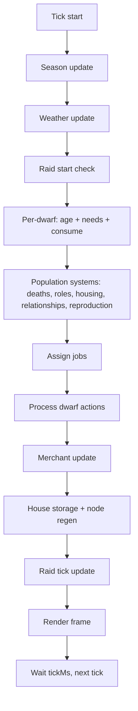

# NodeDwarves Development Manual

Welcome to the codebase my lovely Dwarven Lovers!
This guide explains the architecture, simulation logic, and the most common extension paths.

## 1) Mental model (big picture)

NodeDwarves is a fully autonomous colony simulation that runs in the terminal. Each tick:

1. The **state** is updated (season, weather, raids, population, jobs, movement, etc.).
2. The **renderer** turns state into ASCII + optional colors.
3. The loop repeats at a configurable tick rate.

Everything important is **config-driven** via `config.json`.

## 2) Tick flow (diagram + order)

The tick order in code lives in `src/simulation/index.js`.

**Tick order (short list)**

1. Update **season** (`season.js`).
2. Update **weather** (`weather.js`).
3. Check raid start conditions (`raids.js`).
4. For each dwarf:
   - Age + life stage updates (`population.js`).
   - Needs decay (season/weather modifiers).
   - Consume resources from stockpile when thresholds hit.
5. Handle deaths, roles, housing, relationships, reproduction (`population.js`, `roles.js`).
6. Assign jobs (`jobs.js`).
7. Move and perform actions (`dwarf_actions.js`).
8. Merchant update (`merchant.js`).
9. House storage + node regen (`resources.js`).
10. Raid tick update (`raids.js`).

**Tick flow diagram**



Notes:

- The **render** step happens outside the simulation in `app.js` after `stepState(...)`.
- When you add new systems, decide where they fit in this order.

## 3) Entry points and runtime

- `app.js`
  - Main CLI entrypoint.
  - Loads `config.json`, builds the terminal runtime, creates initial state, and starts the tick loop.
  - Optionally loads an AI policy when `--ai <path>` or env `AI_POLICY` is provided.
- `src/config.js`
  - Thin JSON loader for configuration.
- `src/runtime.js`
  - Calculates grid size, HUD space, frame sizes, and handles terminal resize.
- `src/terminal.js`
  - Low-level terminal helpers (clear screen, move cursor, hide/show cursor).

## 4) State creation and world generation

### Core state builder

- `src/state/index.js`
  - `createInitialState(config, runtime)` builds the state object:
    - `dwarves`, `nodes`, `structures`, `merchant`, `weather`, `raid`, `tools`, etc.
    - `stockpile` initialized from `config.resources.stockpile`.
  - `fitStateToGrid(...)` repositions entities after resize and keeps everything in-bounds.

### Terrain generation

- `src/state/terrain.js`
  - Generates terrain using noise and rules.
  - Supports **coast** and **valley** modes (see `config.display.terrain.mode`).
  - Produces:
    - `types` grid (terrain types)
    - `walkable` map
    - `spawnable` map
  - Valley mode can sprinkle extra ponds (`display.terrain.valley.ponds`) that count as lake water for humidity and gathering.
  - Forest edges near water can be softened with distance jitter and a shoreline buffer via `display.terrain.valley.forest`.
  - Terrain affects movement, spawn rules, and (optionally) resource gathering.

## 5) Simulation systems (what lives in `src/simulation/`)

### Population and life cycle

- `population.js`
  - Aging, life stages, needs, morale, stress.
  - Beer consumption is driven by thirst thresholds and reserve ratios; defaults now drink a bit earlier and grant a stronger high-morale bonus.
  - Housing assignment, couple co-housing, reproduction flow, and death handling.
  - Winter penalties are tied to housing coverage.

### Jobs and economy

- `jobs.js`
  - Computes **shortages** by comparing stockpile vs targets.
  - Creates gather/build/craft/upgrade jobs based on shortages and guardrails.
  - Build jobs can be parallelized with `jobs.buildQueue` while idle builders exist.
  - Supports role-based scheduling (builder/gatherer/manager/brewmaster).
  - Optional AI action weights can bias priority order.

### Dwarf actions

- `dwarf_actions.js`
  - Executes a dwarf's job: move, gather, build, upgrade, craft.
  - Idle behavior (return home, wander around home).
  - Panic logic during raids (run to home or flee).

### Movement and pathing

- `movement.js`
  - Grid-based movement with cooldowns.
  - Two pathing modes: classic detour and potential-field.
  - Terrain can add movement delays.

### Resources and stockpile

- `resources.js`
  - Stockpile target calculation (with per-capita options).
  - Node regeneration (season + weather modifiers).
  - Field irrigation logic based on water stockpile.
  - House storage buffers and decay rules.

### Structures and building

- `structures.js`
  - Structure creation, build jobs, upgrade jobs, placement rules.
  - Houses can have levels and variable capacities.
  - Guardrails are **ratio-based** (important for stability).

### Roles

- `roles.js`
  - Assigns adult dwarves into roles.
  - Supports role switching cooldowns and emergency gather logic.
  - Special handling for brewmaster counts.

### Seasons and weather

- `season.js`
  - Cycles seasons by ticks and applies modifiers.
- `weather.js`
  - Picks weather types by weighted probability + season bias.
  - Weather modifiers affect needs and regen.

### Raids

- `raids.js`
  - Seasonal wildlife raids (optional, config-driven).
  - Spawns beasts, applies deaths and loot loss, and logs events.

### Merchant

- `merchant.js`
  - A simple state machine: idle → entering → trading → exiting.
  - Trades based on surplus/need ratios using resource targets.

### Terrain helpers

- `terrain.js`
  - Walkable/spawnable checks, terrain resource sampling, movement delays.

### Events + randomness

- `events.js` tracks event log lines for the HUD.
- `random.js` provides stable random helpers.

## 6) Rendering system (ASCII + HUD)

Everything under `src/render/` is pure rendering: no simulation changes.

- `render/index.js`
  - Composes header, grid, HUD, footer, and optional frame.
  - Places nodes, structures, dwarves, merchant, and raid beasts on the grid.
  - Selects a stable subset of dwarves to keep the map readable.

- `render/grid.js`
  - Builds the base grid from terrain symbols.
  - River connections use box-drawing symbols.
  - Optional seasonal color overrides.

- `render/hud.js`
  - Builds a multi-column HUD: world, population, housing, defense, structures, stockpile bars.

- `render/legend.js`
  - Footer legend built from `config.json` symbols and resource nodes.

- `render/colors.js` and `render/seasonal_colors.js`
  - Optional ANSI color mapping and seasonal palettes.

## 7) AI and training 🤖

### JS inference

- `src/ai/observation.js`
  - Converts state to observation features (stockpile ratios, node ratios, needs, weather, raids, housing, etc.).
- `src/ai/policy.js`
  - Loads JSON policies (linear or MLP) and outputs action weights.
- `src/ai_policy.js`
  - Thin wrapper used by `app.js`.

### Training bridge

- `ai_server.js`
  - Runs a simulation instance that communicates over stdin/stdout JSON lines.
  - Commands: `reset`, `step`, `close`.
  - Handles scenario overrides, seeded randomness, rewards, and debug payloads.

### Python side

- `python/train.py`
  - PPO training loop (2x128 MLP), logs, checkpoints, and evals.
- `python/agent.py`
  - Example agent showing how to call the server.
- `python/bootstrap.py`
  - Creates a local venv and installs deps.

Policies are saved as JSON in `models/` so JS inference stays dependency-free.

## 8) Configuration (single source of truth)

`config.json` is the master tuning file. Main sections:

- `display`: grid size, HUD, frame, terrain, colors.
- `resources`: stockpile targets, node counts/capacity, regen rates, crafting inputs.
- `structures`: build costs, build ticks, upgrade rules, capacities.
- `population`: needs decay, aging, housing rules, reproduction, roles, pathing.
- `seasons` + `weather`: cycle durations and modifiers.
- `raids`: wildlife raid settings.
- `merchant`: spawn cadence and trade behavior.
- `ai`: runtime policy + training defaults.

See `docs/PARAMETERS.md` for a full reference.

## 9) Role-based guide (choose your lane) 🧭

### Gameplay and features

If you are adding new mechanics, resources, or balancing gameplay:

- Start in `config.json`, then trace into `src/simulation/*`.
- Change **behavior** in `src/simulation/` and **initial conditions** in `src/state/`.
- Keep guardrails ratio-based (stockpile/target), not absolute values.
- Check seasonal and weather modifiers so new features scale naturally.
- If you touch jobs or stockpiles, also update HUD/legend for clarity.

Suggested starting files:

- `src/simulation/index.js`, `src/simulation/jobs.js`, `src/simulation/resources.js`
- `src/state/index.js`, `src/state/terrain.js`

### AI training

If you work on the policy or training loop:

- Feature extraction lives in `src/ai/observation.js`.
- Policy inference lives in `src/ai/policy.js`.
- Training loop and scenario sampling live in `python/train.py`.
- The JS ↔ Python bridge is `ai_server.js`.

Important rule: if you change **resource lists** or **observation features**, you must retrain from scratch with `--fresh` (see `npm run ai:train:fresh`).

### Rendering

If you work on the UI/UX in the terminal:

- `src/render/index.js` orchestrates the frame.
- `src/render/grid.js` handles terrain symbols and colors.
- `src/render/hud.js` is the stats and stockpile bars.
- `src/render/legend.js` maps symbols to labels.

Keep HUD lines short (respect `display.hud.width`) and update legend symbols when adding new entities.

## 10) Adding a new resource (deep dive) ✅

This section is intentionally detailed so adding resources is painless.

### A) Decide the resource ID

- Use `snake_case` (example: `mana_crystal`).
- Keep it consistent across config, simulation, and rendering.

### B) Config changes (required)

**Core resource config** (`config.json`):

- `resources.stockpile.<id>`: initial amount at game start.
- `resources.targets.<id>`: desired stockpile target (used for shortages, merchant, AI).
- `resources.targetsPerCapita.<id>` (optional): target scaling with population.
- `resources.labels.<id>`: HUD label.

**Gathering model** (choose one):

1. **Terrain tiles** (current default)

- Keep `resources.useTerrainTiles: true`.
- Add `resources.terrainAllowed.<id>` with a list of terrain types that yield the resource.
- Make sure `config.display.terrain.symbols` contains symbols for those terrain types.

2. **Discrete nodes**

- Set `resources.useTerrainTiles: false` (or keep true if you only want nodes for some resources and accept terrain for others).
- Add `resources.nodes.<id>`: number of nodes to spawn.
- Add `resources.nodeCapacity.<id>` or rely on `resources.defaultNodeCapacity`.

**Jobs tuning** (optional but recommended):

- `jobs.gatherTicks.<id>`: how long each gather takes.
- `jobs.gatherYield.<id>`: how much is produced per gather.

**Visuals** (highly recommended):

- `symbols.<id>`: symbol used for nodes/legend.
- `display.colors.map.<id>`: ANSI color for the resource symbol in the map and legend (if colors enabled).

### C) Simulation logic (verify impact)

Most resource logic is generic, but check these spots:

- `src/simulation/resources.js`
  - `getGatherTicks`, `getGatherYield` are config-driven.
  - `applyOutputs` applies global multipliers (tools, beer, mithril forge).

- `src/simulation/jobs.js`
  - Shortages are computed from targets and current stockpile.
  - If the resource is **craftable**, add a recipe in `config.recipes.<id>` and ensure a workshop exists.

- `src/simulation/population.js`
  - If the new resource is **consumed** (like food/water/beer), update `consumeResources(...)`.

### D) Rendering & UX

- `src/render/legend.js` uses `resources.nodes` keys for resource legend entries.
  - If your resource is **terrain-based** and mapped to a terrain symbol, it may be omitted from the node legend.
- `src/render/hud.js` lists everything in `state.stockpile`, so adding to `resources.stockpile` is enough to show it.
- If you want special HUD formatting, add it explicitly.

### E) AI and training impact

Training reads resources from:

- `config.resources.targets` (preferred) or
- `config.resources.stockpile` as fallback.

So adding a new resource **changes observation/action sizes**. This means:

- retrain with `npm run ai:train:fresh`
- update any saved policy files in `models/`
- keep `ai.training.trainer.featureNames` stable unless you intentionally add new features

### F) Docs and checklist

Update docs every time you add a resource:

- `docs/PARAMETERS.md`
- `README.md`

Quick checklist:

- [ ] `resources.stockpile`, `resources.targets`, `resources.labels`
- [ ] `resources.terrainAllowed` or `resources.nodes` + `nodeCapacity`
- [ ] `jobs.gatherTicks`, `jobs.gatherYield`
- [ ] `symbols` + `display.colors.map`
- [ ] `tools.applyTo` / `consumption.beerProductionApplyTo` if multipliers should apply
- [ ] `config.recipes` if craftable + verify workshop exists
- [ ] `consumeResources(...)` if it should be edible/drinkable
- [ ] Update docs and retrain AI if needed

## 11) Project layout cheatsheet

- `app.js` → main terminal simulation
- `ai_server.js` → JSON bridge for Python training
- `src/`
  - `simulation/` → game logic
  - `state/` → initial state + terrain generation
  - `render/` → ASCII output
  - `ai/` → observation + policy
  - `runtime.js`, `terminal.js`, `utils.js` → support
- `python/` → PPO training + agent example
- `docs/` → config parameter reference and training override docs
- `models/` → JSON policy checkpoints

## 12) Common workflows

### Run the simulation

```bash
npm start
```

### Run training

```bash
npm run ai:train
```

### Run trained policy

```bash
npm run ai:play
```

(See `README.md` for full command variants.)
