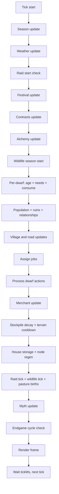

# NodeDwarves Technical Manual ⚙️

This is the technical and gameplay manual for NodeDwarves. `README.md` is a high-level
product overview; this document is the operational runbook for system behavior, execution
flow, and implementation references, with a deterministic-chaos engineering mindset.

## 0) Scope and navigation 🧭

- For running the simulation, controls, and export workflows, see "Operations and workflows".
- For system architecture and execution pipeline order, see "Mental model" and "Tick flow".
- For detailed system behavior (economy, structures, raids, ruins, myths), see "Simulation systems".
- For rendering internals and view-layer constraints, see "Rendering system".
- For policy inference and PPO training details, see "AI and training".
- For config control-plane reference, see "Configuration".
- For deep dives and checklists, see "Adding a new resource" and "Project layout cheatsheet".

## 1) Operations and workflows 🛠️

Use this as the runtime runbook for local dev loops and exports.

### Run the simulation ▶️

```bash
npm start
```

Runtime controls: `Space` pause/resume, `l` legend panel, `i` dwarf inspect panel,
`m` export current map (PNG + SVG), `Shift+M` export map with structures/roads.

### Run training 🏋️

```bash
npm run ai:train
```

Pass extra trainer flags safely through any profile command (for example):

```bash
npm run ai:train:fast -- --fresh
```

### Run trained policy 🧠

```bash
npm run ai:play
```

See "AI and training" below for preset details and evaluation notes.

### Export a map PNG + SVG 🗺️

During gameplay, press `m` to export the current season map. Press `Shift+M`
to include built structures and roads (dwarves are excluded).

```bash
npm run map:export -- --width=120 --height=40 --season=spring
```

All seasons with the same seed:

```bash
npm run map:export:seasons -- --width=120 --height=40 --seed=12345
```

Notes:
- Renders the terrain map only (no HUD or active entities; includes static structures like mines/ruins; frame follows `display.frame.enabled`).
- Outputs to `maps/png` and `maps/svg` by default.
- Uses a fixed terrain palette defined in `scripts/export_map.js` so terminal
  colors remain unchanged.
- If `display.frame.enabled` is true, the export includes the frame; `--width`
  and `--height` still refer to the inner map size (output grows by 2).
- Default export background/foreground are `#24273a` / `#cad3f5` (override with
  `--background`/`--foreground`).
- `--scale` affects PNG output only; SVG is vector.
- Stores metadata in a PNG `tEXt` chunk named `NodeDwarves` with JSON containing
  seed, season info, terrain counts, hashes, and a SHA-256 signature. The SVG
  embeds the same JSON in a `<metadata>` block.
- Uses Puppeteer (headless Chromium) for PNG rendering and SVG font metrics
  (Chromium is downloaded on install unless configured) and picks mid-season
  ticks to avoid transition palettes.
- `--seasonProgress` lets you pick a progress value in `0..1`.
- `--season=all` or `--allSeasons` exports all seasons with the same seed.
- `--count` exports multiple images; with `--seed` it increments from that
  base, otherwise seeds are random.
- When `--name` is used with `--count`, a numeric suffix is appended.
- `--includeStructures` keeps all structures and roads from a snapshot.
- `--state` provides the JSON snapshot file (used by `Shift+M`).

## 2) Mental model (big picture) 🧠

NodeDwarves is a fully autonomous colony simulation that runs in the terminal.
Think of it as a configurable state machine with an ASCII renderer on top. Each tick:

1. The **state** is updated (season, weather, raids, population, jobs, movement, etc.).
2. The **renderer** turns state into ASCII + optional colors.
3. The loop repeats at a configurable tick rate.

Everything important is **config-driven** via `config.json`.

Key concepts:

- **State-first**: the simulation has one authoritative JS world state updated each tick.
- **Config-first**: tunables live in `config.json` (training overrides act as a controlled overlay).
- **Shortage-driven economy**: stockpile ratios behave like a feedback controller for priorities and builds.
- **Soft modifiers**: seasons, weather, clans, ruins, and myths stack as multiplicative layers.
- **Deterministic core**: randomness is localized (weather, raids, ruins) to keep runs comparable for training.

## 3) Tick flow (diagram + order) ⏱️

The tick order in code lives in `src/simulation/index.js` and is the execution contract.

**Tick order (short list)**

1. Update **season** (`season.js`).
2. Update **weather** (`weather.js`).
3. Check raid start conditions (`raids.js`).
4. Update festivals (`festivals.js`).
5. Update contracts (`contracts.js`).
6. Update alchemy rites and backlash (`alchemy.js`).
7. Update wildlife season spawns (`wildlife.js`).
8. For each dwarf:
   - Age + life stage updates (`population.js`).
   - Needs decay (season/weather/myth/alchemy/festival modifiers).
   - Consume resources from stockpile when thresholds hit.
9. Handle deaths, roles, ruins, housing, relationships, reproduction (`population.js`, `roles.js`, `ruins.js`).
10. Village and road updates (`villages.js`, `roads.js`).
11. Assign jobs (`jobs.js`).
12. Move and perform actions (`dwarf_actions.js`).
13. Merchant update (`merchant.js`).
14. Stockpile decay + terrain cooldown tick (`resources.js`, `terrain.js`).
15. House storage + node regen (`resources.js`).
16. Raid tick + wildlife tick + pasture births (`raids.js`, `wildlife.js`).
17. Myth update (`myths.js`).
18. Endgame cycle check (`endgame.js`).

**Tick flow diagram**



Notes:

- The **render** step happens outside the simulation in `app.js` after `stepState(...)`.
- AI actions are sampled in `app.js` every `ai.stepTicks` and passed into the simulation for
  job priorities and festival intent.
- Endgame resets replace the state in place; active myths are cleared, traditions persist.
- When adding new systems, place them intentionally in this order and define which modifiers they must respect.

## 4) Entry points and runtime 🖥️

- `app.js`
  - Main CLI orchestrator and simulation control loop.
  - Loads `config.json`, builds the terminal runtime, creates initial state, and starts the tick loop.
  - Optionally loads an AI policy when `--ai <path>` or env `AI_POLICY` is provided.
  - Tick pacing uses `display.tickMs`; hard stop uses `simulation.maxTicks`.
  - AI action cadence uses `ai.stepTicks` to throttle policy calls.
  - Space toggles pause/resume during the live simulation.
  - Press `i` to open/close the dwarf inspect panel (works during pause or live); use `←`/`→` to browse spawn order.
  - Press `l` to toggle the legend overlay panel (works during pause or live).
  - Press `m` to export a map snapshot (PNG + SVG) using the current season styling.
- `src/config.js`
  - Zero-magic JSON loader for configuration.
- `src/runtime.js`
  - Computes grid/HUD/frame layout and handles terminal resize.
- `src/terminal.js`
  - Low-level terminal I/O helpers (clear screen, move cursor, hide/show cursor).
  - Handles screen clearing and cursor control during live rendering.

## 5) State creation and world generation 🌍

### Core state builder 🧱

- `src/state/index.js`
  - `createInitialState(config, runtime)` builds the authoritative world state:
    - `dwarves`, `nodes`, `structures`, `merchant`, `weather`, `raid`, `tools`, etc.
    - `stockpile` initialized from `config.resources.stockpile`.
    - Initial stockpiles (and optional node counts) can scale with map size via `resources.mapScale`
      using the map grid dimensions as a baseline.
    - Counters and stats used by AI, raids, ruins, myths, alchemy, and endgame cycles.
  - `fitStateToGrid(...)` repositions entities after resize and keeps everything in-bounds.

### Terrain generation 🗺️

- `src/state/terrain.js`
  - Generates terrain using noise and rules.
  - Valley-only terrain generator (see `config.display.terrain.valley.*`).
  - Produces:
    - `types` grid (terrain types)
    - `walkable` map
    - `spawnable` map
  - Valley mode can sprinkle extra ponds (`display.terrain.valley.ponds`) that count as lake water for humidity and gathering.
  - Domain warp, water-distance jitter, and the biome noise mask can break up geometric patterns (`display.terrain.valley.domain_warp`, `display.terrain.valley.water_distance_*`, `display.terrain.valley.biome_noise`).
  - The biome noise mask is a low-frequency field that biases height thresholds, water-distance, and biome noise thresholds so forests/food/pasture do not follow perfectly smooth contours; tune `display.terrain.valley.biome_noise.*`.
  - Macro climate zones add broad wet/dry and rough/soft regions so thresholds vary per area instead of globally (`display.terrain.valley.macro_zones.*`).
  - A curved world spine can raise a long relief band for more iconic mountain/hill silhouettes (`display.terrain.valley.world_spine.*`).
  - Water coverage can be capped with a global budget so rivers stay readable and optional lakes/ponds do not dominate (`display.terrain.valley.water_budget.*`).
  - Forest/food/pasture borders can be lightly eroded/expanded with noise to avoid clean geometric edges (`display.terrain.valley.biome_edge_jitter.*`).
  - Optional `display.terrain.valley.fantasyPreset` applies curated terrain art-direction presets; `natural_epic` is balanced/organic, while `heroic_contrast` pushes stronger landmark silhouettes.
  - Landmark guides can shape a stronger fantasy composition: `landmarks.river_spine` nudges river tracing along an organic corridor, while `landmarks.ridge_mask` lifts and reinforces a mountainous band.
  - `display.terrain.valley.landmark_first` can shift terrain generation to a landmark-led composition pass so rivers/ridges define macro relief before local noise.
  - Default `landmark_first` and `landmark_suitability` values are intentionally moderate to keep maps evocative without destabilizing biome balance.
  - Forest/food/pasture suitability can also consume those landmark masks through `landmark_suitability`, so biome placement follows story landmarks instead of only local noise.
  - `display.terrain.valley.forest.natural_spread` adds a low-frequency inland mask so forests can form organic groves away from water instead of hugging only river/lake corridors.
  - Forest edges near lakes can be softened with distance jitter and shoreline edge noise via `display.terrain.valley.forest`.
  - Valley ponds/fallback lakes can use jagged edges or edge stretch via the `edge_*` lake/pond settings.
  - Pasture patches can be generated via `display.terrain.valley.pasture` and get their own symbol/color.
  - Minimum terrain tile counts (food/pasture/mountain/stone) can be enforced with `display.terrain.minimumTiles`.
  - Ruins placement can reserve spawn terrain via `structures.ruins.minSpawnTiles`.
  - Terrain affects movement, spawn rules, and (optionally) resource gathering.
  - Terrain resources can be harvested directly when `resources.useTerrainTiles` is enabled.
  - Terrain walkability and movement delays are controlled by `display.terrain.walkable.*` and `display.terrain.movementDelay.*`.

## 6) Simulation systems (what lives in `src/simulation/`) ⚙️

These modules are the simulation hot path. Keep logic explicit and complexity predictable.

### Population and life cycle 👥

- `population.js`
  - Ages and life stages from `population.aging` (adult age, fertile range, old age start, max age).
  - Needs decay per tick from `needs.decayPerTick`, scaled by season/weather/housing/myths.
  - Consumption uses `consumption.*` thresholds/relief values for food, water, beer, plus beer reserve logic.
  - Derived mood metrics (morale/stress/fatigue) come from average needs and beer morale boost.
  - Deaths: starvation threshold/ticks and old-age chance from `population.death` and `population.aging`.
  - Housing assignment, couple co-housing, and winter penalties are driven by `population.housing.*`.
  - Relationships/bonding use `population.relationships.*`, with morale and housing multipliers,
    plus optional same-clan bond gain bonuses.
  - Reproduction uses `population.reproduction.*` (base chance, soft cap, gestation, cooldown, stockpile gates, birth cost).

### Clan culture 🛡️

- `clans.js` is the canonical clan utility layer (ids, labels, weighted picks, effects, and share helpers).
  - `clans.enabled=false` hard-disables clan assignment and clan effects.
  - `clans.list` defines valid ids; `clans.labels` only affects display.
  - Spawn distribution is weighted by `clans.distribution.<id>`; if weights are invalid/empty, fallback is uniform.
- Newborn inheritance is deterministic-by-rule, stochastic-by-branch (`population.js`):
  - `clans.inheritance.mode=parent` (default): if both parents have clans, child inherits one parent clan (50/50 when mixed).
  - `clans.inheritance.mode=random`: newborn ignores parents and rolls distribution again.
  - Missing parent clan data falls back to weighted random pick.
- Effects are local to dwarves but consumed by multiple global systems:
  - `jobs.js`: build speed adjustments (`build_ticks_bonus`) before job execution.
  - `dwarf_actions.js`: gather/mine/sawmill output/tick penalties and mine rare-drop chance bonus.
  - `dwarf_actions.js`: build completion can apply extra stone/iron costs (`build_cost_penalty`) if stockpile can pay.
  - `index.js`: storm/cold need-decay mitigation (`storm_cold_need_decay_bonus`) during harsh weather.
  - `raids.js`: adult-population clan share contributes to defense and watchtower kill cap.
  - `ruins.js`: expedition party clan share contributes to hazard reduction and combat power.
- Aggregation model is explicit:
  - Raid modifiers are weighted by adult clan share (`getClanShare`).
  - Ruins modifiers are weighted by expedition party share (`getClanShareByIds`).
  - This keeps effects continuous and avoids hard binary breakpoints.
- Social synergy note:
  - Relationship bonding can receive same-clan bonus via `population.relationships.sameClanBondGainBonus` (config-driven, outside `clans.effects`).
- Visibility and AI:
  - HUD clans block shows per-clan counts with labels.
  - AI observation includes `clanShare_<id>` features, so policy training can adapt to composition changes.

### Jobs and economy 📦

- `jobs.js` is a staged scheduler with strict early exits (first failing gate stops that branch, not the whole tick).
- Worker pool creation:
  - Eligible workers are idle adults and not on expedition.
  - Brewmasters are handled first (unless brewery is paused by food emergency).
- High-level assignment pipeline (in order):
  1. Brewmaster staffing/build.
  2. Manager-managed builds (well/field/watchtower) when manager mode is active.
  3. Forced extra mine queue (if configured and eligible).
  4. General build/upgrade queue (housing, workshops, mines, armory, alchemy lab, etc.).
  5. Continuous structure work slots (mine, sawmill).
  6. Tool upgrade and structure upgrade jobs.
  7. Armory kit production jobs.
  8. Shortage-driven gather/craft/hunt jobs.
- Queue guardrails are explicit and independent:
  - `jobs.buildQueue.maxConcurrent/maxPerTick` for build+upgrade.
  - `jobs.mineQueue.maxConcurrent/maxPerTick` for extra mine expansion.
  - Reserved build positions/structure ids prevent duplicate build/upgrade targeting in the same tick.
- Emergency behavior:
  - Role emergency mode suppresses non-critical build/craft branches.
  - Mines/sawmills/armory/brewery can pause on emergency depending on per-structure flags.
- Shortage scoring model:
  - Target source: `resources.targets` (+ `targetsPerCapita` scaling).
  - Trigger threshold: `effectiveTarget = target * jobs.gatherTriggerRatio`.
  - Missing amount drives base urgency; final priority is `score = shortageRatio * weight`.
  - Weight source: AI action weights (or defaults), with optional dynamic low-stock boosts (`ai.priorityBoosts`).
- Shortage execution model:
  - If resource has active nodes/terrain source -> gather job.
  - If resource is `food` and hunting is enabled/eligible -> hunt job can replace gather.
  - If no direct source and recipe exists -> craft job at available workshop capacity.
- Role-aware assignment:
  - Ordering prefers gatherers first for shortage flow; builders/managers are consumed by earlier branches.
  - `takeIdleDwarf` enforces role preference but gracefully degrades to any idle worker.
- Crafting and kit production:
  - Inputs are reserved at job creation time (not at completion), reducing race conditions.
  - Workshop capacity is tracked from active craft jobs to avoid overbooking.
  - Armory kit output obeys `kitMax`, `kitTicks`, and `kitCost`.
- Integration with other systems:
  - Build costs and ratio guardrails are structure-config-driven (`structures.js` helpers).
  - Gather work/yield also inherits season/weather/myth/morale multipliers via `resources.js`.
  - Job priorities from AI directly steer runtime economy through `action.weights`.

### Dwarf actions ⛏️

- `dwarf_actions.js`
  - Executes a dwarf's job: move, gather, build, upgrade, craft.
  - Gather jobs pull from nodes or terrain tiles; terrain tiles get cooldowns after use.
  - Hunt jobs resolve against wildlife herds with configurable death/penalty risk and food yield.
  - Build/upgrade jobs create or level structures and can spawn well/field nodes.
  - Mine/sawmill/brewery jobs output per tick while staffed; brewery consumes food per tick.
  - Craft/armory jobs apply outputs on completion (after paying inputs).
  - Idle behavior returns home or wanders around the anchor.
  - Panic logic during raids (run to home or flee).

### Movement and pathing 🧭

- `movement.js`
  - Grid-based movement with cooldowns.
  - Pathing mode from `population.pathing.mode`: `detour` or `field`.
  - Detour mode uses stall detection (`stallThreshold`), detour ticks, and local BFS (`bfsRadius`).
  - Field mode builds distance fields (`field.radius`) cached for `field.ttlTicks`.
  - Field step costs weight terrain delay and crowding (`field.terrainWeight`, `field.crowdWeight`),
    plus inertia and stay penalty.
  - Field pathing can optionally bias medium/long trips toward road overlays via
    `population.pathing.field.roadAffinity.*`.
  - Road affinity supports `pragmatic` and `scenic` profiles for lighter vs stronger corridor-following.
  - Terrain movement delays come from `display.terrain.movementDelay.<type>`.

### Resources and stockpile 📊

- `resources.js`
  - Stockpile target calculation (with per-capita options).
  - Stockpile ratios drive shortages, guardrails, and AI signals.
  - Node regeneration uses `resources.nodeRegen.*` scaled by season/weather/myths.
  - Field irrigation scales with water stockpile (`structures.field.irrigationMin/MaxMultiplier`).
  - Terrain gathering uses `resources.useTerrainTiles` and `resources.terrainAllowed`.
  - Terrain cooldowns are controlled by `resources.terrainCooldownTicks` and can be bypassed
    by `resources.terrainCooldownCriticalRatio` during shortages.
  - Pasture stock regrows on a global birth interval via `pasture.birth.*`.
  - House storage buffers use `structures.house.storage.*` (capacity per level, transfer, decay).
  - Stockpile decay per tick uses `resources.decayPerTick`.
  - Output multipliers stack from tools, mithril forge, beer morale, contract boons, ruins bonuses, and alchemy rites/backlash.

### Structures and building 🏗️

- `structures.js`
  - Structure creation, build jobs, upgrade jobs, placement rules.
  - Build costs/ticks live in `structures.<type>.buildCost/buildTicks` (plus upgrade variants).
  - Houses have levels with per-level capacity and optional storage buffers.
  - Wells/fields spawn resource nodes and respect max counts and spacing rules.
  - Industrial buildings can use `structures.<type>.placement.mode = poisson` with `placement.district.*` and `placement.roadAffinity.*` for sampled peripheral placement that also follows organic sectors and road frontage.
  - `placement.nearbySearchRadius` can be lowered for more micro-variation or raised for smoother, cleaner district outlines.
  - Watchtowers provide raid defense and per-tick attacks.
  - Alchemy labs unlock high-risk global rite formulas fueled by rare minerals.
  - Mines/sawmills/breweries scale output by level with exponential upgrade costs.
  - Mine placement respects `buildMinRadius`/`buildOuterBuffer` unless `structures.mine.ignorePeripheralRadius` is enabled.
  - Extra mine builds can be prioritized via `structures.mine.preferExtraAlways`.
  - Guardrails are **ratio-based** (important for stability).

### Villages 🏘️

- `villages.js`
  - Tracks village centers and founding triggers.
  - New villages are founded at population thresholds.
  - New centers must be far enough from existing villages and near required resources.
  - Stockpile remains shared; village centers influence well/field/house placement.

### Roads 🛣️

- `roads.js` runs as a planner + builder pipeline, not an instant path painter.
- Runtime state (`state.roads`) tracks:
  - built tile map (`types`), pending queue (`queue`, `queueIndex`, `planned`)
  - per-link progress (`links`, `tileLinks`, `pending`, `completed`)
  - failure/retry bookkeeping (`failedLinks`, `retryLinks`)
  - primary mine lock (`primaryMineLinkKey`) and build cadence (`nextBuildTick`)
- Planning order is intentionally staged for stable growth:
  1. Plan the primary mine link from V1 to nearest mine.
  2. Until that link is completed (or failed), village inter-links are blocked.
  3. After primary completion, plan `V1 <-> V2`.
  4. If V3 exists, plan `V3 -> nearest(V1,V2)`.
  5. Additional mines link to nearest village center.
- Link construction is incremental:
  - Each successful path is converted into queued tiles with per-tile link ownership.
  - `buildNextRoadTile` consumes one tile at cadence `roads.buildEveryTicks`.
  - Tile build requires both stockpile ratio gate (`roads.buildMinResources`) and tile material cost (`roads.cost.<tileType>`).
  - If tile cost is temporarily unaffordable, tile is requeued instead of abandoning the whole link.
- Pathfinding strategy is multi-pass and deterministic-by-seed:
  - Preferred mode: weighted A* with terrain penalties and style noise (`roads.pathStyle.enabled=true`).
  - Fallback mode: strict BFS if style pathing is disabled.
  - Search passes:
    - primary: hard avoid + soft-avoid treated as blocked
    - fallback: hard avoid only, soft-avoid becomes weighted penalty
    - relaxed: same two modes with smaller parallel-avoid radius when enabled
- Shape controls (`roads.pathStyle.*`):
  - `profile`: `pragmatic` vs `scenic` default bundles.
  - `turnPenalty`, `straightStepThreshold/straightStepPenalty` tune corridor curvature.
  - `noiseScale/noiseWeight` add deterministic low-frequency route variance.
  - `terrainPenalty` adds per-terrain weighted costs.
  - `softAvoidPenalty` discourages but does not hard-block fallback terrains.
- Long-link waypoint system:
  - For long Manhattan distances, candidates are generated near a perpendicular offset corridor.
  - Candidate path must satisfy detour bounds (`maxDetourRatio`, `maxDirectRatio`) and segment minima.
  - Final pick is based on path score and optional curvature/deviation gains (`minTurnGain`, `minLineDeviationGain`, `turnReward`).
- Topology hygiene rules:
  - Anchor snapping (`anchorRadius`) reuses nearby road endpoints near villages/mines.
  - Parallel suppression (`parallelAvoidRadius`) blocks path tiles near existing roads except near start/goal buffers.
  - Optional relax-on-fail (`parallelRelaxOnFail`, `parallelRelaxRadius`) avoids deadlocks in dense maps.
- Terrain and crossings:
  - `avoidTerrain` is always blocked.
  - `softAvoidTerrain` is blocked in primary pass, penalized in fallback.
  - River/water crossings resolve into `bridge`/`ford` by link kind and `roads.crossings.*`.
  - `waterTerrain` forces bridge tile typing when fallback passes through water-like tiles.
- Failure handling:
  - Failed links are marked in `failedLinks` and optionally re-armed via `retryFailedEveryTicks`.
  - Completion pushes an event (`Road completed: ...`) and unlocks dependent planning branches.
- Gameplay note:
  - Roads are currently overlay/visual infrastructure only; movement speed/path costs for dwarves do not yet consume road state directly.

### Roles 👤

- `roles.js`
  - Assigns adult dwarves into roles based on `population.roles.*`.
  - Role switching uses `population.roles.switchCooldownTicks`.
  - Emergency gathering triggers when `population.roles.emergencyMinRatio` is breached for
    `population.roles.emergencyResources`.
  - Special handling for brewmaster counts via `structures.brewery.brewmaster*`.

### Seasons and weather 🌦️

- `season.js` is deterministic and tick-index driven:
  - Season is computed from `state.tick`, `seasons.durationTicks`, and `seasons.order`.
  - No hidden timers: `season.globalIndex`, `season.tickInSeason`, and `season.duration` are recomputed each tick.
  - Modifier access is explicit via `getSeasonModifier(state, key, fallback)`.
- Season modifiers are multiplicative inputs for multiple systems:
  - need decay, gather ticks/yield, craft ticks, node/field regen, reproduction factors.
  - The active season payload is copied into `state.season.modifiers` for cheap lookup.
- `weather.js` is a state machine with weighted resampling:
  - If `ticksRemaining > 0`, weather just counts down.
  - When timer hits 0, next weather type is sampled from `weather.states.*.weight` plus optional `weather.seasonBias.<season>`.
  - Duration is sampled from per-state `durationTicks` or global fallback.
  - Every transition emits an event (`Weather: <Type>`).
- Weather multipliers are split by granularity:
  - scalar modifiers via `getWeatherModifier(..., key, fallback)`.
  - per-need map via `needDecayByNeed` for asymmetric stress (e.g. thirst vs hunger).
- `festivals.js` is season-coupled and AI-intent driven:
  - Trigger source is `action.festivalIntent` normalized against AI weight range.
  - Activation requires all gates: season allowed, window open, cooldown seasons passed, stockpile ratio guardrails, full cost affordability, optional raid lock.
  - Costs are paid up-front once at start (`festivals.costs`).
  - Active festivals apply temporary `effects.*` multipliers until `durationTicks` expires.
  - Start/end events are pushed for HUD observability.
- Festival eligibility is exposed to AI:
  - observation contains `festivalActive`, `festivalTimeLeft`, `festivalEligible`, `festivalCostRatio`.
  - This allows policy to time activation near seasonal windows instead of random triggering.
- Stacking order in the simulation loop:
  - season and weather update first, festival update runs before per-dwarf needs.
  - final need decay multiplier stacks season * weather * housing * endgame difficulty * clan * myths * alchemy * festival.

### Myths (global modifiers) 🗿

- `myths.js` manages a full lifecycle state: `active`, `history`, `traditions`, `counters`, and per-myth cooldown bookkeeping.
- Update sequence per tick:
  1. Expire active myths whose `endsTick` passed.
  2. Convert eligible expired myths into traditions (if enabled/capped).
  3. Evaluate trigger definitions.
  4. Activate newly triggered myths if slot/cooldown constraints pass.
- Trigger families currently supported:
  - `resource_crisis`: low stockpile ratio sustained by ticks and/or repeated season-window hits.
  - `raid_deaths`: per-raid deaths and rolling recent-raid death windows.
  - `ruins_success`: success streak tracking plus optional artifact-immediate trigger.
  - `drought_or_water_crisis`: drought-season hits and/or prolonged low-water ratio.
- Activation guardrails:
  - `myths.maxActive` limits concurrent active myths.
  - `myths.minGapTicks` enforces per-myth retrigger cooldown via `lastTriggerTicks`.
  - Already-active myths never reactivate until expired.
- Effects model:
  - Active myth multipliers come from `definitions.<id>.effects`.
  - Tradition multipliers come from `definitions.<id>.traditionEffects`.
  - `getMythMultiplier` multiplies active and tradition contributions together with caller fallback.
- Expiry and tradition behavior:
  - Myth duration is `durationTicks` (0 means no auto-expiry timer).
  - On expiry, history entry gets `endedTick`; tradition may be added/refreshed.
  - Traditions are capped by `myths.maxTraditions`; oldest is evicted when full.
- Endgame interaction:
  - Active myths and trigger counters are reset on cycle reset.
  - Traditions and bounded history are carried across cycles (`carryMythsAcrossCycle`).
- Observability:
  - Events: `Myth awakened`, `Myth faded`, `Tradition formed`.
  - HUD renders active myths + traditions and an aggregate bonuses line.
  - AI observation includes myth flags and severity metrics, so policy can react to long-tail global states.

### Alchemy lab and pacts ⚗️

- `alchemy.js`
  - Uses a single-slot deterministic state machine: only one rite can be active at a time, then optional backlash, then cooldown (`active -> backlash? -> cooldown -> ready`).
  - Tick order matters: alchemy updates before per-dwarf need decay and before ruins/raid resolution in the same tick, so modifiers apply immediately once a rite starts.
  - Formula selection is deterministic: formulas are sorted by `priority` (desc) then formula id (asc), and the first eligible formula is activated.
  - Eligibility gates are strict and all must pass:
    - required structures (`requiredStructures`, default fallback requires `alchemy_lab`)
    - minimum population (`minPopulation`)
    - optional unresolved-artifact gate (`requiresUnfoundArtifacts`)
    - raid lock (`blockDuringRaid`, default-on unless explicitly `false`)
    - input stockpile availability (`inputs`)
    - stockpile ratio guardrails (`minStockpileRatios.<resource>`)
  - Rite inputs are consumed up-front when activation happens (`inputs` are paid once at start, not per tick).
  - Active modifiers are global and stack multiplicatively with other systems (season/weather/myths/contracts/etc.) through `effects.*`, plus an additive production term via `outputBonus`.
  - Effect keys currently wired:
    - `needDecay` -> per-dwarf need decay
    - `mineRareChance` -> rare mine drop probability
    - `ruinsHazard`, `ruinsArtifactChance` -> expedition failure/artifact roll odds
    - `raidDeathRate`, `raidResourceLoss` -> raid casualties and stockpile loot loss
    - `outputBonus` -> additive contribution to production multiplier (`1 + totalBonus`, clamped)
  - Backlash trigger logic is intentionally delayed: ruins failures are counted during the active window, but backlash is evaluated only when the rite expires (`failuresSinceStart >= failureThreshold`).
  - Backlash phase can do two things:
    - immediate stockpile burn (`resourceLossRatio` over `lossResources`)
    - temporary negative/positive global modifiers (`backlash.effects.*`, `backlash.outputBonus`)
  - Cooldown starts only after the active rite ends, and it ticks down only when no active rite/backlash is running.
  - History/stats are persisted in `state.alchemy`:
    - `stats.activations`, `stats.stableCompletions`, `stats.backlashes`
    - bounded history via `alchemy.historyLimit` (0 = unlimited)
  - HUD status (`src/render/hud.js`) exposes runtime intent clearly:
    - `Alchemy: <label> <ticksLeft>t F<failures>/<threshold>` while active
    - `Alchemy: <backlashLabel> <ticksLeft>t` during backlash
    - `Alchemy: cooldown <ticksLeft>t` during cooldown
  - Endgame reset behavior: alchemy state is recreated on cycle reset (no pact/backlash carry-over between cycles).
  - Build-path note: `structures.js` auto-queues an `alchemy_lab` build only after its own structure and stockpile guardrails are met (`structures.alchemy_lab.requiresStructures`, `buildMinResources`, `buildCost`).
  - Current default epic formula: **Stone Abyss Pact** (`alchemy.formulas.stone_abyss_pact`):
    - active window `220` ticks, cooldown `260` ticks
    - requires `alchemy_lab + mithril_forge + armory + ruins`, `minPopulation=42`, and at least one unfound artifact
    - consumes `mithril 8`, `adamantio 4`, `mana_crystal 4`, `embersteel 2`, `ironshade 2`, `beer 120`
    - active upside: `outputBonus +0.20`, `mineRareChance x1.70`, `ruinsArtifactChance x1.35`
    - active risk: `ruinsHazard x1.18`, `needDecay x1.06`, `raidDeathRate x1.08`, `raidResourceLoss x1.12`
    - backlash trigger: `2` ruins failures during active phase
    - backlash penalty: `280` ticks, immediate `22%` loss on configured resources, `outputBonus -0.35`, harsher needs/raids/ruins, and reduced rare mining (`mineRareChance x0.75`)

### Raids 🐺

- `raids.js` has two phases: `updateRaidStart` (season-edge trigger) and `updateRaidTick` (active raid loop + resolution).
- Start trigger is intentionally narrow:
  - raids only roll on `season.tickInSeason === 1` for allowed `raids.seasonNames`.
  - requires `minTick`, `minPopulation`, and `minSeasonsBetween` since previous raid.
  - final chance is lerped from `raids.chance.min/max` by difficulty.
- Difficulty source:
  - base from `ai.difficulty` (`0..1`), multiplied by `state.endgameDifficulty`, then clamped.
  - This keeps raid pressure scaling with long-cycle progression.
- Active raid state tracks:
  - timer (`ticksRemaining`, `duration`), seasonal metadata, and visual beast positions.
  - beasts move each tick and can be thinned by watchtower attacks.
- Watchtower mitigation (`applyWatchtowerAttacks`):
  - each tower searches nearest beast in range.
  - per-tower hit rolls use `watchtower.raid.hitChance`.
  - max kills per tick is capped and can be increased by clan bonus.
- Raid resolution at timer end:
  - unsheltered dwarves are computed via exact house-position shelter check.
  - deaths are sampled from exposed dwarves only.
  - resource losses are applied by weighted stockpile loss map.
- Casualty/loss formulas are multiplicative stacks:
  - death rate uses difficulty, defense, myths, alchemy, and contract war reduction.
  - loot loss uses difficulty, defense, myths, and alchemy.
  - defense combines adult ratio, tower defense, and clan defense share.
- Stats and events:
  - cumulative: raid count, deaths, and loot totals.
  - per-last-raid: `lastRaidDeaths`, `lastRaidTick`.
  - events include raid start and a compact outcome summary (`slain`, `loot ...`).
- Integration points:
  - myths/alchemy/contract buffs all hook raid formulas through explicit multipliers/reductions.
  - housing quality indirectly drives raid survivability by reducing exposed population.

### Endgame cycles 🔁

- `endgame.js` handles cycle resets as a controlled state replacement, not an incremental cleanup.
- Trigger contract:
  - all configured ruin artifacts must be found.
  - once complete, `endgameArtifactsTick` is latched.
  - reset fires when `tick - endgameArtifactsTick >= minTicksAfterArtifacts` (or immediately if 0).
- Reset execution (`runEndgameReset`):
  - builds a fresh state via `createInitialState`.
  - optionally overrides starting dwarf count with `endgame.resetPopulation`.
  - optionally randomizes terrain seed when transition config requests it.
  - swaps old state in-place with new state object.
- Persisted vs reset data:
  - persisted: `cycleStats.count`, `cycleStats.lastTicks`, myth traditions/history carry-over.
  - reset: terrain, nodes, structures, stockpile, jobs, raid/weather/alchemy/festival runtime state.
  - `endgameArtifactsTick` is cleared after reset.
- Difficulty scaling:
  - per-cycle multiplier from `endgame.difficulty.perCycle`, capped by `maxMultiplier`.
  - cached to `state.endgameDifficulty` each tick and consumed by raid/needs pressure.
- Safety behavior:
  - if artifact condition becomes false before threshold is reached, completion tick is cleared (no stale trigger).
  - reset path is deterministic given config + selected seed policy.
- Transition/UI note:
  - fade/story presentation is configured under `endgame.transition.*` in runtime/render flow.
  - simulation reset logic itself remains isolated in `endgame.js`.

### Ruins and expeditions 🗝️

- `ruins.js`
  - Drives the ruins expedition loop (rooms, hazards, guardians, rewards).
  - Manages expedition cooldowns, casualties, and artifact bonuses.
- Armory kits are crafted in the `armory` structure and consumed per expedition.
- Mithril is only used for late-game expedition reinforcement.
- Preconditions (all must be satisfied before an expedition can start):
  - `ruins.enabled` is true and a `ruins` structure exists on the map.
  - `ruins.expedition.requiresArmory` requires at least one `armory`.
  - At least 1 kit in stockpile (`ruins.expedition.kitResource`).
  - `ruins.expedition.minPopulation` and `ruins.expedition.minIdleAdults` are met.
  - All `ruins.expedition.minStockpileRatio.<resource>` thresholds are met.
  - Room cost (`ruins.rooms[].cost`) is available.
- Party size:
  - Desired size is `ruins.rooms[].partySize`, clamped to `ruins.expedition.partySizeMin/Max`.
  - If idle adults are fewer than `partySizeMin`, no expedition starts.
- Timing:
  - Each room has `ruins.rooms[].expeditionTicks`.
  - Success applies `ruins.expedition.cooldownTicks`; failure applies `ruins.expedition.failureCooldownTicks`.
  - After all rooms are cleared, expeditions repeat the final room to finish artifact collections.
  - Repeatable expeditions can run concurrently (up to `ruins.expedition.maxConcurrentAfterClear`) and
    are limited by idle adults and resource costs rather than cooldowns.
  - Expeditions stop automatically once all artifacts in `ruins.artifacts.pool` are found.
- Guardians and combat:
  - Guardian spawns with `ruins.rooms[].guardianChance`.
  - Combat power is `partySize * (1 + kitPowerBonus + mithrilPowerBonus + combatBonus)`.
  - Guardian is defeated if combat power >= `ruins.rooms[].guardianPower`; otherwise expedition fails.
  - `kitPowerBonus` comes from `ruins.expedition.kitPowerBonus`.
  - `mithrilPowerBonus` applies only if reinforcement is used (see below).
  - `combatBonus` comes from artifacts/set/combos (`ruins.setBonuses` and `ruins.comboBonuses`).
- Hazards:
  - Base failure chance per room is `ruins.rooms[].hazardChance`.
  - Hazard chance is reduced by `hazardReduction` bonuses (from artifacts/combos).
- Mithril reinforcement:
  - Enabled by `ruins.mithrilReinforcement.enabled`.
  - Only available from room index `ruins.mithrilReinforcement.minRoom` (1-based).
  - Consumes `ruins.mithrilReinforcement.cost` and adds `ruins.mithrilReinforcement.powerBonus`.
- Artifacts and drop rates (on successful expedition only):
  - Number of rolls: `ruins.rooms[].artifactRolls`.
  - Per roll chance: `artifactChance + guardianBonus + artifactChanceBonus`.
    - `artifactChance` is `ruins.rooms[].artifactChance`.
    - `guardianBonus` is `ruins.guardians.artifactBonus` (only if a guardian was defeated).
    - `artifactChanceBonus` comes from set/combo bonuses.
  - Each successful roll selects a not-yet-found artifact from `ruins.artifacts.pool` by weight.
  - Found artifacts update set counts (`ruins.artifacts.sets`) and activate bonuses (`ruins.setBonuses`, `ruins.comboBonuses`).
- Failure and casualties:
  - On failure, casualties are randomly selected from the expedition party.
  - Base loss range is `ruins.expedition.failureLossMin/Max`.
  - Losses are reduced by `casualtyReduction` bonuses (from artifacts/combos).

### Merchant 🧳

- `merchant.js` is a four-phase state machine with explicit state persistence:
  - `idle -> entering -> trading -> exiting -> idle`.
  - Spawn timing is pre-scheduled (`nextSpawnTick`) using `merchant.spawnRangeTicks`.
- Spawn/route behavior:
  - Merchant spawns from a random edge side and receives an independent exit side.
  - Stop target prefers a tile adjacent to random house, then falls back to village build spot.
  - Entry/exit movement reuses standard movement helpers (walkable constraints still apply).
- Trading behavior:
  - Trading lasts until `stayTicks` or `tradesRemaining` reaches zero.
  - Each tick in trading phase attempts at most one trade opportunity.
  - Trade search is shortage-aware:
    - pick most under-target resource as `receiveResource`.
    - pick most over-reserve resource (excluding `neverGive`) as `giveResource`.
- Trade sizing:
  - Uses target ratios from `resources.targets`/`targetsPerCapita`.
  - `reserveRatio` blocks giving away resources that are not safely above target.
  - `tradeRate` (default or per-resource) determines give/receive amounts.
  - Minimum transfer quantity is clamped to at least 1 on both sides.
- Accounting and observability:
  - Visit-level trade log tracks pair counts (`A->B xN`) and is summarized on departure.
  - Global stats track total ticks, trade count, cumulative `given`, cumulative `received`.
  - Events announce arrival/departure and short trade summary.
- Design intent:
  - Merchant acts as a soft rebalancer for overstock/shortage cycles without bypassing target logic.
  - `neverGive` protects strategic resources from accidental depletion.

### Contracts 📜

- `contracts.js` runs a timed single-active-contract loop with faction reputation and temporary boons.
- Lifecycle:
  - if active contract exists: check instant fulfillment first, then expiry fail check.
  - if none active and spawn timer elapsed: roll/create next offer.
  - next spawn tick is always rescheduled on completion/failure/no-offer.
- Offer generation:
  - picks one random faction from `contracts.factions`.
  - request resources sampled from `allowedResources`.
  - request count comes from `requestCount.min/max`.
  - per-resource amount is derived from target * sampled `requestRatio`.
  - contract carries `expiresAt`, `requested` map, and per-resource `targetBoosts`.
- Active steering effect:
  - while active, `getContractTargetBoost` inflates stockpile targets for requested resources.
  - this feeds directly into shortage computation/jobs, pushing economy toward fulfillment.
- Completion path:
  - requested resources are consumed immediately.
  - faction reputation increases (`reputation.successDelta`, clamped to min/max).
  - base rewards apply, plus optional faction mineral reward at reputation thresholds.
  - role-based temporary buff is activated (`production` or `war`) for configured duration.
- Failure path:
  - reputation decreases (`reputation.failureDelta`, clamped).
  - no reward and no new buff.
- Buff model:
  - `production` buff -> global output bonus.
  - `war` buff -> raid death-rate reduction + ruins combat bonus.
  - buff expiry is tick-based and checked every update.
- Integration points:
  - jobs/resources consume `targetBoost` while contract is active.
  - production bonus feeds output multipliers in `resources.js`.
  - war bonus is consumed in raid and ruins resolution.
  - high-rep minerals (for example `embersteel`/`ironshade`) feed late-game alchemy recipes.
- Events and UX:
  - offer event summarizes top requested resources.
  - completion/failure events include faction label.
  - boon event prints compact effect summary with remaining ticks.

### Terrain helpers 🧰

- `terrain.js`
  - Walkable/spawnable checks for placement and movement.
  - Terrain resource sampling for gather jobs (when `resources.useTerrainTiles` is enabled).
  - Terrain cooldown tracking per tile after gathering.
  - Resource ratio calculations when terrain tiles are used as sources.
  - Terrain movement delay lookups used by pathing.

### Events + randomness 🎲

- `events.js` tracks event log lines for the HUD (`events.maxEntries`).
  - Systems push concise strings for weather, raids, ruins, builds, and myth changes.
- `random.js` provides random helpers (ranges, shuffling) used across systems.
  - Training/eval can override randomness through scenario config and seed control.

## 7) Rendering system (ASCII + HUD) 🎨

Everything under `src/render/` is view-layer only: no simulation state mutations.

- `render/index.js`
  - Composes header, grid, HUD, footer, and optional frame.
  - Layout sizing uses `display.hud.*`, `display.header.*`, `display.footer.*`, and frame settings.
  - Default layout assumes a 190x60 terminal (columns x rows); adjust `display.width`/`display.height`
    and HUD width if you target a different size.
  - Places nodes, structures, dwarves, merchant, and raid beasts on the grid.
  - Selects a stable subset of dwarves to keep the map readable (`display.dwarves.maxVisible`).
  - Applies the dwarf inspect overlay when `display.inspect_panel.enabled` is true.
  - Applies the map-save confirmation overlay when `display.save_panel.enabled` is true.

- `render/inspect.js`
  - Builds the ASCII inspect panel overlay (box, content, controls) and draws it onto the grid.
  - Panel size is controlled by `display.inspect_panel.width`/`height`.
  - Lore content is deterministic and pulled from `src/dwarf_lore.js` (epithet, title, heraldry, saga).

- `render/legend_panel.js`
  - Builds the legend overlay panel (legend and map key sections) and draws it onto the grid.
  - Panel size is controlled by `display.legend_panel.width`/`height`.

- `render/save_panel.js`
  - Builds the map-export confirmation modal and draws it onto the grid.
  - Panel size is controlled by `display.save_panel.width`/`height`.

- `render/grid.js`
  - Builds the base grid from terrain symbols.
  - River connections use box-drawing symbols and `display.terrain.riverSymbols.*`.
  - Terrain symbol set comes from `display.terrain.symbols.*`.
  - Forest tiles can use a dense symbol for interior tiles, with optional patchy noise via `display.terrain.forestSymbols.*`.
  - Hill tiles can use a pronounced symbol with patchy noise, and can be forced near mountains, via `display.terrain.hillSymbols.*`.
  - Mountain tiles can use medium vs high symbols with patchy noise, and can be forced to medium near hills, via `display.terrain.mountainSymbols.*`.
  - Stone tiles reuse the mountain glyphs and colors in the map render.
  - Dense forest colors are driven by `display.colors.map.terrain_forest_dense*`.
  - Optional seasonal color overrides via `display.colors.seasonal.*`.

- `render/hud.js`
  - Builds a multi-column HUD: world, population, clans, housing, defense, structures, stockpile bars.
  - Column layout uses `display.hud.columns` and `display.hud.columnGap`.
  - Stockpile bars scale with `display.hud.stockBarMax` or resource targets.
  - World HUD includes event stream (`events.maxEntries`) and myth/ruins overlays.
  - World HUD includes the current village count.

- `render/legend.js`
  - Footer controls are built for `Space`, `l`, `i`, and `m`.
  - Legend/map entries are built from `config.json` symbols and resource nodes for the overlay panel.
  - Uses `symbols.*` and `resources.labels.*` for readable names.

- `render/colors.js` and `render/seasonal_colors.js`
  - Optional ANSI color mapping (`display.colors.map`) and seasonal palettes.
  - Seasonal palettes can be per-terrain and per-season with patchy noise transitions.
  - Named seasonal presets can override palette entries at runtime via `display.colors.seasonal.preset` (for example `ice_fantasy` for softer, low-contrast winter tones).
  - Default spring/summer/autumn terrain colors are tuned to softer fantasy shades for readability and reduced eye strain in long runs.
  - Include `food`, `river`, and `lake` in `display.colors.seasonal.types` so winter presets remain coherent across resources and water; hills/mountains/stone are intentionally fixed across seasons.

## 8) AI and training 🤖

### JS inference 🧠

- `src/ai/observation.js`
  - Converts state to observation features (stockpile ratios, node ratios, needs, weather, raids, housing, ruins, myths, festivals).
  - Adds normalized ratios and flags used by the policy feature list.
- `src/ai/policy.js`
  - Loads JSON policies (linear or MLP) and outputs action weights plus festival intent.
  - Feature order is defined by `featureNames`; defaults live in the file.
- `src/ai_policy.js`
  - Thin wrapper used by `app.js`.

### Training bridge 🌉

- `ai_server.js`
  - Runs a simulation instance that communicates over stdin/stdout JSON lines.
  - Commands: `reset`, `step`, `close`.
  - Handles scenario overrides, seeded randomness, rewards, and debug payloads.
  - Supports training overrides and eval overrides (see `docs/TRAINING_OVERRIDES.md`).

### Python side 🐍

- `python/train.py`
  - PPO training loop (2x128 MLP), logs, checkpoints, and evals.
  - Exports JSON weights for JS inference.
- `python/agent.py`
  - Example agent showing how to call the server.
- `python/bootstrap.py`
  - Creates a local venv and installs deps.

Policies are saved as JSON in `models/` so JS inference stays dependency-free.

### Training notes (clans + ruins) 🧪

Clan dynamics add heterogeneity and longer-horizon trade-offs. To keep PPO stable:

- Run longer episodes to span raids and ruins with mixed clan parties.
- Keep eval runs deterministic (fixed seeds) to measure policy robustness.
- Consider a curriculum: start with clans disabled or reduced bonuses, then ramp up.
- Use slightly higher entropy early to explore clan/role/job combinations.
- Observations include clan shares and ruins status (active, cooldown, progress, artifacts); retrain with `--fresh` if you change them.
- Reward shaping can emphasize ruins outcomes via `ai.reward.ruinsSuccess`, `ai.reward.ruinsArtifact`, `ai.reward.ruinsFailure`, and `ai.reward.ruinsRoomClear`, plus festivals via `ai.reward.festival_active`, `ai.reward.festival_start`, and `ai.reward.festival_intent`.

## 9) Configuration (single source of truth) ⚙️

`config.json` is the master control-plane file. Main sections:

- `display`: grid size, HUD, frame, terrain, colors.
- `resources`: stockpile targets, node counts/capacity, regen rates, crafting inputs.
- `structures`: build costs, build ticks, upgrade rules, capacities.
- `population`: needs decay, aging, housing rules, reproduction, roles, pathing.
- `clans`: clan IDs, distributions, inheritance, and per-clan effects.
- `seasons` + `weather`: cycle durations and modifiers.
- `raids`: wildlife raid settings.
- `merchant`: spawn cadence and trade behavior (including `neverGive` exclusions).
- `ai`: runtime policy + training defaults.
- `myths`: global modifier definitions, triggers, caps, and traditions.
- `alchemy`: rite formulas, global modifiers, backlash, and cooldown pacing.

See `docs/PARAMETERS.md` for a full reference.

## 10) Role-based guide (choose your lane) 🧭

Use this section to keep your change-set scoped and avoid cross-system regressions.

### Gameplay and features 🎮

If you are adding new mechanics, resources, or balancing gameplay:

- Start in `config.json`, then trace into `src/simulation/*`.
- Change **behavior** in `src/simulation/` and **initial conditions** in `src/state/`.
- Keep guardrails ratio-based (stockpile/target), not absolute values.
- Check seasonal and weather modifiers so new features scale naturally.
- If you touch jobs or stockpiles, also update HUD/legend for clarity.
- If you add new global modifiers, update myths config + HUD for visibility.

Suggested starting files:

- `src/simulation/index.js`, `src/simulation/jobs.js`, `src/simulation/resources.js`
- `src/state/index.js`, `src/state/terrain.js`

### AI training 🤖

If you work on the policy or training loop:

- Feature extraction lives in `src/ai/observation.js`.
- Policy inference lives in `src/ai/policy.js`.
- Training loop and scenario sampling live in `python/train.py`.
- The JS ↔ Python bridge is `ai_server.js`.

Important rule: if you change **resource lists** or **observation features**, you must retrain from scratch with `--fresh` (for example `npm run ai:train -- --fresh`).

Training presets:

- `ai:train` (alias of `ai:train:fast`) runs a fast baseline loop tuned for sub-5-minute runs (8 workers, 200 episodes, max_steps=1600, step_ticks=2). The difficulty ramp reaches 1.0 by episode 120 and eval runs every 20 episodes at difficulty 1.0, followed by a post-run promotion check comparing the latest policy to the best snapshot.
- `ai:train:fresh` runs the same fast preset but clears existing policy and best-eval snapshots first.
- `ai:train:fast:quality` runs the fast phase plus a short full-sim finetune at max difficulty (40 episodes, max_steps=1800). Eval cadence is 20 episodes in the fast phase and 10 episodes in finetune, with the promotion check after each phase.
- `ai:train:endgame` runs an intermediate endgame-enabled pass (8 episodes, max_steps=2400) with a single eval at the end. It is tuned to improve late-game quality signal while staying much faster than the older 120-episode endgame run.
- `ai:promote:best` runs just the promotion check manually.
- Presets generate a run-specific config in `debug/run_<timestamp>/`, align `ai.training.*Overrides.ai.maxTicks` with `max_steps * step_ticks`, and reuse that same config for `promote_best`.
- All presets save the best model to `models/policy_best.json` (with meta in `models/policy_best.meta.json`) and resume from it unless `--fresh` is used.
- Best-checkpoint writes are explicit in logs: `train.py` prints a colored `[BEST SAVED]` line on eval improvement, and `promote_best.py` prints the same marker when latest is promoted.


### Rendering 🖼️

If you work on the UI/UX in the terminal:

- `src/render/index.js` orchestrates the frame.
- `src/render/grid.js` handles terrain symbols and colors.
- `src/render/hud.js` is the stats and stockpile bars.
- `src/render/legend.js` maps symbols to labels.

Keep HUD lines short (respect `display.hud.width`) and update legend symbols when adding new entities.

## 11) Adding a new resource (deep dive) ✅

This section is intentionally detailed so resource additions stay deterministic and
do not break training contracts.

### A) Decide the resource ID 🏷️

- Use `snake_case` (example: `mana_crystal`).
- Keep it consistent across config, simulation, and rendering.

### B) Config changes (required) ⚙️

**Core resource config** (`config.json`):

- `resources.stockpile.<id>`: initial amount at game start.
- `resources.targets.<id>`: desired stockpile target (used for shortages, merchant, AI).
- `resources.targetsPerCapita.<id>` (optional): target scaling with population.
- `resources.labels.<id>`: HUD label.

**Gathering model** (choose one):

1. **Terrain tiles** (current default)

- Keep `resources.useTerrainTiles: true`.
- Add `resources.terrainAllowed.<id>` with a list of terrain types that yield the resource.
- Make sure `config.display.terrain.symbols` contains symbols for those terrain types.

2. **Discrete nodes**

- Set `resources.useTerrainTiles: false` (or keep true if you only want nodes for some resources and accept terrain for others).
- Add `resources.nodes.<id>`: number of nodes to spawn.
- Add `resources.nodeCapacity.<id>` or rely on `resources.defaultNodeCapacity`.

**Jobs tuning** (optional but recommended):

- `jobs.gatherTicks.<id>`: how long each gather takes.
- `jobs.gatherYield.<id>`: how much is produced per gather.
- `jobs.gatherTriggerRatio.<id>`: multiplier applied to targets when computing shortages.

**Visuals** (highly recommended):

- `symbols.<id>`: symbol used for nodes/legend.
- `display.colors.map.<id>`: ANSI color for the resource symbol in the map and legend (if colors enabled).

### C) Simulation logic (verify impact) 🔍

Most resource logic is generic, but check these spots:

- `src/simulation/resources.js`
  - `getGatherTicks`, `getGatherYield` are config-driven.
  - `applyOutputs` applies global multipliers (tools, beer, mithril forge).

- `src/simulation/jobs.js`
  - Shortages are computed from targets and current stockpile.
  - If the resource is **craftable**, add a recipe in `config.recipes.<id>` and ensure a workshop exists.

- `src/simulation/population.js`
  - If the new resource is **consumed** (like food/water/beer), update `consumeResources(...)`.

### D) Rendering & UX 🖼️

- `src/render/legend.js` uses `resources.nodes` keys for resource legend entries.
  - If your resource is **terrain-based** and mapped to a terrain symbol, it may be omitted from the node legend.
- `src/render/hud.js` lists everything in `state.stockpile`, so adding to `resources.stockpile` is enough to show it.
- If you want special HUD formatting, add it explicitly.

### E) AI and training impact 🤖

Training reads resources from:

- `config.resources.targets` (preferred) or
- `config.resources.stockpile` as fallback.

So adding a new resource **changes observation/action sizes**. This means:

- retrain with `npm run ai:train -- --fresh`
- update any saved policy files in `models/`
- keep `ai.training.trainer.featureNames` stable unless you intentionally add new features

### F) Docs and checklist 📝

Update docs every time you add a resource:

- `docs/PARAMETERS.md`
- `README.md`

Quick checklist:

- [ ] `resources.stockpile`, `resources.targets`, `resources.labels`
- [ ] `resources.terrainAllowed` or `resources.nodes` + `nodeCapacity`
- [ ] `jobs.gatherTicks`, `jobs.gatherYield`
- [ ] `symbols` + `display.colors.map`
- [ ] `tools.applyTo` / `consumption.beerProductionApplyTo` if multipliers should apply
- [ ] `config.recipes` if craftable + verify workshop exists
- [ ] `consumeResources(...)` if it should be edible/drinkable
- [ ] Update docs and retrain AI if needed

## 12) Project layout cheatsheet 🗂️

- `app.js` → main terminal simulation
- `config.json` → single source of truth for gameplay and training tunables
- `ai_server.js` → JSON bridge for Python training
- `src/config.js` → runtime config loader
- `src/`
  - `simulation.js` / `state.js` / `render.js` / `ai_policy.js` → stable wrappers
  - `simulation/` → game logic
    - `simulation/alchemy.js` → alchemy rite lifecycle and modifiers
    - `simulation/contracts.js` → contract offers, reputations, and boons
    - `simulation/roads.js` → road planning/build queue/pathing
    - `simulation/ruins.js` → expeditions, artifacts, and set bonuses
  - `state/` → initial state + terrain generation
  - `render/` → ASCII output
  - `ai/` → observation + policy
  - `runtime.js`, `terminal.js`, `utils.js` → support
- `scripts/train_wrapper.js` → unified safe wrapper for `ai:train:*` profiles
- `scripts/regression.js` → AI regression harness and profile recording
- `scripts/export_map.js` → map export pipeline (PNG + SVG)
- `python/train.py` → PPO trainer and best-checkpoint updates
- `python/promote_best.py` → post-train promotion check (latest vs best)
- `python/bootstrap.py` / `python/agent.py` → venv bootstrap + sample agent
- `docs/PARAMETERS.md` / `docs/TRAINING_OVERRIDES.md` → config and training override references
- `models/` → `policy.json`, `policy_best.json`, `policy_best.meta.json`
