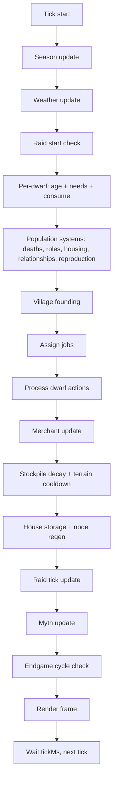

# NodeDwarves Development Manual

Welcome to the codebase my lovely Dwarven Lovers!
This guide explains the architecture, simulation logic, and the most common extension paths.

## 1) Mental model (big picture)

NodeDwarves is a fully autonomous colony simulation that runs in the terminal. Each tick:

1. The **state** is updated (season, weather, raids, population, jobs, movement, etc.).
2. The **renderer** turns state into ASCII + optional colors.
3. The loop repeats at a configurable tick rate.

Everything important is **config-driven** via `config.json`.

Key concepts:

- **State-first**: the entire simulation is a single JS state object updated each tick.
- **Config-first**: all tunables live in `config.json` (with training overrides layered on top).
- **Shortage-driven economy**: stockpile ratios drive priorities, builds, and guardrails.
- **Soft modifiers**: seasons, weather, clans, ruins, and myths apply multipliers instead of new actions.
- **Deterministic core**: randomness is localized (weather, raids, ruins) to keep runs comparable for training.

## 2) Tick flow (diagram + order)

The tick order in code lives in `src/simulation/index.js`.

**Tick order (short list)**

1. Update **season** (`season.js`).
2. Update **weather** (`weather.js`).
3. Check raid start conditions (`raids.js`).
4. For each dwarf:
   - Age + life stage updates (`population.js`).
   - Needs decay (season/weather modifiers).
   - Consume resources from stockpile when thresholds hit.
5. Handle deaths, roles, housing, relationships, reproduction (`population.js`, `roles.js`).
6. Village founding checks (`villages.js`).
7. Assign jobs (`jobs.js`).
8. Move and perform actions (`dwarf_actions.js`).
9. Merchant update (`merchant.js`).
10. Stockpile decay + terrain cooldown tick (`resources.js`, `terrain.js`).
11. House storage + node regen (`resources.js`).
12. Raid tick update (`raids.js`).
13. Myth update (`myths.js`).
14. Endgame cycle check (`endgame.js`).

**Tick flow diagram**



Notes:

- The **render** step happens outside the simulation in `app.js` after `stepState(...)`.
- AI actions are sampled in `app.js` every `ai.stepTicks` and passed into `assignJobs(...)`.
- Endgame resets replace the state in place; active myths are cleared, traditions persist.
- When you add new systems, decide where they fit in this order and which modifiers they should respect.

## 3) Entry points and runtime

- `app.js`
  - Main CLI entrypoint.
  - Loads `config.json`, builds the terminal runtime, creates initial state, and starts the tick loop.
  - Optionally loads an AI policy when `--ai <path>` or env `AI_POLICY` is provided.
  - Tick pacing uses `display.tickMs`; hard stop uses `simulation.maxTicks`.
  - AI action cadence uses `ai.stepTicks` to throttle policy calls.
- `src/config.js`
  - Thin JSON loader for configuration.
- `src/runtime.js`
  - Calculates grid size, HUD space, frame sizes, and handles terminal resize.
- `src/terminal.js`
  - Low-level terminal helpers (clear screen, move cursor, hide/show cursor).
  - Responsible for screen clearing and cursor control during live rendering.

## 4) State creation and world generation

### Core state builder

- `src/state/index.js`
  - `createInitialState(config, runtime)` builds the state object:
    - `dwarves`, `nodes`, `structures`, `merchant`, `weather`, `raid`, `tools`, etc.
    - `stockpile` initialized from `config.resources.stockpile`.
    - Initial stockpiles (and optional node counts) can scale with map size via `resources.mapScale`
      using the map grid dimensions as a baseline.
    - Counters and stats used by AI, raids, ruins, myths, and endgame cycles.
  - `fitStateToGrid(...)` repositions entities after resize and keeps everything in-bounds.

### Terrain generation

- `src/state/terrain.js`
  - Generates terrain using noise and rules.
  - Supports **coast** and **valley** modes (see `config.display.terrain.mode`).
  - Produces:
    - `types` grid (terrain types)
    - `walkable` map
    - `spawnable` map
  - Valley mode can sprinkle extra ponds (`display.terrain.valley.ponds`) that count as lake water for humidity and gathering.
  - Forest edges near water can be softened with distance jitter and a shoreline buffer via `display.terrain.valley.forest`.
  - Pasture patches can be generated via `display.terrain.valley.pasture` and get their own symbol/color.
  - Minimum terrain tile counts (food/pasture/mountain/stone) can be enforced with `display.terrain.minimumTiles`.
  - Ruins placement can reserve spawn terrain via `structures.ruins.minSpawnTiles`.
  - Terrain affects movement, spawn rules, and (optionally) resource gathering.
  - Terrain resources can be harvested directly when `resources.useTerrainTiles` is enabled.
  - Terrain walkability and movement delays are controlled by `display.terrain.walkable.*` and `display.terrain.movementDelay.*`.

## 5) Simulation systems (what lives in `src/simulation/`)

### Population and life cycle

- `population.js`
  - Ages and life stages from `population.aging` (adult age, fertile range, old age start, max age).
  - Needs decay per tick from `needs.decayPerTick`, scaled by season/weather/housing/myths.
  - Consumption uses `consumption.*` thresholds/relief values for food, water, beer, plus beer reserve logic.
  - Derived mood metrics (morale/stress/fatigue) come from average needs and beer morale boost.
  - Deaths: starvation threshold/ticks and old-age chance from `population.death` and `population.aging`.
  - Housing assignment, couple co-housing, and winter penalties are driven by `population.housing.*`.
  - Relationships/bonding use `population.relationships.*`, with morale and housing multipliers,
    plus optional same-clan bond gain bonuses.
  - Reproduction uses `population.reproduction.*` (base chance, soft cap, gestation, cooldown, stockpile gates, birth cost).

### Clan culture

- `clans` config + `src/clans.js` provide clan IDs, labels, and weighted distributions.
  - `clans.enabled` toggles the system; `clans.list` declares available clans.
  - Distribution is weighted by `clans.distribution.<id>` when spawning dwarves.
  - Inheritance uses `clans.inheritance.mode` (parent or random).
- Clan effects are per-dwarf and applied across systems:
  - Gathering/building/mine output or tick modifiers.
  - Raid defense and raid kill caps scaled by adult share.
  - Ruins combat/hazard bonuses scaled by expedition party share.
  - Storm/cold need decay bonuses during harsh weather.
- Build cost penalties (stone/iron) are applied when a build/upgrade job completes and stockpile can cover the extra cost.
- HUD shows clan totals in a dedicated Clans block using `clans.labels` for short names.

### Jobs and economy

- `jobs.js`
  - Computes **shortages** by comparing stockpile vs targets.
  - Shortages use `resources.targets` (+ `resources.targetsPerCapita`) with optional `jobs.gatherTriggerRatio`.
  - Creates gather/build/craft/upgrade jobs based on shortages and guardrails.
  - When wildlife is enabled, food shortages can spawn **hunt** jobs targeting roaming herds.
  - Build jobs are rate-limited by `jobs.buildQueue.maxConcurrent/maxPerTick`.
  - Managed structures (wells/fields/watchtowers) spawn build jobs using stockpile/node ratio thresholds.
  - Housing builds and upgrades respect `population.housing.buildTargetRatio` and `structures.house.upgrade*` rules.
  - Supports role-based scheduling (builder/gatherer/manager/brewmaster).
  - Optional AI action weights can bias priority order and resource focus.

### Dwarf actions

- `dwarf_actions.js`
  - Executes a dwarf's job: move, gather, build, upgrade, craft.
  - Gather jobs pull from nodes or terrain tiles; terrain tiles get cooldowns after use.
  - Hunt jobs resolve against wildlife herds with configurable death/penalty risk and food yield.
  - Build/upgrade jobs create or level structures and can spawn well/field nodes.
  - Mine/sawmill/brewery jobs output per tick while staffed; brewery consumes food per tick.
  - Craft/armory jobs apply outputs on completion (after paying inputs).
  - Idle behavior returns home or wanders around the anchor.
  - Panic logic during raids (run to home or flee).

### Movement and pathing

- `movement.js`
  - Grid-based movement with cooldowns.
  - Pathing mode from `population.pathing.mode`: `detour` or `field`.
  - Detour mode uses stall detection (`stallThreshold`), detour ticks, and local BFS (`bfsRadius`).
  - Field mode builds distance fields (`field.radius`) cached for `field.ttlTicks`.
  - Field step costs weight terrain delay and crowding (`field.terrainWeight`, `field.crowdWeight`),
    plus inertia and stay penalty.
  - Terrain movement delays come from `display.terrain.movementDelay.<type>`.

### Resources and stockpile

- `resources.js`
  - Stockpile target calculation (with per-capita options).
  - Stockpile ratios drive shortages, guardrails, and AI signals.
  - Node regeneration uses `resources.nodeRegen.*` scaled by season/weather/myths.
  - Field irrigation scales with water stockpile (`structures.field.irrigationMin/MaxMultiplier`).
  - Terrain gathering uses `resources.useTerrainTiles` and `resources.terrainAllowed`.
  - Terrain cooldowns are controlled by `resources.terrainCooldownTicks` and can be bypassed
    by `resources.terrainCooldownCriticalRatio` during shortages.
  - Pasture stock regrows on a global birth interval via `pasture.birth.*`.
  - House storage buffers use `structures.house.storage.*` (capacity per level, transfer, decay).
  - Stockpile decay per tick uses `resources.decayPerTick`.
  - Output multipliers stack from tools, mithril forge, beer morale, and ruins bonuses.

### Structures and building

- `structures.js`
  - Structure creation, build jobs, upgrade jobs, placement rules.
  - Build costs/ticks live in `structures.<type>.buildCost/buildTicks` (plus upgrade variants).
  - Houses have levels with per-level capacity and optional storage buffers.
  - Wells/fields spawn resource nodes and respect max counts and spacing rules.
  - Watchtowers provide raid defense and per-tick attacks.
  - Mines/sawmills/breweries scale output by level with exponential upgrade costs.
  - Guardrails are **ratio-based** (important for stability).

### Villages

- `villages.js`
  - Tracks village centers and founding triggers.
  - New villages are founded at population thresholds.
  - New centers must be far enough from existing villages and near required resources.
  - Stockpile remains shared; village centers influence well/field/house placement.

### Roles

- `roles.js`
  - Assigns adult dwarves into roles based on `population.roles.*`.
  - Role switching uses `population.roles.switchCooldownTicks`.
  - Emergency gathering triggers when `population.roles.emergencyMinRatio` is breached for
    `population.roles.emergencyResources`.
  - Special handling for brewmaster counts via `structures.brewery.brewmaster*`.

### Seasons and weather

- `season.js`
  - Cycles seasons using `seasons.order` and `seasons.durationTicks`.
  - Per-season modifiers live in `seasons.modifiers.<season>` (needs, gathering, regen, reproduction, fields).
- `weather.js`
  - Picks weather types by weighted probability + `weather.seasonBias`.
  - Duration is controlled by `weather.durationTicks` or per-state overrides.
  - Weather modifiers affect needs, gathering, node regen, irrigation, and per-need decay.
  - Weather transitions log events for the HUD.

### Myths (global modifiers)

- `myths.js`
  - Tracks global cultural modifiers triggered by repeated crises or successes.
  - Trigger types include resource crises, raid losses, ruins success streaks, and drought/water crises.
  - Effects apply as multipliers on existing systems (needs, gathering, raids, ruins, reproduction).
  - Caps and cooldowns are config-driven (`myths.maxActive`, `myths.minGapTicks`).
  - Myths expire after `durationTicks`; expired myths can become **traditions**.
  - Traditions are weaker, persist across endgame cycles within the same run, and are capped by `myths.maxTraditions`.
  - HUD lists active myths + traditions. A separate "Myth bonuses" line summarizes combined
    deltas and wraps automatically (capped to 2-3 lines depending on HUD width). AI
    observations include myth flags and severity.

### Raids

- `raids.js`
  - Seasonal wildlife raids (optional, config-driven).
  - Start conditions use `raids.seasonNames`, `raids.minTick`, `raids.minPopulation`, and `raids.minSeasonsBetween`.
  - Trigger chance is `raids.chance.min/max`, scaled by difficulty.
  - Beasts are spawned for visuals using `raids.beasts.*`.
  - Defense combines adult ratio, watchtowers, and clan bonuses.
  - Deaths and loot loss scale with difficulty and defense (`raids.deathRate`, `raids.resourceLoss`).
  - Outcomes update raid stats and push HUD events.

### Endgame cycles

- `endgame.js`
  - Resets the simulation after all artifacts are collected and a configurable delay has passed.
  - Trigger uses `endgame.minTicksAfterArtifacts` since the last artifact completion.
  - Resets map, terrain, nodes, structures, and stockpiles.
  - Population resets to `endgame.resetPopulation` if set.
  - Tracks completed cycles and last cycle ticks in `cycleStats`.
  - Difficulty can scale per cycle via `endgame.difficulty.*`.
  - Myths are cleared, but traditions persist across cycles within the same run.

### Ruins and expeditions

- `ruins.js`
  - Drives the ruins expedition loop (rooms, hazards, guardians, rewards).
  - Manages expedition cooldowns, casualties, and artifact bonuses.
- Armory kits are crafted in the `armory` structure and consumed per expedition.
- Mithril is only used for late-game expedition reinforcement.
- Preconditions (all must be satisfied before an expedition can start):
  - `ruins.enabled` is true and a `ruins` structure exists on the map.
  - `ruins.expedition.requiresArmory` requires at least one `armory`.
  - At least 1 kit in stockpile (`ruins.expedition.kitResource`).
  - `ruins.expedition.minPopulation` and `ruins.expedition.minIdleAdults` are met.
  - All `ruins.expedition.minStockpileRatio.<resource>` thresholds are met.
  - Room cost (`ruins.rooms[].cost`) is available.
- Party size:
  - Desired size is `ruins.rooms[].partySize`, clamped to `ruins.expedition.partySizeMin/Max`.
  - If idle adults are fewer than `partySizeMin`, no expedition starts.
- Timing:
  - Each room has `ruins.rooms[].expeditionTicks`.
  - Success applies `ruins.expedition.cooldownTicks`; failure applies `ruins.expedition.failureCooldownTicks`.
  - After all rooms are cleared, expeditions repeat the final room to finish artifact collections.
  - Repeatable expeditions can run concurrently (up to `ruins.expedition.maxConcurrentAfterClear`) and
    are limited by idle adults and resource costs rather than cooldowns.
  - Expeditions stop automatically once all artifacts in `ruins.artifacts.pool` are found.
- Guardians and combat:
  - Guardian spawns with `ruins.rooms[].guardianChance`.
  - Combat power is `partySize * (1 + kitPowerBonus + mithrilPowerBonus + combatBonus)`.
  - Guardian is defeated if combat power >= `ruins.rooms[].guardianPower`; otherwise expedition fails.
  - `kitPowerBonus` comes from `ruins.expedition.kitPowerBonus`.
  - `mithrilPowerBonus` applies only if reinforcement is used (see below).
  - `combatBonus` comes from artifacts/set/combos (`ruins.setBonuses` and `ruins.comboBonuses`).
- Hazards:
  - Base failure chance per room is `ruins.rooms[].hazardChance`.
  - Hazard chance is reduced by `hazardReduction` bonuses (from artifacts/combos).
- Mithril reinforcement:
  - Enabled by `ruins.mithrilReinforcement.enabled`.
  - Only available from room index `ruins.mithrilReinforcement.minRoom` (1-based).
  - Consumes `ruins.mithrilReinforcement.cost` and adds `ruins.mithrilReinforcement.powerBonus`.
- Artifacts and drop rates (on successful expedition only):
  - Number of rolls: `ruins.rooms[].artifactRolls`.
  - Per roll chance: `artifactChance + guardianBonus + artifactChanceBonus`.
    - `artifactChance` is `ruins.rooms[].artifactChance`.
    - `guardianBonus` is `ruins.guardians.artifactBonus` (only if a guardian was defeated).
    - `artifactChanceBonus` comes from set/combo bonuses.
  - Each successful roll selects a not-yet-found artifact from `ruins.artifacts.pool` by weight.
  - Found artifacts update set counts (`ruins.artifacts.sets`) and activate bonuses (`ruins.setBonuses`, `ruins.comboBonuses`).
- Failure and casualties:
  - On failure, casualties are randomly selected from the expedition party.
  - Base loss range is `ruins.expedition.failureLossMin/Max`.
  - Losses are reduced by `casualtyReduction` bonuses (from artifacts/combos).

### Merchant

- `merchant.js`
  - A simple state machine: idle → entering → trading → exiting.
  - Spawn cadence uses `merchant.spawnRangeTicks.min/max`.
  - Visit duration is `merchant.stayTicks`, capped by `merchant.maxTradesPerVisit`.
  - Trades are chosen from stockpile ratios vs targets, respecting `merchant.reserveRatio`.
  - Trade rates come from `merchant.tradeRate` (default + per-resource overrides).
  - `merchant.neverGive` prevents key resources from being traded away.

### Terrain helpers

- `terrain.js`
  - Walkable/spawnable checks for placement and movement.
  - Terrain resource sampling for gather jobs (when `resources.useTerrainTiles` is enabled).
  - Terrain cooldown tracking per tile after gathering.
  - Resource ratio calculations when terrain tiles are used as sources.
  - Terrain movement delay lookups used by pathing.

### Events + randomness

- `events.js` tracks event log lines for the HUD (`events.maxEntries`).
  - Systems push concise strings for weather, raids, ruins, builds, and myth changes.
- `random.js` provides random helpers (ranges, shuffling) used across systems.
  - Training/eval can override randomness through scenario config and seed control.

## 6) Rendering system (ASCII + HUD)

Everything under `src/render/` is pure rendering: no simulation changes.

- `render/index.js`
  - Composes header, grid, HUD, footer, and optional frame.
  - Layout sizing uses `display.hud.*`, `display.header.*`, `display.footer.*`, and frame settings.
  - Default layout assumes a 190x60 terminal (columns x rows); adjust `display.width`/`display.height`
    and HUD width if you target a different size.
  - Places nodes, structures, dwarves, merchant, and raid beasts on the grid.
  - Selects a stable subset of dwarves to keep the map readable (`display.dwarves.maxVisible`).

- `render/grid.js`
  - Builds the base grid from terrain symbols.
  - River connections use box-drawing symbols and `display.terrain.riverSymbols.*`.
  - Terrain symbol set comes from `display.terrain.symbols.*`.
  - Forest tiles can use a dense symbol for interior tiles, with optional patchy noise via `display.terrain.forestSymbols.*`.
  - Hill tiles can use a pronounced symbol with patchy noise, and can be forced near mountains, via `display.terrain.hillSymbols.*`.
  - Mountain tiles can use medium vs high symbols with patchy noise, and can be forced to medium near hills, via `display.terrain.mountainSymbols.*`.
  - Stone tiles reuse the mountain glyphs and colors in the map render.
  - Dense forest colors are driven by `display.colors.map.terrain_forest_dense*`.
  - Optional seasonal color overrides via `display.colors.seasonal.*`.

- `render/hud.js`
  - Builds a multi-column HUD: world, population, clans, housing, defense, structures, stockpile bars.
  - Column layout uses `display.hud.columns` and `display.hud.columnGap`.
  - Stockpile bars scale with `display.hud.stockBarMax` or resource targets.
  - World HUD includes event stream (`events.maxEntries`) and myth/ruins overlays.
  - World HUD includes the current village count.

- `render/legend.js`
  - Footer legend built from `config.json` symbols and resource nodes.
  - Uses `symbols.*` and `resources.labels.*` for readable names.

- `render/colors.js` and `render/seasonal_colors.js`
  - Optional ANSI color mapping (`display.colors.map`) and seasonal palettes.
  - Seasonal palettes can be per-terrain and per-season with patchy noise transitions.

## 7) AI and training 🤖

### JS inference

- `src/ai/observation.js`
  - Converts state to observation features (stockpile ratios, node ratios, needs, weather, raids, housing, ruins, myths).
  - Adds normalized ratios and flags used by the policy feature list.
- `src/ai/policy.js`
  - Loads JSON policies (linear or MLP) and outputs action weights.
  - Feature order is defined by `featureNames`; defaults live in the file.
- `src/ai_policy.js`
  - Thin wrapper used by `app.js`.

### Training bridge

- `ai_server.js`
  - Runs a simulation instance that communicates over stdin/stdout JSON lines.
  - Commands: `reset`, `step`, `close`.
  - Handles scenario overrides, seeded randomness, rewards, and debug payloads.
  - Supports training overrides and eval overrides (see `docs/TRAINING_OVERRIDES.md`).

### Python side

- `python/train.py`
  - PPO training loop (2x128 MLP), logs, checkpoints, and evals.
  - Exports JSON weights for JS inference.
- `python/agent.py`
  - Example agent showing how to call the server.
- `python/bootstrap.py`
  - Creates a local venv and installs deps.

Policies are saved as JSON in `models/` so JS inference stays dependency-free.

Training device selection:

- `ai.training.trainer.device` selects the PPO device (`auto`, `cpu`, or `cuda[:index]`). `auto` uses CUDA when available and falls back to CPU.
- `ai.training.trainer.workerDevice` selects the rollout worker device (default `cpu`). Keep workers on CPU to avoid GPU contention unless you explicitly want GPU rollouts.
- CLI overrides are supported: `python3 python/train.py --device cuda --worker-device cpu`.

### Training notes (clans + ruins)

Clan dynamics add heterogeneity and longer-horizon trade-offs. To keep PPO stable:

- Run longer episodes to span raids and ruins with mixed clan parties.
- Keep eval runs deterministic (fixed seeds) to measure policy robustness.
- Consider a curriculum: start with clans disabled or reduced bonuses, then ramp up.
- Use slightly higher entropy early to explore clan/role/job combinations.
- Observations include clan shares and ruins status (active, cooldown, progress, artifacts); retrain with `--fresh` if you change them.
- Reward shaping can emphasize ruins outcomes via `ai.reward.ruinsSuccess`, `ai.reward.ruinsArtifact`, `ai.reward.ruinsFailure`, and `ai.reward.ruinsRoomClear`.

## 8) Configuration (single source of truth)

`config.json` is the master tuning file. Main sections:

- `display`: grid size, HUD, frame, terrain, colors.
- `resources`: stockpile targets, node counts/capacity, regen rates, crafting inputs.
- `structures`: build costs, build ticks, upgrade rules, capacities.
- `population`: needs decay, aging, housing rules, reproduction, roles, pathing.
- `clans`: clan IDs, distributions, inheritance, and per-clan effects.
- `seasons` + `weather`: cycle durations and modifiers.
- `raids`: wildlife raid settings.
- `merchant`: spawn cadence and trade behavior (including `neverGive` exclusions).
- `ai`: runtime policy + training defaults.
- `myths`: global modifier definitions, triggers, caps, and traditions.

See `docs/PARAMETERS.md` for a full reference.

## 9) Role-based guide (choose your lane) 🧭

### Gameplay and features

If you are adding new mechanics, resources, or balancing gameplay:

- Start in `config.json`, then trace into `src/simulation/*`.
- Change **behavior** in `src/simulation/` and **initial conditions** in `src/state/`.
- Keep guardrails ratio-based (stockpile/target), not absolute values.
- Check seasonal and weather modifiers so new features scale naturally.
- If you touch jobs or stockpiles, also update HUD/legend for clarity.
- If you add new global modifiers, update myths config + HUD for visibility.

Suggested starting files:

- `src/simulation/index.js`, `src/simulation/jobs.js`, `src/simulation/resources.js`
- `src/state/index.js`, `src/state/terrain.js`

### AI training

If you work on the policy or training loop:

- Feature extraction lives in `src/ai/observation.js`.
- Policy inference lives in `src/ai/policy.js`.
- Training loop and scenario sampling live in `python/train.py`.
- The JS ↔ Python bridge is `ai_server.js`.

Important rule: if you change **resource lists** or **observation features**, you must retrain from scratch with `--fresh` (for example `npm run ai:train -- --fresh`).

Training presets:

- `ai:train` (alias of `ai:train:fast`) runs a fast baseline loop (8 workers, step_ticks=2) with an accelerated difficulty ramp.
- `ai:train:fast:quality` runs the fast phase plus a short full-sim finetune at max difficulty.
- `ai:train:fast:endgame` runs full-sim at fixed max difficulty with a long-horizon setup to stress-test late-game survival.
- All presets save the best model to `models/policy_best.json` (with meta in `models/policy_best.meta.json`) and resume from it unless `--fresh` is used.


### Rendering

If you work on the UI/UX in the terminal:

- `src/render/index.js` orchestrates the frame.
- `src/render/grid.js` handles terrain symbols and colors.
- `src/render/hud.js` is the stats and stockpile bars.
- `src/render/legend.js` maps symbols to labels.

Keep HUD lines short (respect `display.hud.width`) and update legend symbols when adding new entities.

## 10) Adding a new resource (deep dive) ✅

This section is intentionally detailed so adding resources is painless.

### A) Decide the resource ID

- Use `snake_case` (example: `mana_crystal`).
- Keep it consistent across config, simulation, and rendering.

### B) Config changes (required)

**Core resource config** (`config.json`):

- `resources.stockpile.<id>`: initial amount at game start.
- `resources.targets.<id>`: desired stockpile target (used for shortages, merchant, AI).
- `resources.targetsPerCapita.<id>` (optional): target scaling with population.
- `resources.labels.<id>`: HUD label.

**Gathering model** (choose one):

1. **Terrain tiles** (current default)

- Keep `resources.useTerrainTiles: true`.
- Add `resources.terrainAllowed.<id>` with a list of terrain types that yield the resource.
- Make sure `config.display.terrain.symbols` contains symbols for those terrain types.

2. **Discrete nodes**

- Set `resources.useTerrainTiles: false` (or keep true if you only want nodes for some resources and accept terrain for others).
- Add `resources.nodes.<id>`: number of nodes to spawn.
- Add `resources.nodeCapacity.<id>` or rely on `resources.defaultNodeCapacity`.

**Jobs tuning** (optional but recommended):

- `jobs.gatherTicks.<id>`: how long each gather takes.
- `jobs.gatherYield.<id>`: how much is produced per gather.
- `jobs.gatherTriggerRatio.<id>`: multiplier applied to targets when computing shortages.

**Visuals** (highly recommended):

- `symbols.<id>`: symbol used for nodes/legend.
- `display.colors.map.<id>`: ANSI color for the resource symbol in the map and legend (if colors enabled).

### C) Simulation logic (verify impact)

Most resource logic is generic, but check these spots:

- `src/simulation/resources.js`
  - `getGatherTicks`, `getGatherYield` are config-driven.
  - `applyOutputs` applies global multipliers (tools, beer, mithril forge).

- `src/simulation/jobs.js`
  - Shortages are computed from targets and current stockpile.
  - If the resource is **craftable**, add a recipe in `config.recipes.<id>` and ensure a workshop exists.

- `src/simulation/population.js`
  - If the new resource is **consumed** (like food/water/beer), update `consumeResources(...)`.

### D) Rendering & UX

- `src/render/legend.js` uses `resources.nodes` keys for resource legend entries.
  - If your resource is **terrain-based** and mapped to a terrain symbol, it may be omitted from the node legend.
- `src/render/hud.js` lists everything in `state.stockpile`, so adding to `resources.stockpile` is enough to show it.
- If you want special HUD formatting, add it explicitly.

### E) AI and training impact

Training reads resources from:

- `config.resources.targets` (preferred) or
- `config.resources.stockpile` as fallback.

So adding a new resource **changes observation/action sizes**. This means:

- retrain with `npm run ai:train -- --fresh`
- update any saved policy files in `models/`
- keep `ai.training.trainer.featureNames` stable unless you intentionally add new features

### F) Docs and checklist

Update docs every time you add a resource:

- `docs/PARAMETERS.md`
- `README.md`

Quick checklist:

- [ ] `resources.stockpile`, `resources.targets`, `resources.labels`
- [ ] `resources.terrainAllowed` or `resources.nodes` + `nodeCapacity`
- [ ] `jobs.gatherTicks`, `jobs.gatherYield`
- [ ] `symbols` + `display.colors.map`
- [ ] `tools.applyTo` / `consumption.beerProductionApplyTo` if multipliers should apply
- [ ] `config.recipes` if craftable + verify workshop exists
- [ ] `consumeResources(...)` if it should be edible/drinkable
- [ ] Update docs and retrain AI if needed

## 11) Project layout cheatsheet

- `app.js` → main terminal simulation
- `ai_server.js` → JSON bridge for Python training
- `src/`
  - `simulation/` → game logic
  - `state/` → initial state + terrain generation
  - `render/` → ASCII output
  - `ai/` → observation + policy
  - `runtime.js`, `terminal.js`, `utils.js` → support
- `python/` → PPO training + agent example
- `docs/` → config parameter reference and training override docs
- `models/` → JSON policy checkpoints

## 12) Common workflows

### Run the simulation

```bash
npm start
```

### Run training

```bash
npm run ai:train
```

For Colab-based runs, use `colab/nodeDwarves_training.ipynb` to clone/pull,
check Torch/Numpy, run `npm run ai:train:python:fresh`, and save outputs to
Google Drive.

### Run trained policy

```bash
npm run ai:play
```

(See `README.md` for full command variants.)
