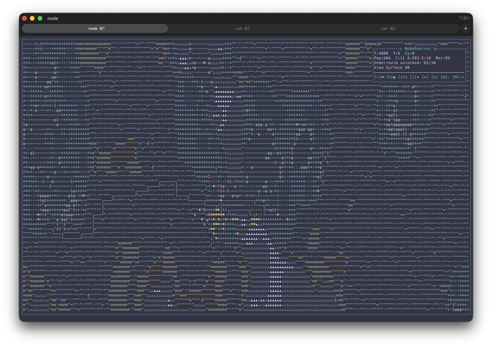
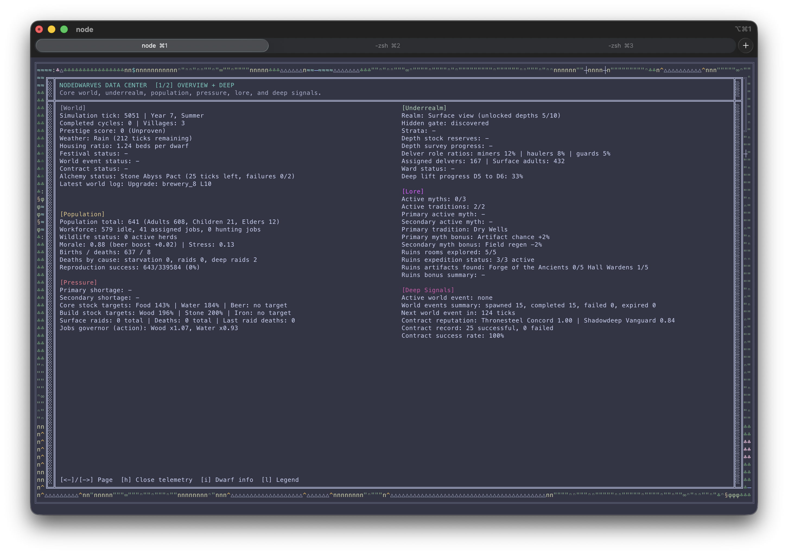
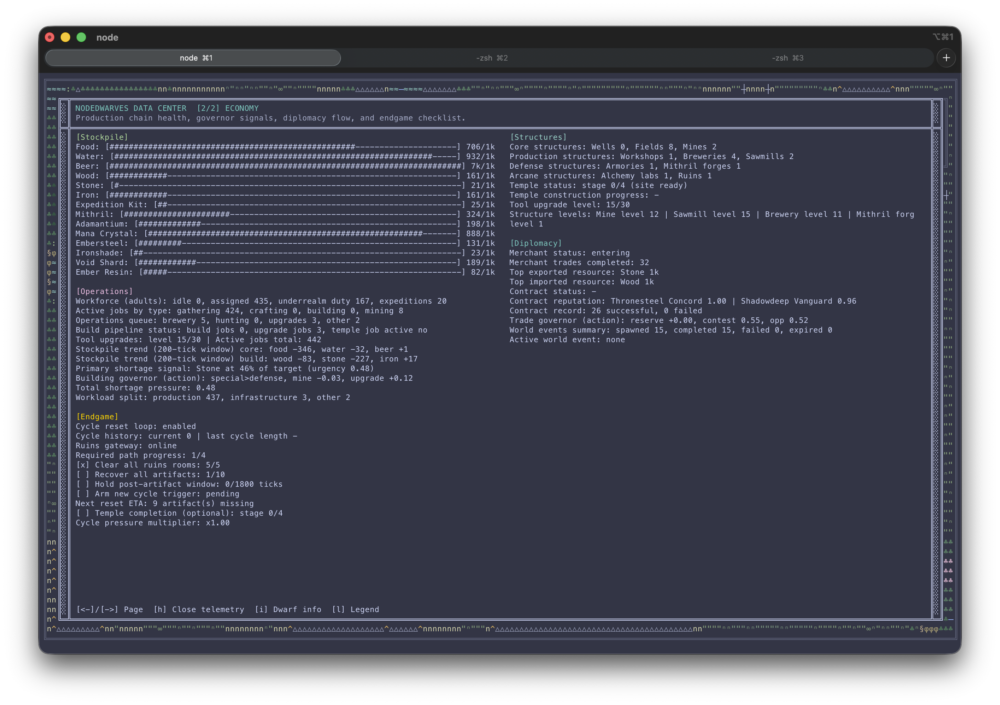

# NodeDwarves 🛠️

NodeDwarves is an autonomous ASCII dwarf-colony simulator that runs entirely in your terminal.
Start a run, watch the settlement react to shortages and crises, and tune the system like a tiny living lab. 🍺⛏️
Chaos, strategy, and tiny bearded logistics experts included. 🧔🧱

## Screenshots 📸





## Highlights ✨

- 🧠 Fully autonomous colony sim: no micromanagement after launch.
- ⛏️ Multi-layer economy with gathering, structures, shortages, and recovery loops.
- 🌦️ Seasons, weather, festivals, raids, and world events that shift priorities.
- 🤝 External camps, diplomacy pressure, contracts, and faction trade opportunities.
- 🎭 Social drama + schism systems for long-horizon political and morale instability.
- 🕳️ Underrealm exploration with depth progression, combat pressure, and endgame cadence.
- 🏅 Warrior League with hero progression, tournaments, injuries, and lineage memory.
- 🌤️ In-map Ops Snapshot shows a live weather token (`Wx:*`, e.g. `Clear`, `Rain`, `Storm`) for at-a-glance climate context.
- 📊 In-game Data Center (`h`) with dashboard, deep economy views, and AI explainability.
- 🤖 PPO training pipeline in Python with JS runtime inference (`models/*.json`).
- 🧪 Deterministic benchmark/regression tooling with cached baseline comparison.

## Quick Start 🚀

```bash
npm install
npm start
```

Run with the best trained policy (if available):

```bash
npm run ai:play
```

## Controls 🎮

- ⏯️ `Space`: pause/resume
- 🗺️ `l`: legend
- 🔍 `i`: dwarf inspect panel
- ⚔️ `w`: Warrior League modal
- 📡 `h`: telemetry Data Center
- 🧾 `e`: Event Log modal
- 🔁 `f`: switch Event Log filter
- ↔️ `←` / `→`: switch telemetry pages (or browse context-specific panels)
- ↕️ `↑` / `↓`: change map depth view (or scroll Event Log)
- 🖼️ `m`: export unlocked layers (PNG + SVG)
- 🏗️ `Shift+M`: export unlocked layers with structures/roads

## AI Training (Optional) 🤖

Bootstrap once, then train/play:

```bash
npm run ai:bootstrap
npm run ai:train
npm run ai:play
```

Quality-oriented loop and acceptance gate:

```bash
npm run ai:train:m4
npm run ai:train -- quality
npm run ai:validate
npm run test:narrative
npm test
```

`test:narrative` runs the fast structured-event contract gate in isolation. `npm test` runs both the
narrative and training/validation contract suites.

`ai:train:m4` is the direct shortcut for the `m4-balanced` profile. The generic
`ai:train` command accepts the wrapper profile after `--`: `fast` (default), `quality`,
`quality-mixed`, `m4-balanced`, `full`, `endgame`, or `benchmark`. The
`m4-balanced` profile is the sustainable speed/quality preset for a 10-core,
16 GB Apple M4: quality-mixed foundation/finetune, a dedicated 20,000-tick
endgame specialization phase, `5→4→3` workers, sparse intermediate evaluation,
and one guarded final canonical check. Add `--fresh` after the profile when
observation or action contracts change.

For full profiles, continuous training cadence, and override strategy, use:
- 📘 `MANUAL.md`
- 🧩 `docs/TRAINING_OVERRIDES.md`
- ✅ `docs/TRAINING_STATUS.md`

## Balance & Benchmark Workflow ⚖️

Keep tuning deterministic and comparable:

```bash
npm run bench:ensure-baseline
npm run bench:candidate -- --set path=value
npm run bench:diff
```

Long-running and weekly checks:

```bash
npm run ai:train:continuous
npm run ai:validate
npm run ai:validate:weekly
npm run debug:clean
```

## Documentation 📚

- 📘 `MANUAL.md`: technical runbook (systems, runtime flow, operations).
- ⚙️ `docs/PARAMETERS.md`: complete config parameter reference.
- 🧩 `docs/TRAINING_OVERRIDES.md`: training override guide.
- ✅ `docs/TRAINING_STATUS.md`: current quality status and validation cadence.
- 🧪 `docs/TRAINING_OPTIMIZATION_WORKBOOK.md`: optimization timeline and decisions.
- 📜 `docs/EPIC_EVOLUTION_WORKBOOK.md`: step-by-step roadmap and progress tracker for the living-chronicle evolution.
- 🧬 `docs/NARRATIVE_EVENT_CONTRACT.md`: versioned facts, deterministic event identity, and bounded-history rules for the living chronicle.
- 📡 `docs/TELEMETRY.md`: telemetry operator guide.
- 🤖 `AGENTS.md`: contributor implementation guidelines.

## Project Layout (High Level) 🧱

- 🚀 `app.js`: simulation entrypoint and loop.
- 🎛️ `config.json`: single source of truth for tuning knobs.
- 🌉 `ai_server.js`: JS inference bridge used by training/eval tooling.
- 🧭 `src/config.js`: config loader.
- ⚙️ `src/simulation/`: core simulation systems (economy, events, underrealm, schism, social drama, warriors, temple).
- 🧬 `src/simulation/narrative_contract.js`: strict narrative-event validation and deterministic identity helpers.
- 🌍 `src/state/`: world/terrain and initial state generation.
- 🎨 `src/render/`: map, overlays, panels, and layout helpers.
- 📊 `src/telemetry/`: Data Center sections and metric builders.
- 🧠 `src/ai/`: observation and policy helpers.
- 🛠️ `scripts/`: benchmarking, regression, validation orchestration, narrative contracts, export, cleanup.
- 🧪 `scripts/test_narrative_contracts.js`: fast executable gate for the living-chronicle event contract.
- 🐍 `python/`: PPO training and rollout tooling.
- 🗂️ `benchmark_cache/`: cached deterministic benchmark baseline.
- 📦 `regression/baselines/`: durable regression reference profiles.
- 📚 `docs/`: manuals, tuning references, the Epic Evolution workbook, and the narrative event contract.

## Contributing 🤝

PRs are welcome for simulation design, AI quality, and terminal UX.
Start with `AGENTS.md` + `MANUAL.md` for implementation standards and workflows.

## License 📄

MIT
