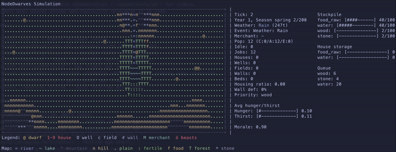

# NodeDwarves

An autonomous, gamey dwarf colony simulation that lives entirely in your terminal.
No player input after launch: the colony gathers, adapts, and tries to keep itself
alive while you watch the chaos unfold in ASCII.

## Index

- [Highlights](#highlights-)
- [Simulation overview](#simulation-overview-)
- [Job system and priorities](#job-system-and-priorities-)
- [Quick start](#quick-start-)
- [AI mode (Python)](#ai-mode-python-)
- [Configuration](#configuration-)
- [Scenario presets (training)](#scenario-presets-training-)
- [Roadmap](#roadmap-)
- [ASCII legend](#ascii-legend-)
- [Project layout](#project-layout-)

## Highlights ✨

- 🧠 Fully autonomous simulation with a real-time ASCII renderer.
- 🧺 Resource economy with food, water, beer, wood, stone, iron, mithril, adamantium, and mana crystal.
- 🏘️ Village growth: houses (beds), wells (water nodes), fields (food nodes), breweries (beer), sawmills (wood), workshops (tools), mithril forges (global output boost), mines (iron/stone + rare drops).
- ❄️ Seasons + housing effects (bonding, winter penalties).
- 🌦️ Dynamic weather cycle that reshapes needs, gathering, and regeneration.
- 🎓 PPO training in Python with JS-only inference.
- 🧱 Modular architecture (simulation, state, render, AI) for easier iteration.

## Screenshot - How it looks 📸



## Simulation overview 🗺️

- 🗺️ The world is a fixed-size ASCII grid with resource nodes, structures, and dwarves.
- 🌍 The map renders a randomized terrain backdrop (coast/valley modes) with CP437-friendly symbols.
- 🌊 River tiles render with curved box-drawing symbols and can originate from multiple map edges.
- 🌲 Forest patches spread beyond water corridors via humidity diffusion for more varied biomes.
- 🌾 Plains render as a weighted mix of CP437 glyphs for subtle texture.
- 🧺 Food tiles are guaranteed to appear near water to avoid barren starts.
- ⏱️ Each tick:
  1. Dwarves accumulate needs (hunger, thirst).
  2. Resources are consumed when needs cross thresholds.
  3. Shortages are computed vs target stockpile levels (optionally scaled per population).
  4. Jobs are assigned based on the largest shortages.
  5. Dwarves move to targets, work, and update stockpiles.
- ♻️ Resource nodes have finite capacity and regenerate slowly.
- 🌾 Fields regenerate based on water availability and seasonal limits.
- 🌤️ Seasons apply modifiers to needs, gather speed, regen, and reproduction.
- 🌧️ Weather cycles (clear, rain, storm, drought, cold) add extra modifiers.
- 👪 Population is dynamic: dwarves age, form bonds, reproduce with gestation, and can die.
- 🪵🪨 Wood and stone build clustered villages (center-out placement).
- 🛏️ Housing provides beds; insufficient shelter slows bonding and makes winter harsher.
- 🧳 A roaming merchant visits periodically, trades surplus for scarce resources, then leaves.
- 🚰 Wells and 🌾 fields use Poisson-style spacing across the map, respecting terrain and distance from the core.
- 📊 HUD shows averages, bars, priorities, and counts for wells/fields.
- 🖼️ The map renders with a framed border for clearer navigation.
- 🧭 Terrain adds visual texture (coast, lakes, rivers); walkability and movement delay are configurable per terrain.
- 🧭 Dwarves use configurable pathing with potential-field variation for more organic routes.
- 🧩 Resources can come from nodes or from terrain tiles (configurable).

## Job system and priorities ⚙️

- 🧭 Shortages are sorted by severity (missing/target ratio).
- ⛏️ If a resource has nodes on the map, a gather job is created.
- 🧪 Crafting is optional: it activates when recipes/workshops exist and roles are disabled.
- 🏠 House build/upgrade jobs spawn when housing is below target ratio and stockpiles meet guardrails.
- 💧 Wells are built when water stocks or water node reserves dip below thresholds.
- 🌱 Fields are built when food stocks or food node reserves dip below thresholds and baseline stockpiles are safe.
- 🪚 Sawmills convert stone + iron investment into steady wood output.
- 🍺 Breweries convert food into beer with a dedicated brewmaster; upgrades boost output while reducing food cost. Brewing can pause when food is critically low, and beer consumption can add a production bonus across resources.
- 🛠️ Workshops unlock tool upgrades that boost all gathering yields, including mines.
- 🔥 Mithril forges provide a global output multiplier that scales by level; late-game upgrades require rare minerals.
- ⛏️ Mines and 🪚 sawmills can be upgraded to level 10 for higher output (exponential cost/bonus).
- ⛏️ Mines are built on mountain terrain when none exist, and miners output iron + stone per tick plus rare minerals from level 5+.
- 🧑‍🏭 Roles (builder/gatherer) can be enabled to keep building stable during shortages.
- 🧱 Manager builders handle watchtowers, wells, and fields using stockpile-based thresholds.
- 🧭 Idle dwarves take short waypoint strolls around home (or their current spot) with brief pauses.

## Quick start 🚀

Make sure you have Node.js and Python 3 installed.

```bash
npm install
npm start
```

## AI mode (Python) 🤖

The AI lives in Python (PyTorch PPO) and talks to the simulation over
stdin/stdout JSON lines. Training uses a 2x128 MLP and exports JSON weights
so inference stays in JS.

Bootstrap the Python venv + deps (recommended once) 🧪:

```bash
npm run ai:bootstrap
```

Run training 🧑‍🏫:

```bash
npm run ai:train

npm run ai:train -- --episodes 5000

npm run ai:train:combo

npm run ai:train:finetune

```

You can stop training with Ctrl+C to terminate the run.

`ai:train:combo` runs a speed-first training loop and then a short fine-tuning pass
(`--full-sim`) with lower learning rate/entropy settings. The combo script trades
off quality for wall-clock speed (fewer episodes/steps, debug off). Eval runs only
in the finetune phase to refresh the best snapshot.

`ai:train:finetune` runs a short full-sim fine-tuning pass with a lower learning
rate and entropy to close the gap with eval/full_sim.

Use `ai:train:combo:fresh` to force a fresh start for the fast phase:

```bash
npm run ai:train:combo:fresh
```

If you change resources or action space, reset the policy files ♻️:

```bash
npm run ai:train:fresh
```

Run the visual simulation with the trained policy 🕹️:

```bash
npm run ai:play
```

Record a regression baseline snapshot 🧪:

```bash
npm run ai:regression:record
```

Use a custom profile name with `-- --profile <name>` if you want multiple baselines.

The training loop saves a PPO policy to the path in
`ai.training.trainer.modelPath` (default `models/policy.json`). The best-eval
snapshot is saved to `ai.training.trainer.bestModelPath` (default
`models/policy_best.json`) and its score is tracked in
`ai.training.trainer.bestModelMetaPath` (default `models/policy_best.meta.json`).
Training is incremental by default when `ai.training.trainer.resumeFromBest` is
enabled. Console logs stay compact, while a summary log is written to
`debug/run_*/summary.log` every 500 episodes (one line per window) with a legend.
Detailed snapshots are written to `debug/run_*/detail_ep*.log` only on notable
events (best eval, eval regression, scenario shift).
If you change observation features (via `ai.training.trainer.featureNames`),
training must restart with `--fresh`.
Observation features live in `src/ai/observation.js`, and policy inference lives
in `src/ai/policy.js`.

## Configuration 🧰

All core knobs live in `config.json`. The training loop reads defaults from
`ai.training.trainer` and CLI flags can override any of them.

See [Parameter reference](docs/PARAMETERS.md).

### Wildlife raids 🐺

Seasonal wildlife raids are optional chaos events. When active, dwarves
panic and run home; only exposed dwarves (not inside their house tile) can be
killed, and raids steal stockpile resources scaled by exposed fraction.

- `raids.enabled`: master switch (default false).
- `raids.seasonNames`: seasons eligible for raids (default spring/autumn).
- `raids.durationTicks`: raid duration in ticks (default 100).
- `raids.chance.min/max`: per-season trigger probability range (0..1).
- `raids.minPopulation`, `raids.minTick`: guardrails to avoid early wipes.
- `raids.deathRate.min/max`: fraction of exposed dwarves killed.
- `raids.resourceLoss.min/max`: base loss ratio (scaled by exposed fraction).
- `raids.resourceLoss.weights`: per-resource loss weights.
- `raids.beasts.*`: visual beast count rules.
- `symbols.beast`: map symbol for beasts (default `\u00f6`).

Watchtowers mitigate raids by reducing effective raid damage. Towers are built
across non-water tiles and scale a defense bonus applied to raid deaths and loot
loss while also shooting beasts during raids.

Training includes a `wildlife_raid` scenario that enables raids with the base
raid parameters and ramps with difficulty.

Training observations expose raid risk (season eligibility), exposure, and defense
so policies can prepare ahead of raids. Reward shaping can further penalize raid
exposure, deaths, and loot loss via `ai.reward.*`.
Recent tuning increases `ai.reward.survival`, `ai.reward.populationDelta`, and
`ai.reward.populationBalance` to keep policies focused on population stability.

### Scenario presets (training) 🎯

Scenario presets let training sample hard situations on purpose (e.g. water
scarcity, low stockpiles). Each preset is a config override merged into the
base config before the usual curriculum randomization scales are applied.

You can optionally ramp a scenario's weight with difficulty using
`difficultyMin/Max` and the corresponding multipliers.

- Training picks a scenario each episode using the weights in
  `ai.training.scenarios`.
- If `ai.training.scenarioSampling.mode` is `adaptive`, weights are rebalanced
  during training to focus on the weakest-performing scenarios.
- If `ai.training.evalScenarios` is set, evaluation splits the eval episodes
  across those scenarios for a balanced score.
- The debug log includes a "Scenario mix" section that shows how often each
  preset appeared in the window.

See [Training overrides (performance)](docs/TRAINING_OVERRIDES.md).

## ASCII legend 🧷

The legend is printed below the map in the footer. Symbols are configurable in
`config.json` under `symbols`.
When house levels are enabled, houses render as digits `1` to `5` instead of `symbols.house`.

## Project layout 🧱

```text
.
├── ai_server.js                  # Headless JSON server for Python agents
├── app.js                        # Entrypoint and main loop
├── config.json                   # Simulation knobs and defaults
├── REQUIREMENTS.md               # MVP requirements
├── README.md
├── docs
│   ├── PARAMETERS.md             # Full config parameter reference
│   └── TRAINING_OVERRIDES.md     # Training overrides guide
├── python
│   ├── agent.py                  # Example Python agent
│   └── train.py                  # PPO training loop (PyTorch)
├── models
│   ├── policy_best.json          # Best-eval policy (default)
│   ├── policy_best.meta.json     # Best-eval metadata
│   └── policy.json               # Optional latest policy (configurable)
└── src
    ├── ai                         # AI observation + policy inference
    │   ├── observation.js
    │   └── policy.js
    ├── ai_policy.js              # Runtime policy loader/inference (wrapper)
    ├── config.js                 # Config loader
    ├── render                    # Renderer modules
    │   ├── colors.js
    │   ├── format.js
    │   ├── grid.js
    │   ├── header.js
    │   ├── hud.js
    │   ├── index.js
    │   └── legend.js
    ├── render.js                 # ASCII renderer + HUD (wrapper)
    ├── runtime.js                # Terminal sizing and layout
    ├── simulation                # Simulation modules
    │   ├── dwarf_actions.js
    │   ├── events.js
    │   ├── index.js
    │   ├── jobs.js
    │   ├── merchant.js
    │   ├── movement.js
    │   ├── population.js
    │   ├── raids.js
    │   ├── random.js
    │   ├── resources.js
    │   ├── roles.js
    │   ├── season.js
    │   ├── structures.js
    │   ├── terrain.js
    │   └── weather.js
    ├── simulation.js             # Needs, jobs, movement, survival loops (wrapper)
    ├── state                     # World state + terrain generation
    │   ├── index.js
    │   └── terrain.js
    ├── state.js                  # World state + spawning (wrapper)
    ├── terminal.js               # Terminal helpers
    └── utils.js                  # Shared helpers
```

## Collaborate with us 🤝

Want to help push this experiment forward? We would love contributors who are
into simulation design, AI training loops, and terminal UX.

Ways to jump in:

- Propose features or balance ideas via issues.
- Improve the job system and resource economy.
- Prototype new AI curricula or reward shaping.

Open a PR or start a discussion with your ideas.

## Roadmap ideas 🧭

- Simple disease system tied to crowding and hygiene.
- Village security upgrades (winter shelters).

## License 📄

MIT
