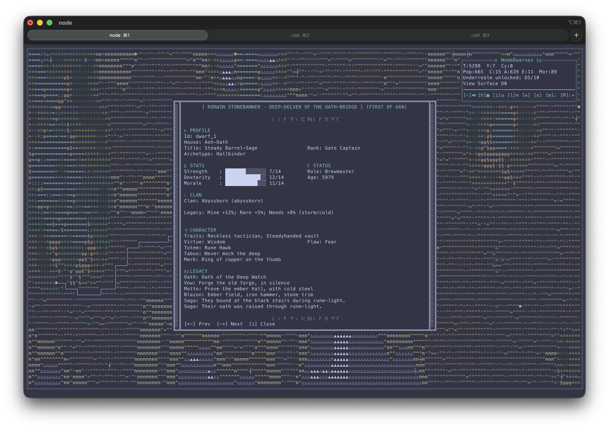
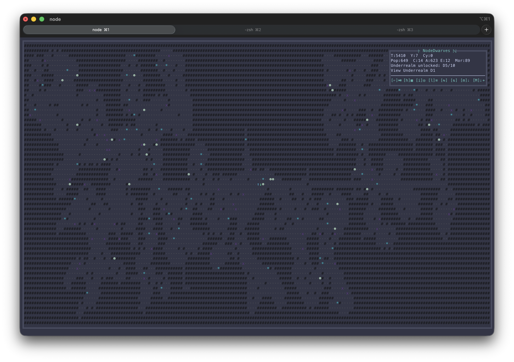

# NodeDwarves 🛠️

An autonomous, gamey dwarf colony simulation that lives entirely in your terminal.
No player input after launch: the colony gathers, adapts, and tries to keep itself alive while you watch the chaos unfold in ASCII. Grab popcorn. :)

Think of it as a living systems sandbox: you tune config, press run, and watch trade-offs emerge from shortages, weather, raids, and long-term growth pressure.

## Screenshots 📸





## Highlights ✨

- 🧠 Fully autonomous ASCII colony sim with real-time rendering.
- ⛏️ Resource economy with production chains and rare minerals (yes, shiny ones).
- 🍺 Brewery + beer morale tuning for long-run saves, so mid/late-game morale fuel stays active.
- 🏘️ Village growth with structures, roads, and organic placement.
- 🌦️ Seasons, weather, festivals, and wildlife that shift priorities (raids optional).
- 📜 Merchant trading, caravan contracts, and faction reputation.
- ⛺ Long-lived external faction camps: trade hubs, militia outposts, and raider pressure points with moving trade caravans, interception risk, and role-based influence zones on the map.
- 🎭 World events now live: traveling bards, rival caravans, and short-deadline opportunities.
- 🔥 Schism arc per run: doctrine shifts with hysteresis, branching anti-repeat festival rituals, social pressure/legitimacy swings, and climax moments that can reshape the economy.
- 🗝️ Endgame ruins expeditions with artifacts, set bonuses, and cycle resets.
- 🏛️ Dwarf Temple of Ancestors: biome-aware multi-stage final work with doctrine-path lock-in and prestige growth.
- 🧭 Economy telemetry now includes an Endgame checklist with live step completion and reset ETA.
- 🔍 AI Explainability in telemetry: top decision drivers, shortage score breakdown, and governor intent sources.
- 🧼 Telemetry clarity pass: adaptive section rows reduce filler noise, key population/world lines are split for faster scanning, and status words (`critical`, `blocked`, `warning`, `ready`) are highlighted in the Data Center.
- 📈 Analyst dashboard page in telemetry Data Center: KPI strip, ASCII trend charts (sparklines with slower snapshot sampling by default for cleaner pacing), forecast+bottleneck lens (runway, net flow, volatility, momentum), risk gauge, operations mix bars, event timeline, and deterministic action hints.
- 🧭 Deep-dive context on `Overview + Deep` and `Economy`: each page now opens with a compact context lens (risk/trend/timeline/shortage posture) before detailed section rows.
- ⚗️ Alchemy Lab rites: burn rare minerals for powerful global buffs, then survive the backlash.
- 🛡️ Clan culture traits that create trade-offs without micromanagement.
- 🏅 Warrior League phase-5 integration: risky ruins dispatches prioritize stronger candidates via deterministic dispatch score, seasonal tournaments now carry epic league names, hero progression tracks scars/titles/vows with capped legacy bonuses, and observability includes top-5 fighters plus a dedicated Warrior League modal with inline shorthand legend (`R/V/W/RW/Mk/P`), selective key-row highlights, and section spacing for quicker scanning.
- ⚔️ Warrior League realism phase-7: tournament duels can now create injuries/recovery windows (with optional retirement/death), champion-defeat succession can promote new heroes, and periodic training sessions materially grow fighter stats.
- 🕳️ Underrealm Front: 10 depth layers with engineered dwarven halls and dense stone-hewn caverns.
- 🧱 Underrealm V2 rollout: champion-gated floor unlock chain + 10-level armory progression + readiness-gated expedition dispatch, now with a high-impact Dwarf Champion command layer (deterministic vacancy auto-promotion, readiness boost, retry-cooldown reduction, champion-HP suppression, party-only duel-round extension, and frontier exploration/Deep Lift acceleration) plus contested-frontier-first champion targeting, deep warning hard-guard dispatch rails, per-depth failure-streak cooldown escalation, and dedicated deep telemetry cues.
- 📦 Telemetry stockpile compaction: weapon/armor tier inventories are grouped into compact aggregate bars so the panel stays readable in long runs.
- 📊 Underrealm-aware AI loop: PPO observation now includes deep combat/progression signals, with benchmark/regression reports exposing compact underrealm KPIs plus death-cause diagnostics (`death_*`) seed-by-seed.
- 🤝 Diplomacy-aware AI loop: PPO observation/reward now include world-event state, contract timing pressure, external-camp pressure, and schism legitimacy/pressure channels.
- 🧠 Warrior-aware AI loop (phase 6): PPO observation now includes aggregate Warrior League channels (`warriorEnabled`, roster coverage, elite score, legacy aura, champion momentum, tournament recency, injury/retired share, survivability, turnover pressure) with compact/legacy transport parity contracts.
- 🧪 Warrior realism curriculum: training now includes a dedicated `warrior_realism_pressure` scenario and extended warrior control channels (`injury`, `retired`, `survivability`, `hero turnover pressure`) to make warrior governance decisions materially affect learning outcomes.
- 🗺️ Map Focus default: no side telemetry column; `h` opens a full-screen paged telemetry Data Center while the map keeps full width.
- 🪟 Terminal-aware layout: with `display.autoSize` the map follows your terminal size (max caps optional), and live resize can keep world geometry locked to avoid infrastructure reflow resets.
- 🪟 In-map Ops Snapshot: a top-right status stack with core runtime signals (time, population, underrealm + view) and a fixed keyboard-command row, without letting roads/buildings/pathing use that carved space.
- 🎨 Visual theme presets: switchable terminal identity with coherent palette overrides, static warning/critical alert accents, and a compact focus-style Ops Snapshot under pressure.
- 🚨 Alert clarity upgrade: risk lines now expose a compact cause tag (`raid`, `shortage`, `stockpile`, `morale`, `mixed`) so critical states are easier to diagnose at a glance.
- 🤖 AI training in Python (PPO) with JS-only inference, now tuned for longer-horizon learning continuity (optimizer-state resume + rotating train seeds across runs + cumulative latest-resume on multi-phase quality/full profiles + one canonical promotion benchmark).
- 🧩 Modular architecture (simulation, state, render, AI) for sane iteration.
- ⚡ Late-game pathing cache optimizations for smoother high-population ticks.
- 🔧 Configurable performance knobs for heavy profiling runs.

## Render charset 🧱

- Core map rendering is ASCII-first, with CP437-friendly symbols for enhanced readability in terminal fonts.
- Underrealm markers follow the same charset logic (`☻` delvers, `☠` deep hostiles), so terminal fallback stays consistent.

## Why it feels good to run 🧪

- You are not micromanaging units: you are validating a system.
- Small config tweaks can produce very different colony behavior.
- Runs are readable in terminal form, so balancing loops is fast.
- You can use it as a game, an AI sandbox, or both.

## Quick start 🚀

```bash
npm install
npm start
```

If you already have a trained model, run:

```bash
npm run ai:play
```

## Controls 🎮

- `Space`: pause/resume
- `l`: legend panel
- `i`: dwarf inspect panel
- `w`: Warrior League modal (champion lineage, top 5 fighters, marks/legacy summary)
- `h`: telemetry Data Center overlay (`Dashboard`, `Overview + Deep`, `Economy`, `Warrior League`) with expanded plain-language metric labels, adaptive section sizing, status-token highlights, ASCII mini-charts, `AI Explainability` drivers, and an `Endgame` progress checklist
- `←` / `→`: change telemetry pages when telemetry is open, or browse dwarves when inspect is open
- `↑` / `↓`: switch map view between surface and unlocked underrealm depths
- `m`: export all currently unlocked layers (surface + underrealm) as PNG + SVG
- `Shift+M`: export all currently unlocked layers with structures/roads

## AI training (optional) 🤖

```bash
npm run ai:bootstrap
npm run ai:train
npm run ai:play
```

Recommended order after C7 (fast feedback + full gate):

```bash
npm run ai:bootstrap                        # once per machine / venv refresh
npm run ai:train:quality                    # or npm run ai:train for fastest loop
npm run ai:validate:canonical               # canonical master contract (20x2200, rpt, compact)
npm run ai:validate:gate                    # benchmark + regression gate
npm run ai:validate:risk                    # collapse + obs-normalization shape guardrails
npm run ai:validate:extended:optimized      # full quality gate (optimized runtime, same checks, per-phase timing report)
npm run ai:validate:horizon:weekly          # weekly deep/governance horizon check (rotating deterministic seed-pack)
npm test                                    # technical contract suite (policy shape + regression/promote report schema)
npm run debug:clean                         # cleanup debug artifacts (keeps latest 3 run_* folders)
npm run ai:train:endgame -- --episodes 16   # endgame (16 episodes)
npm run ai:play
```

Operational 3-cycle tuning loop (single-change iterations):

```bash
# Cycle A (one change only: reward OR curriculum OR trainer knob)
npm run ai:train:quality:daily
npm run ai:validate:canonical
npm run ai:validate:gate

# Cycle B (one additional isolated change)
npm run ai:train:quality:daily
npm run ai:validate:canonical
npm run ai:validate:gate

# Cycle C (final candidate before acceptance)
npm run ai:train:quality:high
npm run ai:validate:canonical
npm run ai:validate:gate
npm run ai:validate:risk
```

Four practical quality scenarios:

```bash
npm run ai:train:quality:daily              # fast daily loop (phase+canonical LCB off, promote progress every episode)
npm run ai:train:quality:high               # high-quality loop (full curriculum + stricter final canonical promote)
npm run ai:train:quality:acceptance         # strict final-only canonical + full validation gate
npm run ai:train:continuous -- --cycles 24 --full-every 4 --high-every 8 --gate-every 8  # continuous loop with periodic consolidation/gate
```

Quality-first full curriculum (early game + endgame + consolidation):

```bash
npm run ai:train:full:fresh
```

For training presets, evaluation, and overrides, see `MANUAL.md` and
`docs/TRAINING_OVERRIDES.md`.

Canonical promotion now owns best-checkpoint writes: wrapper training disables in-train best saves and `promote_best.py` updates `models/policy_best.json` + `models/policy_best.meta.json` only after canonical checks.
📊 Automatic promotion reports are written in each run folder (`debug/run_*/report_promote_*.json/.md`) plus one run summary (`report_training_promotion_summary.json/.md`) with metric glossary.

- 🎯 `ai:train:endgame` now runs a long-horizon specialization preset (`max_steps=10000`, `step_ticks=2`) with eval every 4 episodes, targeting at least 20k ticks per episode.
- 🧠 Latest-checkpoint writes are now decoupled from log windows (`saveEvery` / `--save-every`) so long curriculum runs spend less time on disk I/O.
- ⚡ Promote checks use one canonical benchmark contract (same config/episodes/steps/seed), with wrapper modes for per-phase or final-only canonical checks and optional paired lower-confidence promotion guardrails.
- 📈 Quality profile phase-promotion windows now use more episodes (`10` foundation, `12` finetune) to reduce noisy retain decisions when deltas are small-but-real.
- 🪶 `ai:train:quality:lite` adds a laptop-friendly low-load preset (worker cap, lighter canonical defaults, canonical-final check, and promote progress heartbeat).
- 🧬 `ai:train:quality:mixed` adds a mixed curriculum preset (~76% light foundation, ~24% full-sim finetune) for better throughput/quality trade-off on slower machines.
- 🧱 `ai:train:quality:high` runs the full 4-phase curriculum with stricter promotion guardrails (positive LCB on canonical and phase checks) plus heavier final canonical eval (`32x2400`), aimed at maximizing checkpoint quality before promotion.
- ♻️ `ai:train:continuous` orchestrates long-running incremental learning (`daily` baseline, periodic `full` consolidation, periodic `high` certification, optional gate cadence, and auto-stop guardrails) with run reports in `debug/continuous_train_*.json/.md`.
- ✅ Continuous stop logic is now strict promotion-aligned: a cycle resets no-improve streaks only when canonical promotion succeeds (positive-not-promoted deltas are reported but do not count as improvement).
- 🧪 Training scenario curriculum now includes dedicated deep/governance stress slices (`underrealm_push`, `compound_crisis`, `governance_pressure`), and canonical eval covers high-risk survival/deep/governance cases (`wildlife_raid`, `compound_crisis`, `underrealm_push`, `governance_pressure`).
- 🎯 Warrior/governance determinative tuning now raises pressure in the dedicated curriculum slices (`warrior_realism_pressure`, `governance_pressure`), widens adaptive scenario reweighting (`0.6..1.8`), and uses `evalEpisodes=20` during in-training eval so all configured eval scenarios are exercised in checkpoint selection.
- 🧪 OQ-5 add-ons: added `underrealm_late_gauntlet` for late deep stress, phase-adaptive scenario-sampling schedule (`early/mid/late`), and a diagnostic-only eval ensemble (`rpt` + deep auxiliary channels) for richer promotion reports without changing promotion gates.
- 🧪 Regression deterministic eval is profile-specific (`standard`, `underrealm`, `governance`) so deep/governance regressions surface earlier in dedicated stress slices.
- 🛠️ Latest config-only safety retune keeps those stress slices meaningful while reducing deterministic over-kill risk (`underrealm_push` tighter readiness rails + moderated `compound_crisis` pressure), so full benchmark+regression gate stays green.
- 📈 Trainer summary logs now expose adaptive-sampler update counters as `scenario_updates=<window>/<total>`, so cadence retunes are measurable phase-by-phase.
- 🧭 Validation flow is now explicit in npm scripts: `ai:validate:benchmark`, `ai:validate:regression`, and `ai:validate:gate` (sequential benchmark + regression).
- 🧭 Canonical master validation is scripted as `ai:validate:canonical` (fixed contract: `20x2200`, `rpt`, `compact`) so score comparisons stay consistent over time.
- 🧪 Risk mini-gate is scripted as `ai:validate:risk` (`r001`: deterministic benchmark, `r002`: policy observation-normalization shape guardrail).
- 🧪 Horizon gate (`ai:validate:horizon`) now includes a tighter deaths guardrail (`avg_deaths` tolerance `+16%`) and is paired with historical-replay sanity checks to keep deep/governance regressions detectable.
- 🗓️ Weekly deep-check workflow is available as `ai:validate:horizon:weekly`, backed by deterministic seed-pack rotation from config (`pack_alpha/beta/gamma/delta`, now `4` seeds per pack).
- 🧭 Horizon regression runs now honor `ai.training.deepChecks.seedPackRotation.defaultMode` automatically when you do not pass `--seed-pack` / `--seeds`, so deep-check seed rotation is config-driven by default.
- ⏱️ Runtime-optimized full gate is available as `ai:validate:extended:optimized`: it preserves quality signal while removing duplicate benchmark execution and writes per-phase runtime reports.
- 🧭 Recommended validation cadence: per-change (`canonical` + `gate` + `risk:r002`), acceptance/nightly (`ai:validate:extended:optimized`), weekly deep sentinel (`ai:validate:horizon:weekly`).
- 🧹 Debug housekeeping is scripted as `debug:clean` (`--keep-runs 2|3`, plus `debug:clean:dry` preview) to keep `debug/` lean after each cycle.
- 🛰️ `python/promote_best.py --eval-only` now supports controllable partial progress logs via `--eval-progress/--no-eval-progress` and `--eval-progress-every`.
- 🔎 Promote output now prints paired per-episode score deltas (`latest` vs `best`) when paired-LCB checks are enabled.
- 🧪 Phase-1 training optimization adds bounded delta reward shaping (stockpile/population/deep signals) plus training-only smart plateau termination from `ai.training.terminationProfile`.
- 🧪 Phase-2 training optimization adds PPO stability controls (obs/return normalization, value clipping + optional Huber, target-KL early stop) with normalization metadata shared across trainer, promotion eval, regression rollout, and JS runtime inference.
- 🧪 Phase-3 training optimization adds compact throughput diagnostics (`eps_pm`, `thr[...]`, PPO `upd_ms`), packed worker rollouts with worker-side GAE, promotion-time optimizer-state copy (`modelStatePath -> bestModelStatePath`) for true resume-from-best continuity, and dual IPC transport modes (`legacy` / `compact`) for trainer-eval-regression parity.
- 🚀 Trainer transport default is now `compact`; use `--transport legacy` only as fallback/debug compatibility mode.
- 🛡️ PPO trainer quick-wins pass: IPC read timeout + worker-result watchdog fail fast on stuck runs, worker crashes are surfaced to the learner, per-episode worker RNG seeding is deterministic, the final partial PPO batch is flushed before final checkpoint save, compact `obsVector` contract mismatches fail fast, and worker weight sync uses a binary `state_dict` payload fast path with legacy fallback.
- ⚡ C7 throughput increment hardens compact hot paths (precompiled action/feature slots, lean compact observation build, trainer fast-path vector/action handling) and closes the `>= +25%` throughput gate against the frozen C+ baseline while keeping benchmark/regression guardrails green.
- 🧩 Trainer/promote/regression rollouts now pass the same run config to the JS bridge (`ai_server.js --config ...`), so wrapper-generated overrides are applied consistently.
- 🎯 Training wrappers now auto-tune worker count from CPU capacity (with bounds and manual `--workers` override) to behave better across different machines.
- ⚙️ In auto mode, workers are also phase-aware (foundation/finetune/endgame/consolidation) and you can force flat behavior with `--workers-flat`.
- 🧭 Regression runs now stream subprocess logs directly to per-run files, improving stability on long validation passes.
- 🧪 Regression baseline profiles now live in `regression/baselines/` so reference snapshots are kept outside volatile debug artifacts.
- 🗂️ Headless benchmark now supports comparative score, seed-by-seed deltas, and optional blocking gates (`--gate`) with tunable thresholds for A/B tuning.
- 📈 Regression reports now auto-emit `.txt`, `.json`, and `.md` outputs for local inspection plus CI parsing (override paths with `--report-json/--report-md`).
- 🧾 AI runtime now accepts a backward-compatible governor action envelope, so legacy policy files still run while jobs/trade/building sub-policies roll out.

Jobs prioritization now reads the governor envelope first, while keeping legacy AI weight payloads compatible.
Trade governor hooks now support advisory `trade` intents for merchant reserve, rival caravan contests, and opportunity completion timing.
Contract governor hooks now support advisory `contracts` commit timing (`commitIntent`) with near-expiry force-complete guardrails.
Ruins governor hooks now support advisory `ruins` stances for warning-zone dispatch tolerance and mithril reinforcement posture, while readiness/champion guardrails remain unchanged.
Underrealm crew governor hooks now support advisory `underrealm` biases for surface reserve, depth allocation, and role mix (miner/hauler/guard), with smoothing and major-reallocation cooldown guardrails; defaults now lean conservative to keep deep-survival outcomes stable in regression gates.
Building governor hooks now support advisory `building` ranking signals for housing/economy/defense/special queues, with guardrails still enforced by the existing structure checks.
External camps governor hooks now support advisory `externalCamps` stances for militia support renewal and raider tribute handling, with critical-collapse force-compliance guardrails.
Warrior League governor hooks now support `warriors` intents (training, rotation, tournament risk, champion challenge, recovery priority) with real threshold-gated runtime effects plus telemetry instrumentation.
Telemetry now exposes compact governor signals directly in `Pressure`, `Diplomacy`, `Operations`, and `AI Explainability` so policy intent can be inspected live.
Training action heads now include governor pseudo-action IDs when enabled (`gov_trade_*`, `gov_contract_*`, `gov_ruins_*`, `gov_underrealm_*`, `gov_building_*`, `gov_external_*`, `gov_warriors_*`); Warrior phase-6 AI features expand the observation shape, so restart training with `--fresh` when upgrading from pre-phase-6 checkpoints.
By default, the warriors governor is active with `ai.governors.warriors.actionHeadEnabled=true`; when upgrading from legacy checkpoints without warrior action IDs, run training with `--fresh` (or temporarily set this flag to `false`).
- 🛡️ Warrior League phase-4 now adds persistent hero progression: deterministic scars/titles/vows, event-earned legacy points with strict caps+diminishing returns, and legacy bonuses that influence risky dispatches and tournaments without uncontrolled snowballing.

## Four runs to try ⚡

1. `Vanilla sim`: `npm start`
2. `Train then watch`: `npm run ai:train` then `npm run ai:play`
3. `Capture the world`: during runtime press `m` (or `Shift+M`) to export all unlocked layers
4. `CLI map export`: `npm run map:export -- --width=120 --height=40 --season=spring --layers=surface,d1,d2 --underrealmUnlockedDepth=2`
5. `Balance gate presets`: `npm run balance:gate:standard` (or `:strict` / `:relaxed`)
6. `Cached benchmark loop`: `npm run bench:baseline` then `npm run bench:candidate -- --set path=value` and `npm run bench:diff` (baseline/candidate now stream progress logs during execution)
7. `Underrealm stress loop`: `npm run bench:underrealm:hot` and `npm run bench:underrealm:full` for fixed deep-expedition long-run A/B (`legacy baseline` vs current tuned defaults in the same schism-off profile)

Pass candidate overrides to the active preset with `--set`:

```bash
npm run balance:gate:standard -- --set jobs.gatherTriggerRatio.food=1.1 --set jobs.gatherTriggerRatio.water=1.1
```

## Documentation 📚

- `MANUAL.md`: technical and gameplay manual (systems, formulas, workflows).
- `docs/PARAMETERS.md`: full config reference.
- `docs/TRAINING_OVERRIDES.md`: training override guide.
- `docs/TRAINING_STATUS.md`: current training quality status, active validation cadence, and pending closure items.
- `docs/TRAINING_OPTIMIZATION_WORKBOOK.md`: historical training optimization workbook (timeline, decisions, validation snapshots).
- `docs/TELEMETRY.md`: telemetry operator manual (from zero to hero).
- `AGENTS.md`: contribution and implementation guidelines.

## Roadmap ideas 🧭

- 🧬 (high) Personal dwarf arcs: each dwarf gets origin, virtue, vice, and ambition that evolve into mini story outcomes.
- 🏛️ (high) Seasonal council decrees: choose 1 of 3 political edicts per cycle with strong long-term trade-offs.
- 📜 (high) Multi-act faction questlines: contracts and camps evolve into chapter-based stories with branching outcomes.
- 🛡️ (high) Persistent hero company: named expedition roster gains scars, titles, vows, and legacy bonuses over time.
- 💔 (high) Social drama engine: rivalries, friendships, mentorships, and grudges trigger emergent village events.
- 👑 (medium) Titles and succession: leadership offices (Steward, Marshal, High Priest) shape policy and run identity.
- 🔮 (medium) Ancestor omens and prophecies: periodic signs create high-risk/high-reward roleplay decisions.
- ⚔️ (medium) Nemesis houses: recurring rival factions build personal history with your settlement across multiple cycles.
- 🍻 (low) Tavern rumors and side quests: rotating rumor hooks unlock small narrative objectives with meaningful rewards.
- 📚 (medium) Chronicle and saga system: runs generate an in-world annal that influences prestige and future-start modifiers.

### Roadmap scoring rubric

| Section | Weight | What it measures |
|---|---:|---|
| Systemic breadth | 0.25 | How many core systems are affected |
| Persistence | 0.20 | How long effects stay relevant in a run |
| Frequency | 0.15 | How often it appears during normal play |
| Decision weight | 0.25 | How strongly it changes strategic trade-offs |
| Emergence / AI impact | 0.15 | How much it changes emergent behavior and policy priorities |

Formula: `Total = sum(section_score * weight)`  
Impact thresholds: `High >= 4.0`, `Medium >= 2.8 and < 4.0`, `Low < 2.8`

### Roadmap scorecard

| Idea | Breadth | Persistence | Frequency | Decision weight | Emergence/AI | Total | Impact |
|---|---:|---:|---:|---:|---:|---:|---|
| Personal dwarf arcs | 4 | 5 | 4 | 4 | 4 | 4.20 | High |
| Seasonal council decrees | 5 | 5 | 3 | 5 | 4 | 4.55 | High |
| Multi-act faction questlines | 5 | 4 | 4 | 4 | 4 | 4.25 | High |
| Persistent hero company | 4 | 5 | 3 | 4 | 4 | 4.05 | High |
| Social drama engine | 5 | 4 | 5 | 4 | 5 | 4.55 | High |
| Titles and succession | 4 | 4 | 3 | 4 | 3 | 3.70 | Medium |
| Ancestor omens and prophecies | 3 | 3 | 2 | 4 | 3 | 3.10 | Medium |
| Nemesis houses | 4 | 4 | 3 | 3 | 4 | 3.60 | Medium |
| Tavern rumors and side quests | 2 | 2 | 3 | 2 | 2 | 2.15 | Low |
| Chronicle and saga system | 3 | 4 | 3 | 3 | 3 | 3.20 | Medium |

### Section summary

| Section | Avg | Min-Max | Strong ideas (>=4) | Weak ideas (<=2) |
|---|---:|---|---:|---:|
| Systemic breadth | 3.90 | 2-5 | 7 | 1 |
| Persistence | 4.00 | 2-5 | 8 | 1 |
| Frequency | 3.30 | 2-5 | 3 | 1 |
| Decision weight | 3.70 | 2-5 | 7 | 1 |
| Emergence / AI impact | 3.60 | 2-5 | 6 | 1 |

## Project layout (high level) 🧱

- `app.js`: entrypoint and main loop.
- `config.json`: single source of truth for tunables.
- `.github/workflows/quality_gates.yml`: CI workflow that runs `ai:validate:extended` + `ai:validate:horizon:weekly` and uploads quality artifacts.
- `src/`: simulation, state, rendering, AI.
- `src/simulation/underrealm.js`: Underrealm crew, shrine doctrine, deep economy, exploration unlocks, and hostile faction pressure.
- `src/simulation/world_events.js`: world event lifecycle for bards, rival caravans, and time-limited opportunities.
- `src/simulation/external_camps.js`: long-lived external faction camps with trade, militia support, raider pressure, moving caravans, and influence-zone modifiers.
- `src/simulation/schism.js`: run-scale social schism arc (pressure/legitimacy, doctrine shifts, ritual festivals, and climax events).
- `src/simulation/alchemy.js`: alchemy rites, pact lifecycle, and backlash logic.
- `src/simulation/temple.js`: Temple of Ancestors stages, map footprint, and prestige system.
- `src/simulation/warriors.js`: Warrior League runtime helpers for deterministic combat profiles, risk-aware expedition dispatch, seasonal tournament progression, tournament consequences/succession/training, and persistent scars/titles/vows/legacy bonuses.
- `src/render/map_inset_panel.js`: carved in-map Ops Snapshot component with compact, width-aware runtime lines.
- `src/render/warrior_panel.js`: dedicated Warrior League modal overlay with champion/top-5/marks analytics.
- `src/telemetry/`: telemetry engine and Data Center panel modules.
- `src/telemetry/telemetry.js`: telemetry section builders and formatting helpers.
- `src/telemetry/telemetry_panel.js`: in-game paged telemetry Data Center with section pages and full-height telemetry content area.
- `scripts/train_wrapper.js`: safe unified wrapper for all `ai:train:*` profiles.
- `scripts/train_continuous.js`: continuous training orchestrator for daily/full/high cadence, validation gates, and stop-rule automation.
- `scripts/regression.js`: baseline-vs-current AI regression checks (deterministic eval + randomized stability pass) with txt/json/markdown reports, death-cause diagnostics (`death_*` from `deaths_by_cause=` summary payloads), and live heartbeat progress lines during long phases.
- `scripts/validate_extended_optimized.js`: full validation orchestrator with per-phase timing reports and benchmark deduplication (`ai:validate:extended:optimized`).
- `scripts/clean_debug.js`: debug housekeeping utility (removes transient smoke/regression temp artifacts and keeps only the latest run history).
- `scripts/test_training_contracts.js`: deterministic training/validation contract suite used by `npm test` (policy shape + regression/promote report schema checks).
- `regression/baselines/regression_baseline.json`: durable regression baseline profiles tracked outside `debug/`.
- `scripts/headless_benchmark.js`: deterministic headless benchmark with comparative score, seed deltas, and optional gate for long-run balance tuning.
- `scripts/compare_benchmark_reports.js`: cached report diff utility for baseline/candidate deltas without rerunning both variants.
- `python/regression_rollout.py`: rollout-only randomized regression runner used by `scripts/regression.js`.
- `python/`: PPO training + agent example.
- `docs/`: parameter reference, training overrides, current training status, training optimization workbook archive, and telemetry operator manual.
- `models/`: policy checkpoints.
- `scripts/`: utilities and regression tooling.

## Collaborate with us 🤝

Open a PR or start a discussion if you want to help with simulation design, AI training, or terminal UX. Start with `MANUAL.md` for the technical tour. ;)

## License 📄

MIT
