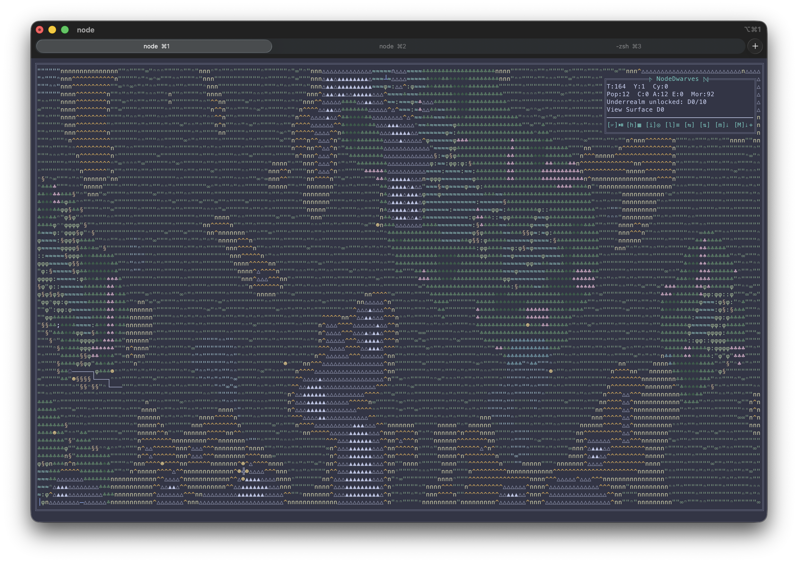

# NodeDwarves

An autonomous, gamey dwarf colony simulation that lives entirely in your terminal.
No player input after launch: the colony gathers, adapts, and tries to keep itself
alive while you watch the chaos unfold in ASCII.

## Highlights ✨

- 🧠 Fully autonomous simulation with a real-time ASCII renderer.
- 🧺 Resource economy with food, water, beer, wood, stone, iron, expedition kits, mithril, adamantium, and mana crystal.
- 🏘️ Village growth: houses (beds), wells (water nodes), fields (food nodes), breweries (beer), sawmills (wood), workshops (tools), armories (expedition kits), mithril forges (global output boost), mines (iron/stone + rare drops).
- 🗝️ End-game ruins expeditions with artifacts, set bonuses, and guardian threats.
- 🔁 End-game cycles: once all artifacts are found and a cooldown window passes, the sim restarts on a new map, tracks completed runs, and can scale difficulty per cycle.
- ❄️ Seasons + housing effects (bonding, winter penalties).
- 🐾 Wildlife migrations + pasture grazing: herds roam seasonally, hunters take risks, pastures regrow.
- 🌦️ Dynamic weather cycle that reshapes needs, gathering, and regeneration.
- 🎓 PPO training in Python with JS-only inference.
- 🧱 Modular architecture (simulation, state, render, AI) for easier iteration.
- 🛡️ Clan culture: per-dwarf bonuses/penalties with HUD clan counts.

## Roadmap ideas 🧭

Have a wild idea? Jump in and ship it — pick one of these and make the colony stronger.

- Faction diplomacy and tribute: neighbor demands or aid requests; reputation shifts merchant rates and raid pressure.
- Seasonal festivals or rituals that trade stockpile costs for morale/production boosts.
- Simple disease system tied to crowding and hygiene.
- Refugees and deserters: population waves triggered by morale, housing, and raid safety; handled as deterministic events with caps.
- Mining hazards and supports: deeper mines boost rare drops but add cave-in risk; support structures mitigate danger.
- Fire hazards and firefighting: rare events that damage structures during storms/droughts; implement as event rolls, fire status ticks, and a dedicated job priority.
- Caravan contracts: periodic trade requests with rewards and reputation effects.
- Village security upgrades (winter shelters, gatehouses, patrol routes).
- Canals and aqueducts: buildable water routing that extends fertile zones and irrigates distant fields, with upkeep costs.
- Road building and path upkeep: faster movement and less congestion along roads; implement as buildable terrain overlays with movement multipliers and decay/maintenance.
- Cisterns and reservoirs: buffer water during droughts and smooth well usage; implement as structures with storage capacity, rain fill rates, and draw rules.
- Soil fertility and crop rotation: fields gain fatigue over time and recover when fallow; yield scales with per-field fertility.
- Tool wear and maintenance: tool levels slowly decay with use; workshop jobs repair/upgrade using wood and iron.
- Food preservation chains: convert surplus food into longer-lasting rations; implement as a recipe + structure with spoilage tuning and shortage triggers.
- Skill progression and apprenticeships: gradual per-role XP that raises output/efficiency; implement as per-dwarf skill tracks with config-driven caps and job bias.
- Dwarf traits and injuries: light, persistent modifiers from harsh work or events; implement as per-dwarf tags with decay and config-safe caps.
- Logistics improvements: stockpile zones, hauling priorities, or storage upgrades.
- Weather forecasting and preparation: signal towers reveal upcoming weather windows and temporarily bias job priorities.
- Long-term wonders: a monumental project that unlocks late-game bonuses.

## Screenshot - How it looks 📸



## Simulation overview 🗺️

- 🗺️ The world is a fixed-size ASCII grid with resource nodes, structures, and dwarves.
- 🌍 The map renders a randomized terrain backdrop (coast/valley modes) with CP437-friendly symbols, plus rivers, lakes, and ponds.
- 🌊 River tiles render with curved box-drawing symbols and can originate from multiple map edges.
- 🌲 Forest patches spread beyond water corridors via humidity diffusion, with jittered edges for more organic shorelines.
- 🌾 Plains render as a weighted mix of CP437 glyphs for subtle texture.
- 🌲 Forest tiles can swap to a denser symbol on interior tiles, with a darker tint for extra depth.
- ⛰️ Hills can render gentle vs pronounced glyphs for extra terrain depth.
- 🏔️ Mountains render as medium vs high peaks, with higher peaks highlighted in white.
- ⛰️ Stone terrain uses the same mountain glyphs, so mineral regions blend into the peaks.
- 🧺 Food tiles are guaranteed to appear near water to avoid barren starts, with minimum counts enforced for food/mountain/stone tiles.
- ⏱️ Each tick:
  1. Dwarves accumulate needs (hunger, thirst).
  2. Resources are consumed when needs cross thresholds.
  3. Shortages are computed vs target stockpile levels (optionally scaled per population and gather trigger multipliers).
  4. Jobs are assigned based on the largest shortages.
  5. Dwarves move to targets, work, and update stockpiles.
- ♻️ Resource nodes have finite capacity and regenerate slowly.
- ⏳ Terrain gathering tiles can go on cooldown after use, and stockpiles can decay over time.
- 🌾 Fields regenerate based on water availability and seasonal limits.
- 🐾 Pastures provide stable grazing stock that regrows over time, while wildlife herds cross the map in spring/autumn and can be hunted for food with risk.
- 🌤️ Seasons apply modifiers to needs, gather speed, regen, and reproduction.
- 🎨 Optional seasonal palettes recolor terrain in patchy waves during season transitions.
- 🌧️ Weather cycles (clear, rain, storm, drought, cold) add extra modifiers.
- 🗿 Myths: rare global modifiers born from repeated crises or successes; traditions persist between endgame cycles within the same run.
- 👪 Population is dynamic: dwarves age, form bonds (same-clan pairs can bond faster), reproduce with gestation, and can die.
- 👪 Reproduction can be gated by minimum stockpile ratios to avoid boom-bust starvation cycles.
- 🪵🪨 Wood and stone build clustered villages (center-out placement).
- 🛏️ Housing provides beds; insufficient shelter slows bonding and makes winter harsher.
- 🧳 A roaming merchant visits periodically, trades surplus for scarce resources, then leaves (food/water can be excluded from offers).
- 🚰 Wells and 🌾 fields use Poisson-style spacing across the map, respecting terrain and distance from the core.
- 🏘️ Villages can be founded at population thresholds, adding new build centers (shared stockpile; max 3 villages).
- 🏛️ Ruins spawn in mountainous terrain; expeditions consume kits, face guardians, and unlock artifact bonuses (repeatable in the final room for completion).
- 📊 HUD shows averages, bars, priorities, clan totals, and structure breakdowns.
- 🖼️ The map renders with a framed border for clearer navigation.
- 🧭 Terrain adds visual texture (coast, lakes, rivers); walkability and movement delay are configurable per terrain.
- 🧭 Dwarves use configurable pathing with potential-field variation for more organic routes.
- 🧩 Resources can come from nodes or from terrain tiles (configurable).
- ⏳ Terrain gathering cooldowns can be bypassed during critical shortages.

## Clan culture 🛡️

Each dwarf belongs to a clan. Clan identity is assigned at spawn and, by default,
inherited from parents (configurable via `clans.inheritance.mode`). Clan effects
are per-dwarf and lightweight, designed to create trade-offs without requiring
manual micromanagement.

Default clans:

- **Abyssborn**: +12% mine output (base + rare), +0.05 additive rare drop chance; +8% need decay during storm/cold.
- **Embers of Khorg**: -8% build/upgrade ticks; +5% stone/iron build costs.
- **Threshold Wardens**: +10% raid defense scaled by adult share; +8% watchtower max kills scaled by adult share;
  -5% gather speed (gather ticks + mine/sawmill output).
- **Deep Lantern**: +8% ruins combat and +5% hazard reduction scaled by expedition party share;
  -5% gather yield on wood/stone.

HUD labels use `clans.labels` (short by default: Abyssborn, Embers, Wardens, Lantern).
The Clans section lists clan totals with per-clan HUD colors. The layout assumes
a 190x60 terminal (columns x rows) with the default HUD width/columns; smaller
terminals will clip, so adjust `display.hud.width` or `display.hud.columns` if
you need more space.

## Ancient dwarven ruins 🗝️

The Ancient Dwarven Ruins are an end-game feature based on automated expeditions.
The colony sends parties of idle adults into the ruins (consuming kits and resources), and
each success unlocks the next room. Once all rooms are cleared, expeditions repeat the
final room until all artifacts are collected.
After all rooms are cleared, up to 3 expeditions can run in parallel (configurable via
`ruins.expedition.maxConcurrentAfterClear`), limited by idle adults and resource costs.

Room structure (linear progression):

- **Fractured Entrance** → **Rune Hall** → **Ancient Forge** → **Masters' Archive** → **Stone King's Sanctum**.
- Each room defines expedition duration, party size, resource cost, hazard risk, guardian
  chance/power, and artifact drop chance.
- If the guardian is defeated, it increases the artifact drop chance.
- Terrain generation reserves enough spawn tiles for the initial ruins via
  `structures.ruins.minSpawnTiles`.

Artifact sets:

- **Forge of the Ancients**: Hammer of Khorg, Runic Bellows, Deep Scales, Basalt Seal, Fathers' Anvil.
- **Hall Wardens**: Deep Lantern, Runic Crowns, Thrain's Shield, Veil of Mists, Masters' Tome.
  Artifacts do not grant individual bonuses; they exist to reach set and combo thresholds.

Set bonuses (thresholds within a set, cumulative in the same set):

- **Forge of the Ancients**: 2→ +5% output, 3→ +10% output, 4→ +15% output, 5→ +25% output
  (applies to wood/stone/iron/mithril).
- **Hall Wardens**: 2→ -5% hazard, 3→ +10% combat power, 4→ +10% artifact chance +15% casualty reduction,
  5→ +20% combat power -10% hazard +25% casualty reduction.

Combo bonuses (between sets):

- **Runic Pacts** (2 Forge + 2 Wardens): +3% output, +5% combat power.
- **Oath of Stone** (3 Forge + 3 Wardens): +6% output, +10% combat power.
- **Dominion of the Ancients** (5 Forge + 5 Wardens): +10% output, +20% combat power, -10% hazard.

## Myths (global modifiers) 🗿

Myths are lightweight, global modifiers that emerge when the colony repeatedly
faces crises or achieves notable feats. They do not add new player inputs or
jobs. Instead, they apply soft multipliers (±5–15%) to existing systems like
needs decay, gathering speed, raid outcomes, or ruins rewards. Multipliers are
applied on top of season/weather/clan effects (e.g. a myth can slightly reduce
need decay or slightly slow gathering).

Default myths (see `config.json` → `myths.definitions`):

- **Rationing Oath**: triggered by sustained food/water shortage. Active: reduces need decay but slows gathering. Tradition: a smaller, persistent reduction to need decay.
- **Blood Vigil**: triggered by heavy raid losses. Active: lowers raid casualties and loot loss but slightly slows gathering. Tradition: a smaller, persistent reduction to raid casualties.
- **Relic Fever**: triggered by artifact finds or consecutive ruins successes. Active: improves artifact odds but increases expedition hazard. Tradition: a smaller, persistent improvement to artifact odds.
- **Dry Wells**: triggered by droughts or low water reserves. Active: lowers field regen and irrigation efficiency, plus slightly slows node regen. Tradition: a smaller, persistent reduction to field regen.

Traditions:

- When a myth expires, it can become a weaker **tradition** if enabled and a
  slot is available. Traditions persist across endgame **cycles** within the
  same run (they do not carry across separate runs by default).
- Caps and cooldowns are config-driven (`myths.maxActive`, `myths.maxTraditions`,
  `myths.minGapTicks`). If the tradition cap is exceeded, the oldest tradition
  is dropped.
- Active myths are cleared on cycle reset; traditions remain.

The HUD lists active myths with remaining ticks and any traditions in effect. A
separate "Myth bonuses" line summarizes the combined deltas and wraps
automatically (capped to 2-3 lines depending on HUD width). Myth flags are part
of the AI observation; changing myth features requires fresh training
(`npm run ai:train -- --fresh`).

## Simulation reset (endgame cycles) 🔁

When the colony has completed the ruins, the simulation can reset on a brand new
map to start a fresh cycle.

Trigger prerequisites:

- `endgame.enabled` is true.
- All artifacts in `ruins.artifacts.pool` are found.
- `endgame.minTicksAfterArtifacts` ticks have elapsed since the final artifact
  was collected.

When the reset fires:

- A new map, terrain, nodes, structures, and stockpiles are generated.
- Population resets to `endgame.resetPopulation` (if set).
- Cycle stats are updated and shown in the HUD (`Cycles`, `Last cycle Ticks`).
- Optional difficulty scaling applies per completed cycle (`endgame.difficulty`).

## Job system and priorities ⚙️

- 🧭 Shortages are sorted by severity (missing/target ratio).
- ⛏️ If a resource has nodes on the map, a gather job is created.
- 🧪 Crafting is optional: it activates when recipes/workshops exist and roles are disabled.
- 🏠 House build/upgrade jobs spawn when housing is below target ratio and stockpiles meet guardrails.
- 🏗️ Build jobs can run in parallel (configurable via `jobs.buildQueue`) using idle builders.
- 💧 Wells are built when water stocks or water node reserves dip below thresholds.
- 🌱 Fields are built when food stocks or food node reserves dip below thresholds and baseline stockpiles are safe.
- 🪚 Sawmills convert stone + iron investment into steady wood output.
- 🍺 Breweries convert food into beer with brewmasters that scale with population; upgrades boost output while reducing food cost. Brewing can pause when food is critically low, beer can be rationed against reserve targets, and beer consumption can add a production bonus across resources. Defaults cap the morale bonus to avoid runaway production loops.
- 🛠️ Workshops unlock tool upgrades that boost all gathering yields, including mines.
- 🔥 Mithril forges provide a global output multiplier that scales by level; late-game upgrades require rare minerals.
- ⛏️ Mines and 🪚 sawmills can be upgraded to level 10 for higher output (exponential cost/bonus).
- ⛏️ Mines are built on mountain terrain when none exist, and miners output iron + stone per tick plus rare minerals from level 5+.
- 🧑‍🏭 Roles (builder/gatherer) can be enabled to keep building stable during shortages.
- 🧱 Manager builders handle watchtowers, wells, and fields using stockpile-based thresholds.
- 🧭 Idle dwarves take short waypoint strolls around home (or their current spot) with brief pauses.

## Quick start 🚀

Make sure you have Node.js and Python 3 installed.

```bash
npm install
npm start
```

## AI mode (Python) 🤖

The AI lives in Python (PyTorch PPO) and talks to the simulation over
stdin/stdout JSON lines. Training uses a 2x128 MLP and exports JSON weights
so inference stays in JS.

Bootstrap the Python venv + deps (recommended once) 🧪:

```bash
npm run ai:bootstrap
```

Run training 🧑‍🏫:

```bash
npm run ai:train

npm run ai:train:fresh

npm run ai:train -- --episodes 5000

npm run ai:train:fast:quality

npm run ai:train:fast:endgame

```

You can stop training with Ctrl+C to terminate the run.

Google Colab notebook: `colab/nodeDwarves_training.ipynb` automates clone/pull,
branch checkout, Torch/Numpy checks, runs `npm run ai:train:python:fresh`, and
saves training output to Google Drive. Open it in Colab and adjust `BRANCH`
and `DRIVE_DIR` as needed.

`ai:train` (alias of `ai:train:fast`) runs a fast baseline training loop tuned
for a sub-5-minute run on a typical 8-core laptop: 8 workers, 200 episodes,
max_steps=1600, step_ticks=2, and a difficulty ramp that reaches 1.0 by episode
120. Eval runs every 50 episodes at difficulty 1.0 so the best model and meta
are saved during the run.
All presets keep eval cadence aligned with console logging and summary logs
(eval_every = log_every, SUMMARY_LOG_EVERY = log_every).

`ai:train:fast:quality` runs the fast phase above followed by a short `--full-sim`
finetune pass (40 episodes, max_steps=1800, difficulty fixed to 1.0) with eval
enabled.

`ai:train:fast:endgame` runs full-sim training at max difficulty with a shorter
stress pass (80 episodes, max_steps=2400, step_ticks=2) to probe late-game
survival.

All presets save the best model to `models/policy_best.json` (meta at
`models/policy_best.meta.json`) and resume from it by default unless `--fresh`
is provided.

To force a fresh start, use the dedicated script or add `--fresh` to the fast phase:

```bash
npm run ai:train:fresh

npm run ai:train -- --fresh
```

If you change resources or action space, reset the policy files ♻️ (use `--fresh`):

```bash
npm run ai:train -- --fresh
```

Run the visual simulation with the trained policy 🕹️:

```bash
npm run ai:play
```

Record a regression baseline snapshot 🧪:

```bash
npm run ai:regression:record
```

Use a custom profile name with `-- --profile <name>` if you want multiple baselines.

The training loop saves a PPO policy to the path in
`ai.training.trainer.modelPath` (default `models/policy.json`). The best-eval
snapshot is saved to `ai.training.trainer.bestModelPath` (default
`models/policy_best.json`) and its score is tracked in
`ai.training.trainer.bestModelMetaPath` (default `models/policy_best.meta.json`).
Training is incremental by default when `ai.training.trainer.resumeFromBest` is
enabled. Console logs stay compact, while a summary log is written to
`debug/run_*/summary.log` every 500 episodes (one line per window) with a legend.
Detailed snapshots are written to `debug/run_*/detail_ep*.log` only on notable
events (best eval, eval regression, scenario shift).
If you change observation features (via `ai.training.trainer.featureNames`),
training must restart with `--fresh`.
Observation features live in `src/ai/observation.js`, and policy inference lives
in `src/ai/policy.js`.

### Training notes (clans + ruins) 🧠

Clan dynamics introduce per-dwarf heterogeneity and longer-horizon trade-offs
(raid defense vs production, ruins risk vs resource throughput). For stable PPO
training:

- Run longer episodes so policies experience raids and ruins with mixed clans.
- Keep evaluation deterministic (fixed seeds) to measure robustness across clan mixes.
- Consider a curriculum: start with clans disabled or reduced bonuses, then ramp up.
- Use slightly higher entropy early to explore clan/role/job combinations.
- Observations include clan shares and ruins status (active, cooldown, progress, artifacts); if you change them, retrain with `--fresh`.
- Reward shaping can emphasize ruins outcomes via `ai.reward.ruinsSuccess`, `ai.reward.ruinsArtifact`, `ai.reward.ruinsFailure`, and `ai.reward.ruinsRoomClear`.

## Configuration 🧰

All core knobs live in `config.json`. The training loop reads defaults from
`ai.training.trainer` and CLI flags can override any of them.

See [Parameter reference](docs/PARAMETERS.md).

Map size scaling: `resources.mapScale` can scale initial stockpiles (and,
optionally, node counts/targets) based on the runtime grid area. Use
`baselineWidth`/`baselineHeight` to define the map (grid) size baseline when you
change the terminal size or HUD width.

### Wildlife raids 🐺

Seasonal wildlife raids are optional chaos events. When active, dwarves
panic and run home; only exposed dwarves (not inside their house tile) can be
killed, and raids steal stockpile resources scaled by exposed fraction.

- `raids.enabled`: master switch (default false).
- `raids.seasonNames`: seasons eligible for raids (default spring/autumn).
- `raids.durationTicks`: raid duration in ticks (default 100).
- `raids.chance.min/max`: per-season trigger probability range (0..1).
- `raids.minPopulation`, `raids.minTick`: guardrails to avoid early wipes.
- `raids.deathRate.min/max`: fraction of exposed dwarves killed.
- `raids.resourceLoss.min/max`: base loss ratio (scaled by exposed fraction).
- `raids.resourceLoss.weights`: per-resource loss weights.
- `raids.beasts.*`: visual beast count rules.
- `symbols.beast`: map symbol for beasts (default `\u00f6`).

Watchtowers mitigate raids by reducing effective raid damage. Towers are built
across non-water tiles and scale a defense bonus applied to raid deaths and loot
loss while also shooting beasts during raids.

Training includes a `wildlife_raid` scenario that enables raids with the base
raid parameters and ramps with difficulty.

Training observations expose raid risk (season eligibility), exposure, and defense
so policies can prepare ahead of raids. Reward shaping can further penalize raid
exposure, deaths, and loot loss via `ai.reward.*`.
Recent tuning increases `ai.reward.survival`, `ai.reward.populationDelta`, and
`ai.reward.populationBalance` to keep policies focused on population stability.

### Scenario presets (training) 🎯

Scenario presets let training sample hard situations on purpose (e.g. water
scarcity, low stockpiles). Each preset is a config override merged into the
base config before the usual curriculum randomization scales are applied.

You can optionally ramp a scenario's weight with difficulty using
`difficultyMin/Max` and the corresponding multipliers.

- Training picks a scenario each episode using the weights in
  `ai.training.scenarios`.
- If `ai.training.scenarioSampling.mode` is `adaptive`, weights are rebalanced
  during training to focus on the weakest-performing scenarios.
- If `ai.training.evalScenarios` is set, evaluation splits the eval episodes
  across those scenarios for a balanced score.
- Presets like `ruins_focus` and `clan_*` bias ruins pacing and clan mixes to build long-horizon competence.
- The debug log includes a "Scenario mix" section that shows how often each
  preset appeared in the window.

See [Training overrides (performance)](docs/TRAINING_OVERRIDES.md).

## ASCII legend 🧷

The legend is printed below the map in the footer. Symbols are configurable in
`config.json` under `symbols`.
Houses always render with `symbols.house`, while the HUD lists house levels with their counts.

## Project layout 🧱

```text
.
├── AGENTS.md                     # Agent guidelines
├── LICENSE
├── MANUAL.md                     # Full codebase tour
├── README.md
├── ai_server.js                  # Headless JSON server for Python agents
├── app.js                        # Entrypoint and main loop
├── assets
│   └── NodeDwarves.gif           # Demo recording
├── config.json                   # Simulation knobs and defaults
├── docs
│   ├── PARAMETERS.md             # Full config parameter reference
│   └── TRAINING_OVERRIDES.md     # Training overrides guide
├── models
│   ├── policy_best.json          # Best-eval policy (default)
│   ├── policy_best.meta.json     # Best-eval metadata
│   └── policy.json               # Optional latest policy (configurable)
├── package.json                  # Node scripts + deps
├── python
│   ├── agent.py                  # Example Python agent
│   ├── bootstrap.py              # venv bootstrap
│   └── train.py                  # PPO training loop (PyTorch)
├── scripts
│   ├── bonding_study.js
│   ├── movement_batch.js
│   ├── movement_sandbox.js
│   ├── pathing_probe.js
│   └── regression.js
└── src
    ├── ai                         # AI observation + policy inference
    │   ├── observation.js
    │   └── policy.js
    ├── ai_policy.js              # Runtime policy loader/inference (wrapper)
    ├── clans.js                  # Clan helpers + weighting utilities
    ├── config.js                 # Config loader
    ├── render                    # Renderer modules
    │   ├── colors.js
    │   ├── format.js
    │   ├── grid.js
    │   ├── header.js
    │   ├── hud.js
    │   ├── index.js
    │   ├── legend.js
    │   └── seasonal_colors.js
    ├── render.js                 # ASCII renderer + HUD (wrapper)
    ├── runtime.js                # Terminal sizing and layout
    ├── simulation                # Simulation modules
    │   ├── dwarf_actions.js
    │   ├── endgame.js
    │   ├── events.js
    │   ├── index.js
    │   ├── jobs.js
    │   ├── merchant.js
    │   ├── movement.js
    │   ├── population.js
    │   ├── raids.js
    │   ├── random.js
    │   ├── resources.js
    │   ├── roles.js
    │   ├── ruins.js
    │   ├── season.js
    │   ├── structures.js
    │   ├── terrain.js
    │   ├── wildlife.js
    │   ├── villages.js
    │   └── weather.js
    ├── simulation.js             # Needs, jobs, movement, survival loops (wrapper)
    ├── state                     # World state + terrain generation
    │   ├── index.js
    │   └── terrain.js
    ├── state.js                  # World state + spawning (wrapper)
    ├── terminal.js               # Terminal helpers
    └── utils.js                  # Shared helpers
```

## Collaborate with us 🤝

Want to help push this experiment forward? We would love contributors who are
into simulation design, AI training loops, and terminal UX.

Ways to jump in:

- New here? Start with [MANUAL.md](MANUAL.md) for a full codebase tour.
- Propose features or balance ideas via issues.
- Improve the job system and resource economy.
- Prototype new AI curricula or reward shaping.

Open a PR or start a discussion with your ideas.

## License 📄

MIT
